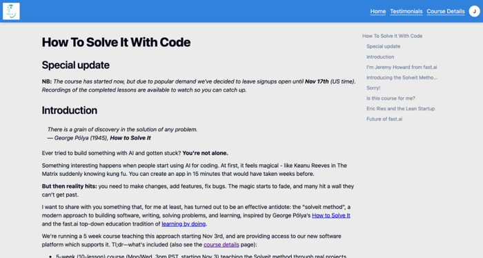

# capture


<!-- WARNING: THIS FILE WAS AUTOGENERATED! DO NOT EDIT! -->

``` python
from IPython.display import display, Image
```

------------------------------------------------------------------------

<a
href="https://github.com/AnswerDotAI/dialoghelper/blob/main/dialoghelper/capture.py#L20"
target="_blank" style="float:right; font-size:smaller">source</a>

### setup_share

``` python

def setup_share(
    
):

```

*Setup screen sharing*

``` python
setup_share()
```

------------------------------------------------------------------------

<a
href="https://github.com/AnswerDotAI/dialoghelper/blob/main/dialoghelper/capture.py#L25"
target="_blank" style="float:right; font-size:smaller">source</a>

### start_share

``` python

def start_share(
    
):

```

``` python
start_share()
```

------------------------------------------------------------------------

<a
href="https://github.com/AnswerDotAI/dialoghelper/blob/main/dialoghelper/capture.py#L34"
target="_blank" style="float:right; font-size:smaller">source</a>

### capture_screen

``` python

def capture_screen(
    timeout:int=15
):

```

*Capture the screen as a PIL image.*

``` python
img = capture_screen()
img.thumbnail((700,700))
img
```



------------------------------------------------------------------------

<a
href="https://github.com/AnswerDotAI/dialoghelper/blob/main/dialoghelper/capture.py#L42"
target="_blank" style="float:right; font-size:smaller">source</a>

### capture_tool

``` python

def capture_tool(
    timeout:int=15
):

```

*Capture the screen. Re-call this function to get the most recent
screenshot, as needed. Use default timeout where possible*

Please view my screen with
&[`capture_tool`](https://AnswerDotAI.github.io/dialoghelper/capture.html#capture_tool)
and describe briefly what you see.

##### 🤖Reply🤖<!-- SOLVEIT_SEPARATOR_7f3a9b2c -->

<details class="tool-usage-details">

``` json
{
  "id": "toolu_01Aqr48jBMZkvMzyBK94qhAt",
  "call": {
    "function": "capture_tool",
    "arguments": {}
  },
  "result": "[{'type': 'image_url', 'image_url': 'data:image/png;base64,iVBORw0KGgoAAAANSUhEUgAABQAAAAKsCAYAAACzn<TRUNCATED>"
}
```

</details>

I can see a webpage for “How To Solve It With Code” - a course by Jeremy
Howard. The page shows a special update noting that signups are open
until Nov 17th, and includes an introduction section with a George Pólya
quote about problem-solving. The page discusses using AI for coding and
introduces the “solveit method” inspired by Pólya’s work and fast.ai’s
learning-by-doing approach. There’s a navigation menu on the right
showing various course sections.
