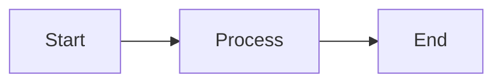

# dialoghelper


<!-- WARNING: THIS FILE WAS AUTOGENERATED! DO NOT EDIT! -->

``` python
from dialoghelper import *
```

``` python
from fastcore import tools
from fastcore.test import *
```

## Helpers

------------------------------------------------------------------------

<a
href="https://github.com/AnswerDotAI/dialoghelper/blob/main/dialoghelper/core.py#L61"
target="_blank" style="float:right; font-size:smaller">source</a>

### add_styles

``` python

def add_styles(
    s:str, cls_map:dict=None
):

```

*Add solveit styles to `s`*

``` python
import mistletoe
from fasthtml.common import show
```

``` python
s = mistletoe.markdown("### hi\n\n- first\n- *second*")
s
```

    '<h3>hi</h3>\n<ul>\n<li>first</li>\n<li><em>second</em></li>\n</ul>\n'

``` python
show(s)
```

<h3>hi</h3>
<ul>
<li>first</li>
<li><em>second</em></li>
</ul>

``` python
show(add_styles(s))
```

<h3 class="uk-h3">hi</h3>
<ul class="uk-list uk-list-bullet space-y-0">
<li class="leading-tight">first</li>
<li class="leading-tight"><em>second</em></li>
</ul>

## Basics

``` python
a = 1
find_var('a')
```

    1

------------------------------------------------------------------------

<a
href="https://github.com/AnswerDotAI/dialoghelper/blob/main/dialoghelper/core.py#L70"
target="_blank" style="float:right; font-size:smaller">source</a>

### find_dname

``` python

def find_dname(
    dname:NoneType=None
):

```

\*Get the dialog name by searching the call stack for \_\_dialog_name,
and resolving `dname` if supplied.\*

``` python
find_dname()
```

    '/aai-ws/dialoghelper/nbs/00_core'

``` python
find_dname('index')
```

    '/aai-ws/dialoghelper/nbs/index'

``` python
find_dname('../index')
```

    '/aai-ws/dialoghelper/index'

``` python
find_dname('/foo/bar')
```

    '/foo/bar'

------------------------------------------------------------------------

<a
href="https://github.com/AnswerDotAI/dialoghelper/blob/main/dialoghelper/core.py#L92"
target="_blank" style="float:right; font-size:smaller">source</a>

### xgeta

``` python

async def xgeta(
    url, kwargs:VAR_KEYWORD
):

```

------------------------------------------------------------------------

<a
href="https://github.com/AnswerDotAI/dialoghelper/blob/main/dialoghelper/core.py#L90"
target="_blank" style="float:right; font-size:smaller">source</a>

### xposta

``` python

async def xposta(
    url, kwargs:VAR_KEYWORD
):

```

------------------------------------------------------------------------

<a
href="https://github.com/AnswerDotAI/dialoghelper/blob/main/dialoghelper/core.py#L114"
target="_blank" style="float:right; font-size:smaller">source</a>

### call_endpa

``` python

async def call_endpa(
    path, dname:str='', json:bool=False, raiseex:bool=False, id:NoneType=None, data:VAR_KEYWORD
):

```

------------------------------------------------------------------------

<a
href="https://github.com/AnswerDotAI/dialoghelper/blob/main/dialoghelper/core.py#L110"
target="_blank" style="float:right; font-size:smaller">source</a>

### call_endp

``` python

def call_endp(
    path, dname:str='', json:bool=False, raiseex:bool=False, id:NoneType=None, data:VAR_KEYWORD
):

```

------------------------------------------------------------------------

<a
href="https://github.com/AnswerDotAI/dialoghelper/blob/main/dialoghelper/core.py#L126"
target="_blank" style="float:right; font-size:smaller">source</a>

### curr_dialog

``` python

async def curr_dialog(
    with_messages:bool=False, # Include messages as well?
    dname:str='', # Dialog to get info for; defaults to current dialog
):

```

*Get the current dialog info.*

------------------------------------------------------------------------

<a
href="https://github.com/AnswerDotAI/dialoghelper/blob/main/dialoghelper/core.py#L136"
target="_blank" style="float:right; font-size:smaller">source</a>

### msg_idx

``` python

async def msg_idx(
    id:str=None, # Message id to find (defaults to current message)
    dname:str='', # Dialog to get message index from; defaults to current dialog
):

```

*Get absolute index of message in dialog.*

``` python
await msg_idx()
```

    27

------------------------------------------------------------------------

<a
href="https://github.com/AnswerDotAI/dialoghelper/blob/main/dialoghelper/core.py#L154"
target="_blank" style="float:right; font-size:smaller">source</a>

### add_html

``` python

def add_html(
    content:str, # The HTML to send to the client (generally should include hx-swap-oob)
    dname:str='', # Dialog to get info for; defaults to current dialog
):

```

*Send HTML to the browser to be swapped into the DOM*

------------------------------------------------------------------------

<a
href="https://github.com/AnswerDotAI/dialoghelper/blob/main/dialoghelper/core.py#L146"
target="_blank" style="float:right; font-size:smaller">source</a>

### add_html_a

``` python

async def add_html_a(
    content:str, # The HTML to send to the client (generally should include hx-swap-oob)
    dname:str='', # Dialog to get info for; defaults to current dialog
):

```

*Send HTML to the browser to be swapped into the DOM*

``` python
from fasthtml.common import *
```

``` python
add_html(Div(P('Hi'), hx_swap_oob='beforeend:#dialog-container'))
```

    {'success': 'Content added to DOM'}

------------------------------------------------------------------------

<a
href="https://github.com/AnswerDotAI/dialoghelper/blob/main/dialoghelper/core.py#L168"
target="_blank" style="float:right; font-size:smaller">source</a>

### add_scr

``` python

def add_scr(
    scr, oob:str='innerHTML:#ephemeral'
):

```

*Swap a script element to the end of the ephemeral element*

------------------------------------------------------------------------

<a
href="https://github.com/AnswerDotAI/dialoghelper/blob/main/dialoghelper/core.py#L163"
target="_blank" style="float:right; font-size:smaller">source</a>

### add_scr_a

``` python

async def add_scr_a(
    scr, oob:str='innerHTML:#ephemeral'
):

```

*Swap a script element to the end of the ephemeral element*

------------------------------------------------------------------------

<a
href="https://github.com/AnswerDotAI/dialoghelper/blob/main/dialoghelper/core.py#L185"
target="_blank" style="float:right; font-size:smaller">source</a>

### iife

``` python

def iife(
    code:str
):

```

*Wrap javascript code string in an IIFE and execute it via
[`add_html`](https://AnswerDotAI.github.io/dialoghelper/core.html#add_html)*

------------------------------------------------------------------------

<a
href="https://github.com/AnswerDotAI/dialoghelper/blob/main/dialoghelper/core.py#L181"
target="_blank" style="float:right; font-size:smaller">source</a>

### iife_a

``` python

async def iife_a(
    code:str
):

```

*Wrap javascript code string in an IIFE and execute it via
[`add_html`](https://AnswerDotAI.github.io/dialoghelper/core.html#add_html)*

------------------------------------------------------------------------

<a
href="https://github.com/AnswerDotAI/dialoghelper/blob/main/dialoghelper/core.py#L193"
target="_blank" style="float:right; font-size:smaller">source</a>

### pop_data

``` python

def pop_data(
    idx, timeout:int=15
):

```

------------------------------------------------------------------------

<a
href="https://github.com/AnswerDotAI/dialoghelper/blob/main/dialoghelper/core.py#L190"
target="_blank" style="float:right; font-size:smaller">source</a>

### pop_data_a

``` python

async def pop_data_a(
    idx, timeout:int=15
):

```

------------------------------------------------------------------------

<a
href="https://github.com/AnswerDotAI/dialoghelper/blob/main/dialoghelper/core.py#L203"
target="_blank" style="float:right; font-size:smaller">source</a>

### fire_event

``` python

def fire_event(
    evt:str, data:NoneType=None
):

```

------------------------------------------------------------------------

<a
href="https://github.com/AnswerDotAI/dialoghelper/blob/main/dialoghelper/core.py#L202"
target="_blank" style="float:right; font-size:smaller">source</a>

### fire_event_a

``` python

async def fire_event_a(
    evt:str, data:NoneType=None
):

```

------------------------------------------------------------------------

<a
href="https://github.com/AnswerDotAI/dialoghelper/blob/main/dialoghelper/core.py#L216"
target="_blank" style="float:right; font-size:smaller">source</a>

### event_get

``` python

def event_get(
    evt:str, timeout:int=15, data:NoneType=None
):

```

*Call
[`fire_event`](https://AnswerDotAI.github.io/dialoghelper/core.html#fire_event)
and then
[`pop_data`](https://AnswerDotAI.github.io/dialoghelper/core.html#pop_data)
to get a response*

------------------------------------------------------------------------

<a
href="https://github.com/AnswerDotAI/dialoghelper/blob/main/dialoghelper/core.py#L210"
target="_blank" style="float:right; font-size:smaller">source</a>

### event_get_a

``` python

async def event_get_a(
    evt:str, timeout:int=15, data:NoneType=None
):

```

*Call
[`fire_event`](https://AnswerDotAI.github.io/dialoghelper/core.html#fire_event)
and then
[`pop_data`](https://AnswerDotAI.github.io/dialoghelper/core.html#pop_data)
to get a response*

------------------------------------------------------------------------

<a
href="https://github.com/AnswerDotAI/dialoghelper/blob/main/dialoghelper/core.py#L223"
target="_blank" style="float:right; font-size:smaller">source</a>

### trigger_now

``` python

def trigger_now(
    evt, data:NoneType=None, ttl:int=5000
):

```

*Synchronously trigger a browser event, safe against replay*

------------------------------------------------------------------------

<a
href="https://github.com/AnswerDotAI/dialoghelper/blob/main/dialoghelper/core.py#L236"
target="_blank" style="float:right; font-size:smaller">source</a>

### display_response

``` python

def display_response(
    display:str, result:str=None
):

```

*Return a special response where `display` is added as markdown/HTML to
the prompt output, and `result` is returned to the LLM*

## Run python

------------------------------------------------------------------------

<a
href="https://github.com/AnswerDotAI/dialoghelper/blob/main/dialoghelper/core.py#L246"
target="_blank" style="float:right; font-size:smaller">source</a>

### set_pyrun

``` python

def set_pyrun(
    rp:RunPython
):

```

*Replace the default RunPython used by msg_pyrun*

``` python
await pyrun('[]')
```

    []

``` python
await pyrun('Path().exists()')
```

    True

``` python
def f(): warnings.warn('a warning')
allow('f')
await pyrun('print("asdf"); f(); 1+1')
```

    {'stdout': 'asdf\n',
     'stderr': "/var/folders/51/b2_szf2945n072c0vj2cyty40000gn/T/ipykernel_86492/3774884187.py:1: UserWarning: a warning\n  def f(): warnings.warn('a warning')\n",
     'result': 2}

------------------------------------------------------------------------

<a
href="https://github.com/AnswerDotAI/dialoghelper/blob/main/dialoghelper/core.py#L252"
target="_blank" style="float:right; font-size:smaller">source</a>

### doc

``` python

def doc(
    sym
)->str:

```

*Get documentation (signature, docstring, + docments if they exist) for
`sym`.* **NB**: This is not an llm tool, so must be run with python().
`sym` must be available in the namespace.

## View/edit dialog

------------------------------------------------------------------------

<a
href="https://github.com/AnswerDotAI/dialoghelper/blob/main/dialoghelper/core.py#L270"
target="_blank" style="float:right; font-size:smaller">source</a>

### read_msg

``` python

async def read_msg(
    n:int=-1, # Message index (if relative, +ve is downwards)
    relative:bool=True, # Is `n` relative to current message (True) or absolute (False)?
    id:str=None, # Message id to find (defaults to current message)
    view_range:list=None, # Optional 1-indexed (start, end) line range for files, end=-1 for EOF
    nums:bool=False, # Whether to show line numbers
    dname:str='', # Dialog to get info for; defaults to current dialog
):

```

*Get the message indexed in the current dialog.* NB: Messages in the
current dialog above the current message are *already* visible; use this
only when you need line numbers for editing operations, or for messages
not in the current dialog or below the current message. - To get the
exact message use `n=0` and `relative=True` together with `id`. - To get
a relative message use `n` (relative position index). - To get the nth
message use `n` with `relative=False`, e.g `n=0` first message, `n=-1`
last message. If `dname` is None, the current dialog is used. If it is
an open dialog, it will be updated interactively with real-time updates
to the browser. If it is a closed dialog, it will be updated on disk.
Dialog names must be paths relative to solveit root (if starting with
`/`, e.g. `/myproject/dlg`) or relative to the current dialog’s folder
(if not starting with `/`), and should *not* include the .ipynb
extension. **Use absolute paths when targeting dialogs outside the
current dialog’s folder tree.**

------------------------------------------------------------------------

<a
href="https://github.com/AnswerDotAI/dialoghelper/blob/main/dialoghelper/core.py#L292"
target="_blank" style="float:right; font-size:smaller">source</a>

### find_msgs

``` python

async def find_msgs(
    re_pattern:str='', # Optional regex to search for (re.DOTALL+re.MULTILINE is used)
    msg_type:str=None, # optional limit by message type ('code', 'note', or 'prompt')
    use_case:bool=False, # Use case-sensitive matching?
    use_regex:bool=True, # Use regex matching?
    only_err:bool=False, # Only return messages that have errors?
    only_exp:bool=False, # Only return messages that are exported?
    only_chg:bool=False, # Only return messages that have changed vs git HEAD?
    ids:str='', # Optionally filter by comma-separated list of message ids
    limit:int=None, # Optionally limit number of returned items
    include_output:bool=True, # Include output in returned dict?
    include_meta:bool=True, # Include all additional message metadata
    as_xml:bool=False, # Use concise unescaped XML output format
    nums:bool=False, # Show line numbers?
    trunc_out:bool=False, # Middle-out truncate code output to 100 characters?
    trunc_in:bool=False, # Middle-out truncate cell content to 80 characters?
    headers_only:bool=False, # Only return note messages that are headers (first line only); cannot be used together with `header_section`
    header_section:str=None, # Find section starting with this header; returns it plus all children (i.e until next header of equal or more significant level)
    dname:str='', # Dialog to get info for; defaults to current dialog
)->list: # Messages in requested dialog that contain the given information

```

*Often it is more efficient to call
[`view_dlg`](https://AnswerDotAI.github.io/dialoghelper/core.html#view_dlg)
to see the whole dialog at once, so you can use it all from then on,
instead of using
[`find_msgs`](https://AnswerDotAI.github.io/dialoghelper/core.html#find_msgs).*
If `dname` is None, the current dialog is used. If it is an open dialog,
it will be updated interactively with real-time updates to the browser.
If it is a closed dialog, it will be updated on disk. Dialog names must
be paths relative to solveit root (if starting with `/`,
e.g. `/myproject/dlg`) or relative to the current dialog’s folder (if
not starting with `/`), and should *not* include the .ipynb extension.
**Use absolute paths when targeting dialogs outside the current dialog’s
folder tree.** Message ids are identical to those in LLM chat history,
so do NOT call this to view a specific message if it’s in the chat
history–instead use
[`view_msg`](https://AnswerDotAI.github.io/dialoghelper/core.html#view_msg).
Do NOT use find_msgs to view message content in the current dialog above
the current prompt – these are *already* provided in LLM context, so
just read the content there directly. (NB: LLM context only includes
messages *above* the current prompt, whereas
[`find_msgs`](https://AnswerDotAI.github.io/dialoghelper/core.html#find_msgs)
can access *all* messages.) To refer to a found message from code or
tools, use its `id` field.

``` python
# NB: must have a dialogue open including a message with this text in its content
txt = 'tools'
found = await find_msgs(txt)
```

``` python
1+1
```

    2

``` python
r = await find_msgs(r'1\+1', include_meta=False, include_output=True)
r
```

    [{'id': '_9f0b2705', 'is_exported': 0, 'content': 'def f(): warnings.warn(\'a warning\')\nallow(\'f\')\nawait pyrun(\'print("asdf"); f(); 1+1\')', 'output': '{&#x27;stdout&#x27;: &#x27;asdf\\n&#x27;,\n &#x27;stderr&#x27;: &quot;/var/folders/51/b2_szf2945n072c0vj2cyty40000gn/T/ipykernel_86492/3774884187.py:1: UserWarning: a warning\\n  def f(): warnings.warn(&#x27;a warning&#x27;)\\n&quot;,\n &#x27;result&#x27;: 2}', 'msg_type': 'code'}, {'id': '_8ce548d6', 'is_exported': 0, 'content': '1+1', 'output': '2', 'msg_type': 'code'}, {'id': '_44cb1b2a', 'is_exported': 0, 'content': "_id = await _add_msg_unsafe('1+1', run=True, msg_type='code')", 'output': '', 'msg_type': 'code'}]

``` python
hl_md(await find_msgs(r'1\+1', include_meta=False, as_xml=True))
```

<div class="prose">

``` html
<msgs><code id="_9f0b2705"><source>def f(): warnings.warn('a warning')
allow('f')
await pyrun('print("asdf"); f(); 1+1')<out>{&#x27;stdout&#x27;: &#x27;asdf\n&#x27;,
 &#x27;stderr&#x27;: &quot;/var/folders/51/b2_szf2945n072c0vj2cyty40000gn/T/ipykernel_86492/3774884187.py:1: UserWarning: a warning\n  def f(): warnings.warn(&#x27;a warning&#x27;)\n&quot;,
 &#x27;result&#x27;: 2}</out></code><code id="_8ce548d6"><source>1+1<out>2</out></code><code id="_44cb1b2a">_id = await _add_msg_unsafe('1+1', run=True, msg_type='code')</code></msgs>
```

</div>

------------------------------------------------------------------------

<a
href="https://github.com/AnswerDotAI/dialoghelper/blob/main/dialoghelper/core.py#L326"
target="_blank" style="float:right; font-size:smaller">source</a>

### view_dlg

``` python

async def view_dlg(
    dname:str='', # Dialog to get info for; defaults to current dialog
    msg_type:str=None, # optional limit by message type ('code', 'note', or 'prompt')
    nums:bool=False, # Whether to show line numbers
    include_output:bool=False, # Include output in returned dict?
    trunc_out:bool=True, # Middle-out truncate code output to 100 characters (only applies if `include_output`)?
    trunc_in:bool=False, # Middle-out truncate cell content to 80 characters?
):

```

*Concise XML view of all messages (optionally filtered by type), not
including metadata. Often it is more efficient to call this to see the
whole dialog at once (including line numbers if needed), instead of
running
[`find_msgs`](https://AnswerDotAI.github.io/dialoghelper/core.html#find_msgs)
or
[`view_msg`](https://AnswerDotAI.github.io/dialoghelper/core.html#view_msg)
multiple times.*

``` python
hl_md((await view_dlg(nums=True))[:500])
```

<div class="prose">

``` html
<msgs><code id="_955b9784">     1 │ #| default_exp core</code><code id="_a982e24d">     1 │ from dialoghelper import *</code><note id="_0aafe008">     1 │ # dialoghelper</note><code id="_468aa264" export>     1 │ import re,inspect,ast,collections,time,asyncio,json,linecache,importlib,difflib,uuid
     2 │ 
     3 │ from typing import Dict
     4 │ from tempfile import TemporaryDirectory
     5 │ from ipykernel_helper import *
     6 │ from dataclasses import dataclass
     7 │ from os.path impor
```

</div>

------------------------------------------------------------------------

<a
href="https://github.com/AnswerDotAI/dialoghelper/blob/main/dialoghelper/core.py#L376"
target="_blank" style="float:right; font-size:smaller">source</a>

### add_msg

``` python

async def add_msg(
    content:str, # Content of the message (i.e the message prompt, code, or note text)
    placement:str='add_after', # Can be 'at_start' or 'at_end', and for default dname can also be 'add_after' or 'add_before'
    id:str=None, # id of message that placement is relative to (if None, uses current message)
    dname:str='', # Dialog to get info for; defaults to current dialog (`run` only has a effect if dialog is currently running)
    msg_type:str='note', # Message type, can be 'code', 'note', or 'prompt'
    output:str='', # Prompt/code output; Code outputs must be .ipynb-compatible JSON array
    time_run:str | None='', # When was message executed
    is_exported:int | None=0, # Export message to a module?
    skipped:int | None=0, # Hide message from prompt?
    i_collapsed:int | None=0, # Collapse input?
    o_collapsed:int | None=0, # Collapse output?
    heading_collapsed:int | None=0, # Collapse heading section?
    pinned:int | None=0, # Pin to context?
)->str: # Message ID of newly created message

```

*Add/update a message to the queue to show after code execution
completes.* **NB**: when creating multiple messages in a row, after the
1st message set `id` to the result of the last
[`add_msg`](https://AnswerDotAI.github.io/dialoghelper/core.html#add_msg)
call, otherwise messages will appear in the dialog in REVERSE order. If
`dname` is None, the current dialog is used. If it is an open dialog, it
will be updated interactively with real-time updates to the browser. If
it is a closed dialog, it will be updated on disk. Dialog names must be
paths relative to solveit root (if starting with `/`,
e.g. `/myproject/dlg`) or relative to the current dialog’s folder (if
not starting with `/`), and should *not* include the .ipynb extension.
**Use absolute paths when targeting dialogs outside the current dialog’s
folder tree.**

------------------------------------------------------------------------

<a
href="https://github.com/AnswerDotAI/dialoghelper/blob/main/dialoghelper/core.py#L389"
target="_blank" style="float:right; font-size:smaller">source</a>

### add_prompt

``` python

async def add_prompt(
    content:str, # Prompt to run
    dname:str=None, # Dialog to run prompt in; defaults to current dialog
    msg_id:str=None, # Message id to place prompt after (if None, places at end)
    wait:bool=True, # Wait for and return response?
    poll:float=0.5, # Frequency of polling to check for completion
    placement:str='', # Location to place message, defaults to 'at_end' if no msg_id
    id:str=None, # id of message that placement is relative to (if None, uses current message)
    output:str='', # Prompt/code output; Code outputs must be .ipynb-compatible JSON array
    time_run:str | None='', # When was message executed
    is_exported:int | None=0, # Export message to a module?
    skipped:int | None=0, # Hide message from prompt?
    i_collapsed:int | None=0, # Collapse input?
    o_collapsed:int | None=0, # Collapse output?
    heading_collapsed:int | None=0, # Collapse heading section?
    pinned:int | None=0, # Pin to context?
): # Message ID of newly created message

```

*Run a prompt and, if `wait`, wait for and return the response text*

``` python
_id = await add_msg('testing')
```

------------------------------------------------------------------------

<a
href="https://github.com/AnswerDotAI/dialoghelper/blob/main/dialoghelper/core.py#L410"
target="_blank" style="float:right; font-size:smaller">source</a>

### read_msgid

``` python

async def read_msgid(
    id:str, # Message id to find
    view_range:list=None, # Optional 1-indexed (start, end) line range for files, end=-1 for EOF
    nums:bool=False, # Whether to show line numbers
    dname:str='', # Dialog to get message from; defaults to current dialog
    add_to_dlg:bool=False, # Whether to add message content to current dialog (as a raw message)
):

```

*Get message `id`. Message IDs can be view directly in LLM chat
history/context, or found in
[`find_msgs`](https://AnswerDotAI.github.io/dialoghelper/core.html#find_msgs)
results.* Use `add_to_dlg` if the LLM or human may need to refer to the
message content again later. If `dname` is None, the current dialog is
used. If it is an open dialog, it will be updated interactively with
real-time updates to the browser. If it is a closed dialog, it will be
updated on disk. Dialog names must be paths relative to solveit root (if
starting with `/`, e.g. `/myproject/dlg`) or relative to the current
dialog’s folder (if not starting with `/`), and should *not* include the
.ipynb extension. **Use absolute paths when targeting dialogs outside
the current dialog’s folder tree.**

``` python
r = await read_msg(-2)
print((await read_msg(-2)).content)
```

    testing

[`read_msg`](https://AnswerDotAI.github.io/dialoghelper/core.html#read_msg)
(and all endpoints that return json) wrap responses in `dict2obj`, so
you can use either dict or object syntax.

``` python
bmsg = await add_msg('at bottom', placement='at_end')
```

``` python
assert(await msg_idx(bmsg)>await msg_idx(_id)+10)
```

------------------------------------------------------------------------

<a
href="https://github.com/AnswerDotAI/dialoghelper/blob/main/dialoghelper/core.py#L426"
target="_blank" style="float:right; font-size:smaller">source</a>

### view_msg

``` python

async def view_msg(
    id:str, # Message id to view
    dname:str='', # Dialog to get message from; defaults to current dialog
    nums:bool=True, # Whether to show line numbers
    view_range:list=None, # Optional 1-indexed (start, end) line range for files, end=-1 for EOF. Rarely needed--read whole message in nearly all cases instead
    add_to_dlg:bool=False, # Whether to add message content to current dialog (as a raw message)
):

```

*Views the *content\* of message `id`. Same as
`read_msgid(...)['content']`, defaulting to `nums=True`.* Use
`add_to_dlg` if the LLM or human may need to refer to the message
content again later. If `dname` is None, the current dialog is used. If
it is an open dialog, it will be updated interactively with real-time
updates to the browser. If it is a closed dialog, it will be updated on
disk. Dialog names must be paths relative to solveit root (if starting
with `/`, e.g. `/myproject/dlg`) or relative to the current dialog’s
folder (if not starting with `/`), and should *not\* include the .ipynb
extension. **Use absolute paths when targeting dialogs outside the
current dialog’s folder tree.**

``` python
print((await view_msg(r.id)))
```

         1 │ testing

``` python
# dh_settings['dname'] = 'tmp'
# _id = await add_msg('testing', placement='at_end')
# print(_id)
# del(dh_settings['dname'])
```

------------------------------------------------------------------------

<a
href="https://github.com/AnswerDotAI/dialoghelper/blob/main/dialoghelper/core.py#L442"
target="_blank" style="float:right; font-size:smaller">source</a>

### del_msg

``` python

async def del_msg(
    id:str=None, # id of message to delete
    dname:str='', # Dialog to get info for; defaults to current dialog
    log_changed:bool=False, # Add a note showing the deleted content?
):

```

*Delete a message from the dialog. DO NOT USE THIS unless you have been
explicitly instructed to delete messages.*

``` python
await del_msg(bmsg)
await del_msg(_id)
```

    {'status': 'success'}

``` python
_id = await _add_msg_unsafe('1+1', run=True, msg_type='code')
```

``` python
await del_msg(_id)
```

    {'status': 'success'}

``` python
_id = await _add_msg_unsafe('Hi', run=True, msg_type='prompt')
```

``` python
await del_msg(_id)
```

    {'status': 'success'}

------------------------------------------------------------------------

<a
href="https://github.com/AnswerDotAI/dialoghelper/blob/main/dialoghelper/core.py#L471"
target="_blank" style="float:right; font-size:smaller">source</a>

### update_msg

``` python

async def update_msg(
    id:str=None, # id of message to update (if None, uses current message)
    msg:Optional=None, # Dictionary of field keys/values to update
    dname:str='', # Dialog to get info for; defaults to current dialog
    log_changed:bool=False, # Add a note showing the diff?
    content:str | None=None, # Content of the message (i.e the message prompt, code, or note text)
    msg_type:str | None=None, # Message type, can be 'code', 'note', or 'prompt'
    output:str | None=None, # Prompt/code output; Code outputs must be .ipynb-compatible JSON array
    time_run:str | None=None, # When was message executed
    is_exported:int | None=None, # Export message to a module?
    skipped:int | None=None, # Hide message from prompt?
    i_collapsed:int | None=None, # Collapse input?
    o_collapsed:int | None=None, # Collapse output?
    heading_collapsed:int | None=None, # Collapse heading section?
    pinned:int | None=None, # Pin to context?
):

```

*Update an existing message. Provide either `msg` OR field key/values to
update.* - Use `content` param to update contents. - Only include
parameters to update–missing ones will be left unchanged. If `dname` is
None, the current dialog is used. If it is an open dialog, it will be
updated interactively with real-time updates to the browser. If it is a
closed dialog, it will be updated on disk. Dialog names must be paths
relative to solveit root (if starting with `/`, e.g. `/myproject/dlg`)
or relative to the current dialog’s folder (if not starting with `/`),
and should *not* include the .ipynb extension. **Use absolute paths when
targeting dialogs outside the current dialog’s folder tree.**

``` python
_id = await add_msg('testing')
```

``` python
_id = await update_msg(_id, content='toasting')
```

``` python
_id = await update_msg(_id, skipped=1)
```

``` python
msg = await read_msgid(_id)
msg['content'] = 'toasted'
await update_msg(msg=msg)
```

    '_b57b4b4a'

``` python
await del_msg(_id)
```

    {'status': 'success'}

``` python
_edit_id = await add_msg('This message should be found.\n\nThis is a multiline message.')
_edit_id
```

    '_32a933a6'

``` python
print((await read_msg())['content'])
```

    5th line
    This should go to the 1st line
    last line

``` python
print((await read_msg(n=0, id=_edit_id, nums=True))['content'])
```

         1 │ This message should be found.
         2 │ 
         3 │ This is a multiline message.

``` python
print((await read_msg(n=0, id=_edit_id, nums=True, view_range=[2,3]))['content'])
```

         2 │ 
         3 │ This is a multiline message.

------------------------------------------------------------------------

<a
href="https://github.com/AnswerDotAI/dialoghelper/blob/main/dialoghelper/core.py#L495"
target="_blank" style="float:right; font-size:smaller">source</a>

### run_msg

``` python

async def run_msg(
    ids:str=None, # Comma-separated ids of message(s) to execute
    dname:str='', # Running dialog to get info for; defaults to current dialog. (Note dialog *must* be running for this function)
):

```

*Adds a message to the run queue. Use read_msg to see the output once it
runs.*

``` python
codeid = (await read_msg())['id']
```

``` python
await run_msg(codeid)
```

    {'status': 'queued'}

------------------------------------------------------------------------

<a
href="https://github.com/AnswerDotAI/dialoghelper/blob/main/dialoghelper/core.py#L504"
target="_blank" style="float:right; font-size:smaller">source</a>

### copy_msg

``` python

async def copy_msg(
    ids:str=None, # Comma-separated ids of message(s) to copy
    cut:bool=False, # Cut message(s)? (If not, copies)
    dname:str='', # Running dialog to copy messages from; defaults to current dialog. (Note dialog *must* be running for this function)
):

```

*Add `ids` to clipboard.*

------------------------------------------------------------------------

<a
href="https://github.com/AnswerDotAI/dialoghelper/blob/main/dialoghelper/core.py#L516"
target="_blank" style="float:right; font-size:smaller">source</a>

### paste_msg

``` python

async def paste_msg(
    id:str=None, # Message id to paste next to
    after:bool=True, # Paste after id? (If not, pastes before)
    dname:str='', # Running dialog to copy messages from; defaults to current dialog. (Note dialog *must* be running for this function)
):

```

*Paste clipboard msg(s) after/before the current selected msg (id).*

``` python
await copy_msg(codeid)
```

    {'success': 'complete'}

``` python
test_eq((await copy_msg('_fake', dname='/dlg/nonexistent'))['error'], 'Dialog /dlg/nonexistent may not be running, or message not found')
```

``` python
tgt = (await read_msg())['id']
```

``` python
await paste_msg(tgt)
```

    {'success': 'complete'}

``` python
test_eq((await paste_msg('_fake', dname='/dlg/nonexistent'))['error'], 'Dialog /dlg/nonexistent may not be running, or message not found')
```

``` python
newmsg = await read_msg(1, id=tgt)
newmsg['content']
```

    'async def run_msg(\n    ids:str=None, # Comma-separated ids of message(s) to execute\n    dname:str=\'\' # Running dialog to get info for; defaults to current dialog. (Note dialog *must* be running for this function)\n):\n    "Adds a message to the run queue. Use read_msg to see the output once it runs."\n    return await call_endpa(\'add_runq_\', dname, ids=ids, json=True)'

``` python
await del_msg(newmsg['id'])
```

    {'status': 'success'}

------------------------------------------------------------------------

<a
href="https://github.com/AnswerDotAI/dialoghelper/blob/main/dialoghelper/core.py#L528"
target="_blank" style="float:right; font-size:smaller">source</a>

### enable_mermaid

``` python

def enable_mermaid(
    
):

```

``` python
enable_mermaid()
```

``` html
<script type="module">
if (window.mermaid) mermaid.run()
else {
    import('https://cdn.jsdelivr.net/npm/mermaid@11/dist/mermaid.esm.min.mjs').then(m => {
        window.mermaid = m.default;
        window.mermaid.run();
        htmx.onLoad(elt => {
            if (elt.matches('div.mermaid, pre.mermaid') || htmx.findAll(elt, 'div.mermaid, pre.mermaid')) window.mermaid.run();
        });
    });
}</script>
```

------------------------------------------------------------------------

<a
href="https://github.com/AnswerDotAI/dialoghelper/blob/main/dialoghelper/core.py#L542"
target="_blank" style="float:right; font-size:smaller">source</a>

### mermaid

``` python

def mermaid(
    code, cls:str='mermaid', kwargs:VAR_KEYWORD
):

```

*A mermaid diagram*

``` python
mermaid('graph LR; A[Start] --> B[Process]; B --> C[End];')
```

``` html
<div class="mermaid">graph LR; A[Start] --&gt; B[Process]; B --&gt; C[End];</div>
```

You can also add to a note:

    ```mermaid
    graph LR
    A[Start] --> B[Process]
    B --> C[End]
    ```

This renders as:



You can also add to a note:

    ```mermaid
    graph LR
    A[Start] --> B[Process]
    B --> C[End]
    ```

This renders as:

    graph LR
    A[Start] --> B[Process]
    B --> C[End]

------------------------------------------------------------------------

<a
href="https://github.com/AnswerDotAI/dialoghelper/blob/main/dialoghelper/core.py#L548"
target="_blank" style="float:right; font-size:smaller">source</a>

### toggle_header

``` python

async def toggle_header(
    id:str, # id of markdown header note message to toggle collapsed state
    dname:str='', # Running dialog to copy messages from; defaults to current dialog. (Note dialog *must* be running for this function)
):

```

*Toggle collapsed header state for `id`*

------------------------------------------------------------------------

<a
href="https://github.com/AnswerDotAI/dialoghelper/blob/main/dialoghelper/core.py#L558"
target="_blank" style="float:right; font-size:smaller">source</a>

### toggle_bookmark

``` python

async def toggle_bookmark(
    id:str, # id of message to toggle bookmark on
    n:int, # Bookmark number (1-9)
    dname:str='', # Dialog to set bookmark in; defaults to current dialog
):

```

*Toggle numbered bookmark (1-9) on a message, clearing it from any other
message when setting*

------------------------------------------------------------------------

<a
href="https://github.com/AnswerDotAI/dialoghelper/blob/main/dialoghelper/core.py#L568"
target="_blank" style="float:right; font-size:smaller">source</a>

### toggle_comment

``` python

async def toggle_comment(
    id:str, # id of code message (or comma-separated ids) to toggle comments on
    dname:str='', # Dialog to toggle comments in; defaults to current dialog. (Note dialog *must* be running for this function)
):

```

*Toggle line comments on code message(s). If any lines are uncommented,
comments all; otherwise uncomments all.*

``` python
await toggle_comment(codeid) # comment
await toggle_comment(codeid) # uncomment
```

    {'success': 'complete'}

``` python
test_eq((await toggle_comment('_fake', dname='/dlg/nonexistent'))['error'], 'Dialog /dlg/nonexistent may not be running, or message not found')
```

#### test header

#### header end

``` python
hdid = (await read_msg())['id']
```

``` python
await toggle_header(hdid)
```

    {'success': 'complete'}

``` python
test_eq((await toggle_header('_fake', dname='/dlg/nonexistent'))['error'], 'Dialog /dlg/nonexistent may not be running, or message not found')
```

### Dlg conveniences

------------------------------------------------------------------------

<a
href="https://github.com/AnswerDotAI/dialoghelper/blob/main/dialoghelper/core.py#L579"
target="_blank" style="float:right; font-size:smaller">source</a>

### url2note

``` python

async def url2note(
    url:str, # URL to read
    extract_section:bool=True, # If url has an anchor, return only that section
    selector:str=None, # Select section(s) using BeautifulSoup.select (overrides extract_section)
    ai_img:bool=True, # Make images visible to the AI
    split_re:str='', # Regex to split content into multiple notes, set to '' for single note
):

```

*Read URL as markdown, and add note(s) below current message with the
result*

``` python
_id = await url2note('https://www.example.org')
```

``` python
await del_msg(_id)
```

    {'status': 'success'}

------------------------------------------------------------------------

<a
href="https://github.com/AnswerDotAI/dialoghelper/blob/main/dialoghelper/core.py#L594"
target="_blank" style="float:right; font-size:smaller">source</a>

### create_or_run_dialog

``` python

async def create_or_run_dialog(
    name:str, # Name/path of the dialog (relative to current dialog's folder, or absolute if starts with '/')
):

```

*Create a new dialog, or set an existing one running*

``` python
await create_or_run_dialog('test_dialog')
```

    {'success': '"aai-ws/dialoghelper/nbs/test_dialog" is now running'}

------------------------------------------------------------------------

<a
href="https://github.com/AnswerDotAI/dialoghelper/blob/main/dialoghelper/core.py#L603"
target="_blank" style="float:right; font-size:smaller">source</a>

### stop_dialog

``` python

async def stop_dialog(
    name:str, # Name/path of the dialog (relative to current dialog's folder, or absolute if starts with '/')
):

```

*Stop a running dialog kernel*

``` python
await stop_dialog('test_dialog')
```

    {'success': 'dialog stopped'}

------------------------------------------------------------------------

<a
href="https://github.com/AnswerDotAI/dialoghelper/blob/main/dialoghelper/core.py#L611"
target="_blank" style="float:right; font-size:smaller">source</a>

### rm_dialog

``` python

async def rm_dialog(
    name:str, # Name/path of the dialog to delete (relative to current dialog's folder, or absolute if starts with '/')
):

```

*Delete a dialog (or folder) and associated records, stopping the kernel
if running*

``` python
await rm_dialog('test_dialog')
```

    {'success': 'deleted "/Users/jhoward/aai-ws/dialoghelper/nbs/test_dialog"'}

------------------------------------------------------------------------

<a
href="https://github.com/AnswerDotAI/dialoghelper/blob/main/dialoghelper/core.py#L620"
target="_blank" style="float:right; font-size:smaller">source</a>

### run_code_interactive

``` python

async def run_code_interactive(
    code:str, # Code to have user run
):

```

*Insert code into user’s dialog and request for the user to run it. Use
other tools where possible, * but if they can not find needed
information, *ALWAYS* use this instead of guessing or giving up.
IMPORTANT: This tool is TERMINAL - after calling it, you MUST stop all
tool usage and wait for user response. Never call additional tools after
this one.

## Text Edit

``` python
await msg_insert_line(_edit_id, 0, 'This should go to the first line')
await msg_insert_line(_edit_id, 3, 'This should go to the 4th line')
print(await msg_insert_line(_edit_id, 5, 'This should go to the last line'))
```

    @@ -5 +5,2 @@
     This is a multiline message.
    +This should go to the last line

``` python
print((await read_msg(n=0, id=_edit_id, nums=True))['content'])
```

         1 │ This should go to the first line
         2 │ This message should be found.
         3 │ 
         4 │ This should go to the 4th line
         5 │ This is a multiline message.
         6 │ This should go to the last line

``` python
print(await msg_str_replace(_edit_id, 'This should go to the first line', 'This should go to the 1st line'))
```

    @@ -1,2 +1,2 @@
    -This should go to the first line
    +This should go to the 1st line
     This message should be found.

``` python
print((await read_msg(n=0, id=_edit_id, nums=True))['content'])
```

         1 │ This should go to the 1st line
         2 │ This message should be found.
         3 │ 
         4 │ This should go to the 4th line
         5 │ This is a multiline message.
         6 │ This should go to the last line

``` python
print(await msg_strs_replace(_edit_id, ['This is a multiline message.', 'This should go to the last line'], ['5th line', 'last line']))
```

    @@ -4,3 +4,3 @@
     This should go to the 4th line
    -This is a multiline message.
    -This should go to the last line
    +5th line
    +last line

``` python
print((await read_msg(n=0, id=_edit_id, nums=True))['content'])
```

         1 │ This should go to the 1st line
         2 │ This message should be found.
         3 │ 
         4 │ This should go to the 4th line
         5 │ 5th line
         6 │ last line

``` python
print(await msg_replace_lines(_edit_id, 2, 4,'line 2\nline 3\nline 4\n'))
```

    @@ -1,5 +1,5 @@
     This should go to the 1st line
    -This message should be found.
    -
    -This should go to the 4th line
    +line 2
    +line 3
    +line 4
     5th line

``` python
print((await read_msg(n=0, id=_edit_id, nums=True))['content'])
```

         1 │ This should go to the 1st line
         2 │ line 2
         3 │ line 3
         4 │ line 4
         5 │ 5th line
         6 │ last line

``` python
print(await msg_del_lines(_edit_id, 2, 4))
```

    @@ -1,5 +1,2 @@
     This should go to the 1st line
    -line 2
    -line 3
    -line 4
     5th line

``` python
print((await read_msg(n=0, id=_edit_id, nums=True)).content)
```

         1 │ This should go to the 1st line
         2 │ 5th line
         3 │ last line

``` python
print(await msg_pyrun(_edit_id, r"'\n'.join(sorted(text.splitlines()))"))
```

    @@ -1,3 +1,3 @@
    +5th line
     This should go to the 1st line
    -5th line
     last line

``` python
print((await read_msg(n=0, id=_edit_id, nums=True)).content)
```

         1 │ 5th line
         2 │ This should go to the 1st line
         3 │ last line

``` python
await del_msg(_edit_id)
```

    {'status': 'success'}

``` python
with TemporaryDirectory() as tmp:
    p = f'{tmp}/test.txt'
    Path(p).write_text('alpha\nbeta\ngamma\ndelta\n')

    print(await file_insert_line(p, 0, 'first'))
    print(await file_str_replace(p, 'beta', 'BETA'))
    print(await file_strs_replace(p, ['gamma', 'delta'], ['GAMMA', 'DELTA']))
    print(await file_replace_lines(p, 2, 3, 'two\nthree\n'))
    print(await file_del_lines(p, 1))
    print(await file_pyrun(p, r"'\n'.join(reversed(text.splitlines()))"))
    print('---')
    print(Path(p).read_text())
```

    @@ -1 +1,2 @@
    +first
     alpha
    @@ -2,3 +2,3 @@
     alpha
    -beta
    +BETA
     gamma
    @@ -3,3 +3,3 @@
     BETA
    -gamma
    -delta
    +GAMMA
    +DELTA
    @@ -1,4 +1,4 @@
     first
    -alpha
    -BETA
    +two
    +three
     GAMMA
    @@ -1,2 +1 @@
    -first
     two
    @@ -1,4 +1,4 @@
    +DELTA
    +GAMMA
    +three
     two
    -three
    -GAMMA
    -DELTA
    ---
    DELTA
    GAMMA
    three
    two

## ast-grep

------------------------------------------------------------------------

<a
href="https://github.com/AnswerDotAI/dialoghelper/blob/main/dialoghelper/core.py#L818"
target="_blank" style="float:right; font-size:smaller">source</a>

### ast_py

``` python

def ast_py(
    code:str
):

```

*Get an SgRoot root node for python `code`*

``` python
node = ast_py("print('hello world')")
stmt = node.find(pattern="print($A)")
res = stmt.get_match('A')
res.text(),res.range()
```

    ("'hello world'",
     Range(start=Pos(line=0, col=6, index=6), end=Pos(line=0, col=19, index=19)))

------------------------------------------------------------------------

<a
href="https://github.com/AnswerDotAI/dialoghelper/blob/main/dialoghelper/core.py#L825"
target="_blank" style="float:right; font-size:smaller">source</a>

### ast_grep

``` python

def ast_grep(
    pattern:str, # ast-grep pattern to search, e.g "post($A, data=$B, $$$)"
    path:str='.', # path to recursively search for files
    lang:str='python', # language to search/scan
):

```

*Use `ast-grep` to find code patterns by AST structure (not text).*

Pattern syntax: - $VAR captures single nodes,
$$$ captures multiple
- Match structure directly: \`def $FUNC($$
$)`finds any function;`class
$CLASS`finds classes regardless of inheritance - DON'T include`:\` -
it’s concrete syntax, not AST structure - Whitespace/formatting
ignored - matches structural equivalence

Examples: `import $MODULE` (find imports); `$OBJ.$METHOD($$$)` (find
method calls); `await $EXPR` (find await expressions)

Useful for: Refactoring—find all uses of deprecated APIs or changed
signatures; Security review—locate SQL queries, file operations, eval
calls; Code exploration—understand how libraries are used across
codebase; Pattern analysis—find async functions, error handlers,
decorators; Better than regex—handles multi-line code, nested
structures, respects syntax

The
[`ast_grep`](https://AnswerDotAI.github.io/dialoghelper/core.html#ast_grep)
function calls the `ast-grep` CLI, which is a tool for searching code
based on its structure rather than just text patterns. Unlike regular
expressions that match character sequences, `ast-grep` understands the
syntax of programming languages and lets you search for code patterns in
a way that respects the language’s grammar. This means you can find
function calls, variable assignments, or other code constructs even when
they’re formatted differently or have varying amounts of whitespace.

The key advantage is using metavariables (like `$A`, `$B`, `$$$`) as
placeholders in your search patterns. When you search for
`xpost($A, data=$B, $$$)`, you’re asking to find all calls to `xpost`
where the first argument can be anything (captured as `$A`), there’s a
keyword argument `data` with any value (captured as `$B`), and there may
be additional arguments after that (the `$$$` matches zero or more
remaining arguments). This is much more reliable than trying to write a
regex that handles all the variations of how that function might be
called.

In the example below, we search for calls to `xpost` in the parent
directory and extract both the matched code and the specific values of
our metavariables, showing us exactly where and how this function is
being used in the codebase.

``` python
res = ast_grep(r"xpost($A, data=$B, $$$)", '..')
[(o['text'],o['metaVariables']['single'],o['file']) for o in res]
```

    [('xpost(url, data=data, headers=headers)',
      {'A': {'text': 'url',
        'range': {'byteOffset': {'start': 5469, 'end': 5472},
         'start': {'line': 111, 'column': 30},
         'end': {'line': 111, 'column': 33}}},
       'B': {'text': 'data',
        'range': {'byteOffset': {'start': 5479, 'end': 5483},
         'start': {'line': 111, 'column': 40},
         'end': {'line': 111, 'column': 44}}}},
      'dialoghelper/core.py')]

**Basic Patterns:** - Match code structure directly:
`console.log($ARG)` - Metavariables capture parts: `$VAR` (single),
`$$$` (multiple) - Patterns match AST structure, not text -
whitespace/formatting doesn’t matter

**The Colon Issue:** - **Don’t include `:` in patterns** - it’s part of
Python’s concrete syntax, not the AST structure - ✅ `def $FUNC($$$)` -
matches function definitions - ❌ `def $FUNC($$$):` - too specific,
looking for the colon token itself

**When to use `kind` vs `pattern`:** - `pattern`: Simple direct matches
(`await $EXPR`) - `kind`: Structural node types
(`kind: function_declaration`)

**Critical rule for relational searches:** Always add `stopBy: end` to
`has`/`inside` rules to search the entire subtree:

``` yaml
has:
  pattern: await $EXPR
  stopBy: end
```

**Escaping in shell:** Use `\$VAR` or single quotes when using
`--inline-rules` from command line

## Context

------------------------------------------------------------------------

<a
href="https://github.com/AnswerDotAI/dialoghelper/blob/main/dialoghelper/core.py#L849"
target="_blank" style="float:right; font-size:smaller">source</a>

### ctx_folder

``` python

async def ctx_folder(
    path:Path='.', # Path to collect
    types:str | list='py,doc', # list or comma-separated str of ext types from: py, js, java, c, cpp, rb, r, ex, sh, web, doc, cfg
    out:bool=False, # Include notebook cell outputs?
    raw:bool=True, # Add raw message, or note?
    exts:str | list=None, # list or comma-separated str of exts to include (overrides `types`)
    prefix:bool=False, # Include Anthropic's suggested prose intro?
    include_base:bool=True, # Include full path in src?
    title:str=None, # Optional title attr for Documents element
    max_size:int=100000, # Skip files larger than this (bytes)
    max_total:int=10000000, # Max total output size in bytes
    readme_first:bool=False, # Prioritize README files at start of context?
    files_only:bool=False, # Return dict of {filename: size} instead of context?
    sigs_only:bool=False, # Return signatures instead of full text? (where supported by `codesigs` lib)
    ids:bool=True, # Include cell ids in notebooks?
    recursive:bool=True, # search subfolders
    symlinks:bool=True, # follow symlinks?
    file_glob:str=None, # Only include files matching glob
    file_re:str=None, # Only include files matching regex
    folder_re:str=None, # Only enter folders matching regex
    skip_file_glob:str=None, # Skip files matching glob
    skip_file_re:str=None, # Skip files matching regex
    skip_folder_re:str=None, # Skip folders matching regex,
    ret_folders:bool=False, # return folders, not just files
    sort:bool=True, # sort files by name within each folder
):

```

*Convert folder to XML context and place in a new message*

``` python
# ctx_folder('..', max_total=600, sigs_only=True, exts='py')
```

<documents><document index="4"><src> ../dialoghelper/capture.py
</src><document-content> def setup_share(): “Setup screen sharing”

def start_share(): fire_event(‘shareScreen’)

def \_capture_screen(timeout=15):

def capture_screen(timeout=15): “Capture the screen as a PIL image.”

def capture_tool(timeout:int=15): “Capture the screen. Re-call this
function to get the most recent screenshot, as needed. Use default
timeout where possible”
</document-content></document><document index="5"><src>
../dialoghelper/core.py </src>\<

\[TRUNCATED: output size 24344 exceeded max size 600 bytes\]

------------------------------------------------------------------------

<a
href="https://github.com/AnswerDotAI/dialoghelper/blob/main/dialoghelper/core.py#L866"
target="_blank" style="float:right; font-size:smaller">source</a>

### ctx_repo

``` python

async def ctx_repo(
    owner:str, # GitHub repo owner
    repo:str, # GitHub repo name
    types:str | list='py,doc', # list or comma-separated str of ext types from: py, js, java, c, cpp, rb, r, ex, sh, web, doc, cfg
    exts:str | list=None, # list or comma-separated str of exts to include (overrides `types`)
    out:bool=False, # Include notebook cell outputs?
    raw:bool=True, # Add raw message, or note?
    ref:str=None, # Git ref (branch/tag/sha) (get from URL not provided); defaults to repo's default branch
    folder:str=None, # Only include files under this path (get from URL not provided)
    show_filters:bool=True, # Include filter info in title?
    token:str=None, # GitHub token (uses GITHUB_TOKEN env var if None)
    prefix:bool=False, # Include Anthropic's suggested prose intro?
    include_base:bool=True, # Include full path in src?
    title:str=None, # Optional title attr for Documents element
    max_size:int=100000, # Skip files larger than this (bytes)
    max_total:int=10000000, # Max total output size in bytes
    readme_first:bool=False, # Prioritize README files at start of context?
    files_only:bool=False, # Return dict of {filename: size} instead of context?
    sigs_only:bool=False, # Return signatures instead of full text? (where supported by `codesigs` lib)
    ids:bool=True, # Include cell ids in notebooks?
    recursive:bool=True, # search subfolders
    symlinks:bool=True, # follow symlinks?
    file_glob:str=None, # Only include files matching glob
    file_re:str=None, # Only include files matching regex
    folder_re:str=None, # Only enter folders matching regex
    skip_file_glob:str=None, # Skip files matching glob
    skip_file_re:str=None, # Skip files matching regex
    skip_folder_re:str=None, # Skip folders matching regex,
    ret_folders:bool=False, # return folders, not just files
    sort:bool=True, # sort files by name within each folder
): # XML for LM context, or dict of file sizes

```

*Convert GitHub repo to XML context and place in a new message*

------------------------------------------------------------------------

<a
href="https://github.com/AnswerDotAI/dialoghelper/blob/main/dialoghelper/core.py#L883"
target="_blank" style="float:right; font-size:smaller">source</a>

### ctx_symfile

``` python

async def ctx_symfile(
    sym
):

```

*Add note with filepath and contents for a symbol’s source file*

``` python
# ctx_symfile(TemporaryDirectory)
```

------------------------------------------------------------------------

<a
href="https://github.com/AnswerDotAI/dialoghelper/blob/main/dialoghelper/core.py#L890"
target="_blank" style="float:right; font-size:smaller">source</a>

### ctx_symfolder

``` python

async def ctx_symfolder(
    sym, # Symbol to get folder context from
    types:str | list='py', # List or comma-separated str of ext types from: py, js, java, c, cpp, rb, r, ex, sh, web, doc, cfg
    skip_file_re:str='^_mod', # Skip files matching regex
    prefix:bool=False, # Include Anthropic's suggested prose intro?
    out:bool=True, # Include notebook cell outputs?
    include_base:bool=True, # Include full path in src?
    title:str=None, # Optional title attr for Documents element
    max_size:int=100000, # Skip files larger than this (bytes)
    max_total:int=10000000, # Max total output size in bytes
    readme_first:bool=False, # Prioritize README files at start of context?
    files_only:bool=False, # Return dict of {filename: size} instead of context?
    sigs_only:bool=False, # Return signatures instead of full text? (where supported by `codesigs` lib)
    ids:bool=True, # Include cell ids in notebooks?
    recursive:bool=True, # search subfolders
    symlinks:bool=True, # follow symlinks?
    file_glob:str=None, # Only include files matching glob
    file_re:str=None, # Only include files matching regex
    folder_re:str=None, # Only enter folders matching regex
    skip_file_glob:str=None, # Skip files matching glob
    skip_folder_re:str=None, # Skip folders matching regex,
    ret_folders:bool=False, # return folders, not just files
    sort:bool=True, # sort files by name within each folder
    exts:str | list=None, # list or comma-separated str of exts to include
):

```

*Add raw message with folder context for a symbol’s source file
location*

``` python
# ctx_symfolder(folder2ctx)
```

------------------------------------------------------------------------

<a
href="https://github.com/AnswerDotAI/dialoghelper/blob/main/dialoghelper/core.py#L899"
target="_blank" style="float:right; font-size:smaller">source</a>

### ctx_sympkg

``` python

async def ctx_sympkg(
    sym, # Symbol to get folder context from
    types:str | list='py', # List or comma-separated str of ext types from: py, js, java, c, cpp, rb, r, ex, sh, web, doc, cfg
    skip_file_re:str='^_mod', # Skip files matching regex
    prefix:bool=False, # Include Anthropic's suggested prose intro?
    out:bool=True, # Include notebook cell outputs?
    include_base:bool=True, # Include full path in src?
    title:str=None, # Optional title attr for Documents element
    max_size:int=100000, # Skip files larger than this (bytes)
    max_total:int=10000000, # Max total output size in bytes
    readme_first:bool=False, # Prioritize README files at start of context?
    files_only:bool=False, # Return dict of {filename: size} instead of context?
    sigs_only:bool=False, # Return signatures instead of full text? (where supported by `codesigs` lib)
    ids:bool=True, # Include cell ids in notebooks?
    recursive:bool=True, # search subfolders
    symlinks:bool=True, # follow symlinks?
    file_glob:str=None, # Only include files matching glob
    file_re:str=None, # Only include files matching regex
    folder_re:str=None, # Only enter folders matching regex
    skip_file_glob:str=None, # Skip files matching glob
    skip_folder_re:str=None, # Skip folders matching regex,
    ret_folders:bool=False, # return folders, not just files
    sort:bool=True, # sort files by name within each folder
    exts:str | list=None, # list or comma-separated str of exts to include
):

```

*Add raw message with repo context for a symbol’s root package*

``` python
# ctx_sympkg(folder2ctx)
```

## Gists

------------------------------------------------------------------------

<a
href="https://github.com/AnswerDotAI/dialoghelper/blob/main/dialoghelper/core.py#L907"
target="_blank" style="float:right; font-size:smaller">source</a>

### load_gist

``` python

def load_gist(
    gist_id:str
):

```

*Retrieve a gist*

``` python
gistid = 'jph00/e7cfd4ded593e8ef6217e78a0131960c'
gist = load_gist(gistid)
gist.html_url
```

    'https://gist.github.com/jph00/e7cfd4ded593e8ef6217e78a0131960c'

------------------------------------------------------------------------

<a
href="https://github.com/AnswerDotAI/dialoghelper/blob/main/dialoghelper/core.py#L915"
target="_blank" style="float:right; font-size:smaller">source</a>

### gist_file

``` python

def gist_file(
    gist_id:str
):

```

*Get the first file from a gist*

``` python
gfile = gist_file(gistid)
print(gfile.content[:100]+"…")
```

    "This is a test module which makes some simple tools available."
    __all__ = ["hi","whoami"]

    testfoo=…

------------------------------------------------------------------------

<a
href="https://github.com/AnswerDotAI/dialoghelper/blob/main/dialoghelper/core.py#L921"
target="_blank" style="float:right; font-size:smaller">source</a>

### import_string

``` python

def import_string(
    code:str, # Code to import as a module
    name:str, # Name of module to create
):

```

``` python
def hi(who:str):
    "Say hi to `who`"
    return f"Hello {who}"

def hi2(who):
    "Say hi to `who`"
    return f"Hello {who}"

def hi3(who:str):
    return f"Hello {who}"

bye = "bye"
```

``` python
assert is_usable_tool(hi)
assert not is_usable_tool(hi2)
assert not is_usable_tool(hi3)
assert not is_usable_tool(bye)
```

------------------------------------------------------------------------

<a
href="https://github.com/AnswerDotAI/dialoghelper/blob/main/dialoghelper/core.py#L937"
target="_blank" style="float:right; font-size:smaller">source</a>

### mk_toollist

``` python

def mk_toollist(
    syms
):

```

``` python
print(mk_toollist([hi]))
```

    - &`hi`: Say hi to `who`

------------------------------------------------------------------------

<a
href="https://github.com/AnswerDotAI/dialoghelper/blob/main/dialoghelper/core.py#L941"
target="_blank" style="float:right; font-size:smaller">source</a>

### import_gist

``` python

def import_gist(
    gist_id:str, # user/id or just id of gist to import as a module
    mod_name:str=None, # module name to create (taken from gist filename if not passed)
    add_global:bool=True, # add module to caller's globals?
    import_wildcard:bool=False, # import all exported symbols to caller's globals
    create_msg:bool=False, # Add a message that lists usable tools
):

```

*Import gist directly from string without saving to disk*

``` python
import_gist(gistid)
importtest.testfoo
```

    'testbar'

``` python
import_gist.__doc__
```

    'Import gist directly from string without saving to disk'

``` python
import_gist(gistid, import_wildcard=True)
importtest.testfoo
```

    'testbar'

``` python
hi("Sarah")
```

    'Hello Sarah'

``` python
importtest.__all__
```

    ['hi', 'whoami']

------------------------------------------------------------------------

<a
href="https://github.com/AnswerDotAI/dialoghelper/blob/main/dialoghelper/core.py#L965"
target="_blank" style="float:right; font-size:smaller">source</a>

### update_gist

``` python

def update_gist(
    gist_id:str, content:str
):

```

*Update the first file in a gist with new content*

## Help

------------------------------------------------------------------------

<a
href="https://github.com/AnswerDotAI/dialoghelper/blob/main/dialoghelper/core.py#L976"
target="_blank" style="float:right; font-size:smaller">source</a>

### dialoghelper_explain_dialog_editing

``` python

def dialoghelper_explain_dialog_editing(
    
)->str: # Detailed documention on dialoghelper dialog editing

```

*Call this to get a detailed explanation of how dialog editing is done
in dialoghelper.* **ALWAYS** call this first, if dialog editing has not
previously occured in this session

------------------------------------------------------------------------

<a
href="https://github.com/AnswerDotAI/dialoghelper/blob/main/dialoghelper/core.py#L1064"
target="_blank" style="float:right; font-size:smaller">source</a>

### solveit_docs

``` python

def solveit_docs(
    
):

```

*Full reference documentation for Solveit - use this to answer questions
about how to use Solveit.* **NB**: The whole docs fit in LLM context, so
read the whole thing, don’t search/filter it. *Always* re-run rather
than relying on truncated history or assumptions.

------------------------------------------------------------------------

<a
href="https://github.com/AnswerDotAI/dialoghelper/blob/main/dialoghelper/core.py#L1074"
target="_blank" style="float:right; font-size:smaller">source</a>

### dialog_link

``` python

def dialog_link(
    path:str='', # Path to dialog (e.g. '/aai-ws/dialoghelper/nbs/00_core'), defaults to current dialog
    msg_id:str=None, # Optional message id to scroll to
):

```

*Return an IPython HTML link to open a dialog in Solveit.* After calling
this tool, output the resulting HTML anchor tag exactly as returned—do
not wrap in a fenced code block or convert to markdown link format.

``` python
dialog_link(msg_id='_a7d82acd')
```

<div class="prose">

[\#\_a7d82acd](#_a7d82acd)

</div>

``` python
dialog_link(path='/CRAFT')
```

<a href="/dialog_?name=CRAFT" target="_blank">CRAFT</a>

``` python
dialog_link(path='/CRAFT', msg_id='_ce727fd8')
```

<a href="/dialog_?name=CRAFT#_ce727fd8" target="_blank">CRAFT</a>
