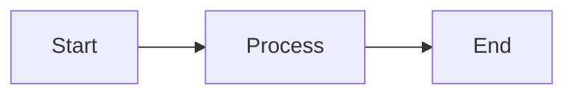

# dialoghelper


<!-- WARNING: THIS FILE WAS AUTOGENERATED! DO NOT EDIT! -->

``` python
from dialoghelper import *
```

``` python
from fastcore import tools
```

## Helpers

------------------------------------------------------------------------

<a
href="https://github.com/AnswerDotAI/dialoghelper/blob/main/dialoghelper/core.py#L51"
target="_blank" style="float:right; font-size:smaller">source</a>

### add_styles

``` python

def add_styles(
    s:str, cls_map:dict=None
):

```

*Add solveit styles to `s`*

``` python
import mistletoe
from fasthtml.common import show
```

``` python
s = mistletoe.markdown("### hi\n\n- first\n- *second*")
s
```

    '<h3>hi</h3>\n<ul>\n<li>first</li>\n<li><em>second</em></li>\n</ul>\n'

``` python
show(s)
```

<h3>hi</h3>
<ul>
<li>first</li>
<li><em>second</em></li>
</ul>

``` python
show(add_styles(s))
```

<h3 class="uk-h3">hi</h3>
<ul class="uk-list uk-list-bullet space-y-0">
<li class="leading-tight">first</li>
<li class="leading-tight"><em>second</em></li>
</ul>

## Basics

------------------------------------------------------------------------

<a
href="https://github.com/AnswerDotAI/dialoghelper/blob/main/dialoghelper/core.py#L68"
target="_blank" style="float:right; font-size:smaller">source</a>

### set_var

``` python

def set_var(
    var:str, val
):

```

*Set var to val after finding it in all frames of the call stack*

------------------------------------------------------------------------

<a
href="https://github.com/AnswerDotAI/dialoghelper/blob/main/dialoghelper/core.py#L64"
target="_blank" style="float:right; font-size:smaller">source</a>

### find_var

``` python

def find_var(
    var:str
):

```

*Search for var in all frames of the call stack*

``` python
a = 1
find_var('a')
```

    1

``` python
set_var('a', 42)
a
```

    42

``` python
# dh_settings = {'port':6001}
```

------------------------------------------------------------------------

<a
href="https://github.com/AnswerDotAI/dialoghelper/blob/main/dialoghelper/core.py#L88"
target="_blank" style="float:right; font-size:smaller">source</a>

### find_msg_id

``` python

def find_msg_id(
    
):

```

\*Get the message id by searching the call stack for \_\_msg_id.\*

------------------------------------------------------------------------

<a
href="https://github.com/AnswerDotAI/dialoghelper/blob/main/dialoghelper/core.py#L76"
target="_blank" style="float:right; font-size:smaller">source</a>

### find_dname

``` python

def find_dname(
    dname:NoneType=None
):

```

\*Get the dialog name by searching the call stack for \_\_dialog_id, and
resolving `dname` if supplied.\*

``` python
find_dname()
```

    '/aai-ws/dialoghelper/nbs/00_core'

``` python
find_dname('index')
```

    '/aai-ws/dialoghelper/nbs/index'

``` python
find_dname('../index')
```

    '/aai-ws/dialoghelper/index'

``` python
find_dname('/foo/bar')
```

    '/foo/bar'

------------------------------------------------------------------------

<a
href="https://github.com/AnswerDotAI/dialoghelper/blob/main/dialoghelper/core.py#L98"
target="_blank" style="float:right; font-size:smaller">source</a>

### call_endp

``` python

def call_endp(
    path, dname:str='', json:bool=False, raiseex:bool=False, id:NoneType=None, data:VAR_KEYWORD
):

```

``` python
find_msg_id()
```

    '_9cbd170d'

------------------------------------------------------------------------

<a
href="https://github.com/AnswerDotAI/dialoghelper/blob/main/dialoghelper/core.py#L110"
target="_blank" style="float:right; font-size:smaller">source</a>

### curr_dialog

``` python

def curr_dialog(
    with_messages:bool=False, # Include messages as well?
    dname:str='', # Dialog to get info for; defaults to current dialog
):

```

*Get the current dialog info.*

------------------------------------------------------------------------

<a
href="https://github.com/AnswerDotAI/dialoghelper/blob/main/dialoghelper/core.py#L120"
target="_blank" style="float:right; font-size:smaller">source</a>

### msg_idx

``` python

def msg_idx(
    id:str=None, # Message id to find (defaults to current message)
    dname:str='', # Dialog to get message index from; defaults to current dialog
):

```

*Get absolute index of message in dialog.*

``` python
msg_idx()
```

    27

------------------------------------------------------------------------

<a
href="https://github.com/AnswerDotAI/dialoghelper/blob/main/dialoghelper/core.py#L130"
target="_blank" style="float:right; font-size:smaller">source</a>

### add_scr

``` python

def add_scr(
    scr, oob:str='innerHTML:#ephemeral'
):

```

*Swap a script element to the end of the ephemeral element*

------------------------------------------------------------------------

<a
href="https://github.com/AnswerDotAI/dialoghelper/blob/main/dialoghelper/core.py#L136"
target="_blank" style="float:right; font-size:smaller">source</a>

### iife

``` python

def iife(
    code:str
)->str:

```

*Wrap javascript code string in an IIFE and execute it via
[`add_html`](https://AnswerDotAI.github.io/dialoghelper/core.html#add_html)*

------------------------------------------------------------------------

<a
href="https://github.com/AnswerDotAI/dialoghelper/blob/main/dialoghelper/core.py#L145"
target="_blank" style="float:right; font-size:smaller">source</a>

### pop_data

``` python

def pop_data(
    idx, timeout:int=15
):

```

------------------------------------------------------------------------

<a
href="https://github.com/AnswerDotAI/dialoghelper/blob/main/dialoghelper/core.py#L149"
target="_blank" style="float:right; font-size:smaller">source</a>

### fire_event

``` python

def fire_event(
    evt:str, data:NoneType=None
):

```

------------------------------------------------------------------------

<a
href="https://github.com/AnswerDotAI/dialoghelper/blob/main/dialoghelper/core.py#L155"
target="_blank" style="float:right; font-size:smaller">source</a>

### event_get

``` python

def event_get(
    evt:str, timeout:int=15, data:NoneType=None
):

```

*Call
[`fire_event`](https://AnswerDotAI.github.io/dialoghelper/core.html#fire_event)
and then
[`pop_data`](https://AnswerDotAI.github.io/dialoghelper/core.html#pop_data)
to get a response*

## View/edit dialog

------------------------------------------------------------------------

<a
href="https://github.com/AnswerDotAI/dialoghelper/blob/main/dialoghelper/core.py#L173"
target="_blank" style="float:right; font-size:smaller">source</a>

### find_msgs

``` python

def find_msgs(
    re_pattern:str='', # Optional regex to search for (re.DOTALL+re.MULTILINE is used)
    msg_type:str=None, # optional limit by message type ('code', 'note', or 'prompt')
    use_case:bool=False, # Use case-sensitive matching?
    use_regex:bool=True, # Use regex matching?
    only_err:bool=False, # Only return messages that have errors?
    only_exp:bool=False, # Only return messages that are exported?
    only_chg:bool=False, # Only return messages that have changed vs git HEAD?
    ids:str='', # Optionally filter by comma-separated list of message ids
    limit:int=None, # Optionally limit number of returned items
    include_output:bool=True, # Include output in returned dict?
    include_meta:bool=True, # Include all additional message metadata
    as_xml:bool=False, # Use concise unescaped XML output format
    nums:bool=False, # Show line numbers?
    trunc_out:bool=False, # Middle-out truncate code output to 100 characters?
    trunc_in:bool=False, # Middle-out truncate cell content to 80 characters?
    headers_only:bool=False, # Only return note messages that are headers (first line only); cannot be used together with `header_section`
    header_section:str=None, # Find section starting with this header; returns it plus all children (i.e until next header of equal or more significant level)
    dname:str='', # Dialog to get info for; defaults to current dialog
)->list: # Messages in requested dialog that contain the given information

```

*Often it is more efficient to call
[`view_dlg`](https://AnswerDotAI.github.io/dialoghelper/core.html#view_dlg)
to see the whole dialog at once, so you can use it all from then on,
instead of using
[`find_msgs`](https://AnswerDotAI.github.io/dialoghelper/core.html#find_msgs).*
If `dname` is None, the current dialog is used. If it is an open dialog,
it will be updated interactively with real-time updates to the browser.
If it is a closed dialog, it will be updated on disk. Dialog names must
be paths relative to solveit root (if starting with `/`,
e.g. `/myproject/dlg`) or relative to the current dialog’s folder (if
not starting with `/`), and should *not* include the .ipynb extension.
**Use absolute paths when targeting dialogs outside the current dialog’s
folder tree.** Message ids are identical to those in LLM chat history,
so do NOT call this to view a specific message if it’s in the chat
history–instead use
[`read_msgid`](https://AnswerDotAI.github.io/dialoghelper/core.html#read_msgid).
Do NOT use find_msgs to view message content in the current dialog above
the current prompt – these are *already* provided in LLM context, so
just read the content there directly. (NB: LLM context only includes
messages *above* the current prompt, whereas
[`find_msgs`](https://AnswerDotAI.github.io/dialoghelper/core.html#find_msgs)
can access *all* messages.) To refer to a found message from code or
tools, use its `id` field.

``` python
# NB: must have a dialogue open including a message with this text in its content
txt = 'tools'
found = find_msgs(txt)
```

``` python
found[0]['content']
```

    '# Solveit Reference\n\n## What is Solveit?\n\nSolveit is a "Dialog Engineering" web application for interactive development. Unlike ChatGPT (pure chat) or Jupyter (pure code), Solveit combines three message types in one workspace: code execution, markdown notes, and AI prompts. Users build solutions incrementally—writing a few lines, understanding them, then continuing—rather than generating large code blocks.\n\nThe AI sees the full dialog context (code, outputs, notes, prompts) when responding -- but only those ABOVE the current message. Users can edit any message at any time, including AI responses—the dialog is a living document, not an append-only log.\n\nThe dialog is a running ipykernel instance. A "dialog" is like a "Jupyter notebook", and uses a compatible ipynb file format, but provides a superset of functionality (in particular, "prompt messages"). A "message" is like a "Jupyter cell", with additional attributes stored as ipynb cell metadata. Most standard jupyter functionality is supported (including cell magics like `%%js`, `%%html`, `%%bash`, and custom magics via `@line_magic`/`@cell_magic` decorators), except for ipywidgets.\n\n## Architecture\n\n- **Instance**: A persistent Linux container (virtual private server) with home dir at `/app/data`. Each user can have multiple instances. Instances have private URLs (for the solveit interface) and public URLs (for hosting apps on port 8000).\n- **Dialog**: An `.ipynb` file containing messages. Each open dialog runs its own Python kernel (ipykernel). Dialogs can be organized into folders.\n- **Kernel**: A running Python 3.12 interpreter maintaining state. Variables persist between code messages. Each dialog has its own isolated kernel. Kernels keep running when navigating away; must explicitly stop via UI or shutdown. Use `%load_ext autoreload` and `%autoreload 2` to auto-reload modules when files change.\n\n### CRAFT and TEMPLATE Files\n\n**CRAFT.ipynb** files provide reusable AI context and auto-executed code for a folder:\n- **Note/prompt messages** are prepended to the AI\'s context for all dialogs in that folder and subfolders\n- **Code messages** are automatically executed in the kernel when opening a dialog\n\n**TEMPLATE.ipynb** files serve as dialog templates—their cells are prepended to new dialogs created in that folder.\n\nBoth use path hierarchy: files from parent folders are included too, letting you build layered configurations (e.g., org-wide settings in root, project-specific in subfolders).\n\n\n## Message Types\n\n| Type | Purpose | Input | Output |\n|------|---------|-------|--------|\n| `code` | Python execution | Python source | ipynb-format output list (stream, execute_result, display_data, error) |\n| `note` | Documentation | Markdown with optional attachments | None |\n| `prompt` | AI interaction | User question/instruction | AI response (markdown string) |\n| `raw` | Frontmatter/metadata | Raw text (no processing, no variable injection) | None |\n\n### Output Editing\n- **Prompt outputs**: Editable via `n` key or clicking title bar. Can undo AI responses with `Cmd+Z`.\n- **Code outputs**: NOT directly editable. Clear with `Backspace`, or re-run message.\n\n## AI Context System\n\nWhen a user sends a prompt, solveit builds context for the AI:\n\n1. **Message Collection**: Gather all messages up to and including the current prompt\n2. **Filtering**: Exclude messages where `skipped=True` (hidden via `h` key or 👁️ button). Hiding propagates to children when applied to a collapsed section.\n3. **Truncation**: If total tokens exceed model limit, oldest non-pinned messages are dropped\n4. **History**: Messages grouped into chunks by prompt boundaries and LLM history recreated\n\n### Pinning (`p` key)\nPinned messages serve three purposes:\n- **Context preservation**: Pinned messages stay available even when long dialogs get truncated\n- **Export control**: Pinned messages are excluded from exports (Python files, gists, published dialogs)\n- **Bulk management**: Pinning a collapsed header pins all child messages too\n\nUse for API docs, examples, and reference materials that should persist but not be exported.\n\n**Context Window Implications**: The AI only sees messages ABOVE the current prompt. Working at the bottom of a dialog includes MORE context (all messages above). Working higher up includes LESS context. Adding messages earlier in the dialog doesn\'t increase context for prompts below them.\n\n### Variable and Expression Injection\nUsers can inject Python values into AI context using **$`name`** syntax in prompts. This works with:\n- **Variables**: `$`myvar`` — injects the current value\n- **Expressions**: `$`len(items)`**, `$`df.shape`**, `$`random()`** — evaluated fresh each prompt\n\nWhen the AI sees the prompt, values are fetched from the kernel and included in a separate section of the chat history. Expressions are re-evaluated on every prompt, so `$`random()`** gives a new value each time.\n\nImages stored in variables (as bytes) are also supported and sent as base64, as are message image attachments if referred to in the content in a link with a `#ai` hash.\n\n## Tools System\n\nTools let the AI call Python functions to accomplish tasks. This is the mechanism for AI to read files, search code, modify the dialog, etc.\n\n### Exposing Tools\nUsers declare tools in any message using & followed by `function_name` or followed by `[func1, func2, func3]`. Solveit then:\n\n1. Finds the function in the kernel\'s namespace\n2. Extracts the schema from type annotations and docstring\n3. Sends the schema to the AI via standard tool calling mechanisms\n4. When AI calls the tool, solveit executes `function_name(**kwargs)` in the kernel\n5. Returns the result to the AI\n\n### Tool Requirements\nA function becomes a valid tool if it has:\n- Type annotations for ALL parameters\n- A docstring describing what it does\n- Fastcore param docments are passed in the json schema if present\n\n```python\ndef get_user(user_id: int) -> dict:\n    "Fetch user data by ID."\n    return {"id": user_id, "name": "Alice"}\n```\n\n### Built-in Tools (dialoghelper.stdtools)\nWhen `use_tools` setting is enabled (🔧 wrench icon), tools from `dialoghelper.stdtools` are added. This includes:\n- File tools: `view`, `create`, `insert`, `str_replace`, `strs_replace`, `replace_lines`\n- Search tools: `rg`, `sed`, `ast_grep`\n- Dialog tools: `add_msg`, `update_msg`, `find_msgs`, `read_msg`, `read_msgid`\n- Inspection tools: `symsrc`, `getval`, `getdir`, `gettype`, `symlen`, `symslice`, `symsearch`\n- Web tools: `read_url`, `web_search`\n\n### dialoghelper Module\nThe `dialoghelper` module provides functions for programmatic dialog manipulation:\n- `add_msg(content, msg_type=\'note\')` - Add message below current\n- `update_msg(idx, content, msg_type=None)` - Update existing message\n- `del_msg(idx)` - Delete message\n- `find_msgs(pattern)` - Search messages by content\n- `read_msg()` - Read message at index\n- `url2note(url)` - Fetch URL and add as markdown note\n- `tool_info()` - Show available tools in a note for AI\n\n### Tool Choice Modes\n- `use_tools=True` + `use_fence=False`: AI can call tools directly (tool_choice=auto)\n- `use_tools=True` + `use_fence=True`: AI writes fenced code blocks instead; only `read_url` available as direct tool (tool_choice=read_url for Claude, none for Gemini)\n\n### Tool Result Handling\nTool results are truncated if too long, to 2000 chars. The `ToolResponse` class can wrap results with metadata.\n\n## File System\n\n- `datapath`: `/app/data` (production) or current working directory (local/test)\n- Dialogs stored at: `{datapath}/some/folders/{dialog_name}.ipynb`\n- Static files served at: `/static/some/folders/` → maps to `{datapath}/some/folders/`\n- Per-dialog Python modules: `{datapath}/some/folders/{dialog_name}.py` (auto-generated from exported messages)\n\n### Dialog Persistence\nDialogs are saved as Jupyter notebooks (`.ipynb`). Solveit converts messages to notebook cells when saving:\n- `note`/`prompt` → markdown cells\n  - Prompt responses stored by appending to message content with separator\n- `code`/`raw` → code/raw cells\n- Metadata stored in cell metadata (skipped, pinned, collapsed states, etc.)\n\n## Keyboard Shortcuts (Selection Mode)\n\nWhen not editing (blue border shows selected message):\n- `↑/↓` or `j/k`: Navigate messages\n- `a/b`: Add message above/below\n- `x/c/v`: Cut/copy/paste messages (`c` also copies to system clipboard as markdown)\n- `,`: Copy message input to clipboard\n- `.`: Copy message output to clipboard\n- `h`: Toggle hidden from AI (`skipped`)\n- `p`: Toggle pinned\n- `e`: Toggle export\n- `1-6`: Set heading level (converts to `## Heading` etc.)\n- `Enter`: Edit selected message\n- `Cmd+Enter`: Run code or send prompt (stay on message)\n- `Shift+Enter`: Run and go to next message\n- `Opt+Enter`: Run and create new message\n- `Shift+R`: Restart kernel\n- `Shift+T`: Open terminal\n- `Shift+S`: Stop AI/code execution\n- `Shift+A/B`: Run all code above/below (skips prompts)\n- `Cmd+Slash`: Toggle comments on code messages\n- `w`: Extract fenced code blocks to new code messages\n- `n`: Edit AI response (output) of prompt message\n- `Cmd+Shift+J/K/L/;`: Switch to code/note/prompt/raw mode\n- `←/→`: Collapse/expand section (based on markdown headers)\n- `r`: Re-run all code messages in dialog (skips prompts)\n- `m`: Copy code blocks from AI response\n- `d`: Duplicate dialog (opens duplicate with bomb icon 💣 to discard)\n- `s`: Save dialog (commits to git if versioning enabled)\n- `0`: Jump to last edited message\n- `/`: Focus bottom editor/input field\n- `Shift+Esc`: Focus back on message list\n- `Home/End`: Jump to first/last message\n- `Cmd+A`: Select all messages\n- `F`: Open find/search modal (`Shift+F` to clear filters)\n- `Backspace`: Clear outputs from selected message(s)\n- `i/o`: Toggle collapse on message input/output\n- `Shift+O`: Clamp output height\n\n### Editor Shortcuts\nWhen editing a message:\n- `Shift+Tab`: Show parameter info/documentation\n- `Cmd+I`: Manually trigger symbol dropdown\n- `Ctrl+Shift+Minus`: Split message at cursor\n- `Cmd+Shift+Comma`: Screenshot last output into context\n- `Cmd+Shift+Period`: Super completion (prefill in prompts) or super edit (with selection)\n- `Cmd+Shift+S`: Save file (in full-page editor view)\n- `ESC`: Save changes and exit edit mode\n- `→` (Right Arrow): Accept ghost text suggestion\n- `Tab`: Select from symbol dropdown\n\n## AI Modes\n\nSet per-dialog, affects AI behavior:\n\n| Mode | Behavior | Ghost Text |\n|------|----------|------------|\n| `learning` | Pedagogical, asks clarifying questions, explains step-by-step | Disabled by default |\n| `concise` | Minimal responses, compact code, no boilerplate | Enabled |\n| `standard` | Default Claude behavior, verbose explanations | Enabled |\n\n## Ghost Text / Completions\n\n### Ghost Text\nInline AI suggestions as you type (faded gray text). Uses smaller/faster FIM model. Press `→` to accept.\n\n### Super Completions (`Cmd+Shift+.`)\nUses main model for larger completions. Can prefill AI response start in prompt messages.\n\n### Super Edits\nSelect text + `Cmd+Shift+.` + instruction → AI rewrites selection. Uses `edit_call()` with GPT-4.1.\n\n## Export System\n\n### Message Export\nPress `e` on code message to mark `is_exported=True`. Adds `#| export` marker. When dialog is saved, exported messages are combined into `{dialog_name}.py`.\n\n### Publish\nSee "Publishing and Sharing" section for full details. Creates shareable view at `share.solve.it.com`. Pinned messages excluded.\n\n### Download Options\n- `.ipynb`: Full notebook\n- `.py` (Full Script): All code messages concatenated  \n- `.py` (Exported): Only `is_exported=True` messages\n- `.md`: Markdown format\n- GitHub Gist: Upload to gist\n\n## FastHTML Integration\n\nSolveit is built with FastHTML. Users can also build FastHTML apps inside dialogs:\n\n```python\nfrom fasthtml.common import *\nfrom fasthtml.jupyter import JupyUvi\n\napp = FastHTML()\nrt = app.route\n\n@rt\ndef index(): return H1("Hello")\n\nsrv = JupyUvi(app)  # Serves on port 8000 → accessible at public URL\n```\n\n`JupyUvi` runs uvicorn in a way compatible with notebook contexts. Changes to routes take effect immediately without restart.\n\n**Note**: The root route `/` is used by Solveit itself. Use different routes like `@rt def homepage()` for your app\'s entry point.\n\n### Rendering Components\n- `render_ft()` - Render FastHTML components as HTML in message outputs\n- `show()` - Alternative with optional iframe wrapping and HTMX processing\n\n## Feature Flags (Secrets)\n\nStored in `solveit_settings.json` under `secrets` key. Accessed via `get_secret(name)`.\n\n| Flag | Values | Effect |\n|------|--------|--------|\n| `USE_KATEX` | `1`/`true` | Enable LaTeX with safe delimiters (`$$`, `\\[`, `\\(`) |\n| `USE_KATEX` | `dollar` | Also enable `$...$` inline math |\n| `USE_VIM` | any truthy | Vim keybindings in editor |\n\n## Image Handling\n\n### Pasted Images\nPaste into note/prompt → stored as message attachment → visible to AI automatically.\n\nIf the clipboard contains both an image AND HTML (e.g., from a DOM screenshot tool), solveit automatically appends the HTML in a fenced code block after the image link—useful for sharing UI screenshots with their underlying markup.\n\nAttachments are stored in notebook message metadata (standard Jupyter format), referenced as ``. Attachments are message-specific—cannot be referenced from other messages.\n\n### Markdown Images\n- `` in notes → displays but NOT sent to AI\n- `` → displays AND sent to AI\n- For reusable images, save to `/app/data/` and use `/static/` URLs\n\n### Code Output Images\nImages in code output (matplotlib, PIL) are captured and can be sent to AI.\n\n### Static Images\nUse `/static/` URLs to reference files in `/app/data/`. Example: `Img(src=\'/static/myapp/image.png\')` for FastHTML, or `` in markdown.\n\n## Collapsible Sections\n\nMarkdown headings (`# H1` through `###### H6`) create collapsible sections:\n- `heading_collapsed=True` on heading message → children have `hidden=True`\n- Token count shows: `heading_tokens + hidden_content_tokens`\n- Cut/copy on collapsed heading includes all children\n- `←` jumps to section start, `→` to section end\n\n## Token Counting\n\nToken counts estimated and used for:\n- Display in UI (message headers show token counts)\n- Context truncation decisions\n- Image tokens calculated separately\n\n## Error Handling\n\n- Errors trigger `msg.uncollapse()` to show the problematic message\n\n## Settings\n\nStored in `{datapath}/solveit_settings.json`. Common settings:\n- `use_tools`: Enable standard tools (🔧 wrench icon in navbar)\n- `use_fence`: Use fenced code mode (AI writes code blocks instead of tool calls)\n- `use_thinking`: Enable extended thinking mode (🧠 brain icon in navbar, or `Cmd+Shift+D`)\n- `default_code`: After AI response, default to code mode (not prompt)\n\n## Feature Flags (Secrets)\n\nStored in `solveit_settings.json` under `secrets` key. Accessed via `get_secret(name)`.\n\n| Flag | Values | Effect |\n|------|--------|--------|\n| `USE_KATEX` | `1`/`true` | Enable LaTeX with safe delimiters (`$$`, `\\[`, `\\(`) |\n| `USE_KATEX` | `dollar` | Also enable `$...$` inline math |\n| `USE_VIM` | any truthy | Vim keybindings in editor |\n## UI Controls\n\n### Header Bar\n\nFrom left to right:\n\n**Left section:**\n| Element | Description |\n|---------|-------------|\n| 📚 **solveit** | Logo/home link - closes dialog, returns to dialog list |\n| 🟢 Green dot | WebSocket connection indicator |\n| Dialog name | Editable - click to rename dialog |\n\n**Mode dropdown:**\n| Element | Description |\n|---------|-------------|\n| `learning`/`standard`/`concise` | AI mode selector - affects response style and ghost text |\n\n**Toggle group (blue when active):**\n| Icon | Tooltip | Setting | Shortcut |\n|------|---------|---------|----------|\n| `<>` | "Default new message type to code?" | `default_code` | — |\n| 🔧 | "Include dialoghelper standard tools in prompts?" | `use_tools` | — |\n| 🧠 | "Use reasoning model" | `use_thinking` | `Cmd+Shift+D` |\n| Fence | "Use fenced blocks instead of tools?" | `use_fence` | — |\n\n**Action buttons:**\n| Icon | Tooltip | Action | Shortcut |\n|------|---------|--------|----------|\n| ? | "Keyboard Shortcuts" | Open info modal | `?` |\n| Git | "Checkpoint" | Create git checkpoint | `Shift+C` |\n| Share | "Share your dialog" | Publish to share.solve.it.com | — |\n| Cloud ↑ | "Upload File" | Open upload modal | — |\n| ⊗ | "Stop" | Stop AI/code execution | `Shift+S` |\n| ▶ | "Run all" | Run all code messages | `r` |\n| ↺ | "Restart" | Restart Python kernel | `Shift+R` |\n| ⚙ | "Settings" | Open settings modal | — |\n| Copy+ | "Duplicate Dialog" | Duplicate and open | `d` |\n| 💣 | "DELETE and close" | Delete duplicate (hidden until duplicated) | — |\n| Terminal | "Open Terminal" | Open terminal in new tab | `Shift+T` |\n| TOC | "Contents" | Toggle sidebar | `Ctrl+Shift+V` |\n| ↗ | "Dialogs" | Open dialog list in new tab | — |\n\n### Message Bar\n\nEach message has a header bar for input (and optionally output). Click the header text to edit.\n\n**Left side:**\n| Element | Description |\n|---------|-------------|\n| Message type | `Code`, `Note`, `Prompt`, or `Raw` |\n| Token count | Estimated tokens for this message |\n\n**Button bar (left to right):**\n| Icon | Tooltip | Shortcut | Action |\n|------|---------|----------|--------|\n| 📋 | "Copy" | `,` | Copy message to clipboard |\n| ▷ | "Run Message" | `Cmd+Enter` | Execute code or send prompt (code/prompt only) |\n| 👁 | "Toggle AI visibility" | `h` | Hide/show message from AI context |\n| 🔖 | "Toggle message export" | `e` | Mark for export to .py file |\n| 🗑 | "Delete Message" | `Shift+D` | Delete this message |\n| ↑⚡ | "Delete above" | — | Delete all messages above (confirms) |\n| ↓⚡ | "Delete below" | — | Delete all messages below (confirms) |\n| ↳ | "Run Above" | `Shift+A` | Run all code messages above |\n| ↲ | "Run Below" | `Shift+B` | Run all code messages below |\n| ↑ | "Add Above" | `a` | Insert new message above |\n| ↓ | "Add Below" | `b` | Insert new message below |\n| 📖↑ | "Shift up" | — | Move message up |\n| 📖↓ | "Shift down" | — | Move message down |\n| 💬+ | "Add copy of message" | `q` | Duplicate this message |\n| 🔀 | "Merge with message below" | `Shift+M` | Combine with next message |\n| ✂️ | "Split note based on headings" | `Ctrl+Shift+Minus` | Split into multiple messages |\n| 📌 | "Toggle message pin" | `p` | Pin/unpin message |\n| 🔗 | "Copy link to message" | — | Copy URL with message anchor |\n| ⌃ | "Collapse contents" | `i` | Collapse/expand input |\n| ↗ | "Open in new tab" | `t` | View message in standalone tab |\n\n### Message Output Bar\n\nOnly code and prompt messages have outputs. Click the header text to edit (prompt outputs only—code outputs are not editable).\n\n**Left side:**\n| Element | Description |\n|---------|-------------|\n| Label | `Output` (code) or `Assistant` (prompt) |\n| Token count | Estimated tokens for this output |\n\n**Button bar (left to right):**\n| Icon | Tooltip | Shortcut | Action |\n|------|---------|----------|--------|\n| 📋 | "Copy" | `.` | Copy output to clipboard |\n| 📋 | "Copy code" | `m` | Copy fenced code blocks to clipboard |\n| 💬+ | "Add fenced block messages" | `w` | Extract fenced blocks to new code messages |\n| ✨ | "Re-run AI" | — | Re-send prompt to AI (prompt outputs only) |\n| ⌃ | "Collapse contents" | `o` | Collapse/expand output |\n| ↗ | "Open in new tab" | `t` | View output in standalone tab |\n## Terminal\n\nPress `Shift+T` to open an integrated terminal in the current dialog\'s folder. Useful for:\n- File operations (`ls`, `mv`, `rm`, etc.)\n- Git commands\n- Package installation (`pip install`)\n- Running shell scripts\n\n## Find/Search\n\nPress `F` to open find modal (selection mode, not editing). Features:\n- Regex search across message content and outputs\n- Filter by message type (colored buttons match UI colors)\n- Filter by whether changed in git diff\n- Searches inside collapsed sections (auto-expands on match)\n- `Shift+F` clears all filters\n\n## Dialog Duplication and Branching\n\nPress `d` to duplicate current dialog. The duplicate opens immediately, with a bomb icon (💣) added to the navbar. This supports a "branching" workflow:\n- Duplicate before experimenting with risky changes\n- If the branch is useful, keep it\n- If not, click the bomb icon to delete and return to the original\n\n## Git/Versioning System\n\nSolveit integrates git for version control at the folder level.\n\n### Enabling Versioning\nClick "Enable versioning" button in any folder to initialize a git repo there. Can create nested repos (repo-in-repo) at any directory level.\n\n### Saving and Committing\n- Press `s` to save the dialog and auto-commit with Solveit\'s distinctive message template\n- Dialogs auto-save on most actions (submit, cancel edit, etc.) but do not commit without `s` or checkpoint\n\n### Checkpoints\nClick "checkpoint" button (appears after versioning enabled) to create a manual commit with a custom message. Useful for marking significant milestones.\n\n### Squashing\nSolveit automatically squashes commits that match its auto-save message template. This keeps history clean—many small saves become one commit, while checkpoint commits with custom messages are preserved.\n\n### Publish Button\nCreates a read-only shareable view at `https://share.solve.it.com/d/[hash]`. Pinned messages are excluded from published output.\n\nURL suffixes:\n- `.html` - Blog-style rendered view\n- `.md` - Raw markdown\n\n## Dialog index page\n\nThe dialog index page lists dialogs and folders in the current folder, along with clickable breadcrumb path.\n\nClick "show all files" to also show non ipynb files, which can be opened in the file editor. By each file or folder are buttons to duplicate or delete it.\n\nOther features of this page:\n- Secrets management (API keys stored as environment variables)\n- Running dialogs (can shut down here)\n- Upload files/folders (zip and unzip for folders)\n\n### Keyboard Shortcuts\n\n| Key | Action |\n|-----|--------|\n| `↑/↓` | Navigate rows |\n| `Enter` | Open dialog/folder |\n| `N` | Focus "new dialog" input |\n| `T` | Open terminal |\n| `D` | Delete selected |\n| `C` | Duplicate selected |\n\n\n### Secrets\nAdd name-value pairs in Secrets section. Common secrets:\n- `ANTHROPIC_API_KEY`, `OPENAI_API_KEY` - LLM API access\n- `AOC_SESSION` - Advent of Code session cookie\n- `USE_KATEX`, `USE_VIM` - Feature flags (see Feature Flags section)\n\nSecrets load when opening a dialog or terminal; add secret then open new dialog to use it.\n\n### Show All Files\nToggle in dialog list view to see all files, not just `.ipynb` dialogs. Enables:\n- Click text files to open in Monaco editor (VS Code-based)\n- Download files via three-dot menu\n\n## Folder Operations\n\n- Create folders: `mkdir` in terminal, or create dialog with path like `newfolder/dialogname`\n- Move dialogs to folders: Rename dialog to include folder path (e.g., `myfolder/mydialog`)\n\n## Dashboard\n\nThe dashboard at `solve.it.com/dashboard` provides:\n- Instance management (start/stop/restart; rename public instance and get URL; share; allow guests)\n- Live session times for courses\n- Version updates (stop → wait → start to upgrade)\n\n### Instance Sharing (Dashboard)\n- **Copy Public URL**: Get URL for apps running on port 8000 (one URL per instance, all dialogs share it)\n- **Share button**: Add collaborators by email (requires Solveit account)\n- **Lock icon (Allow Guests)**: Enable public access to entire instance without authentication\n\n## Raw Message Type\n\nRaw messages (`Cmd+Shift+;`) are for content that shouldn\'t be processed:\n- Large documents as AI context (no sidebar headings, no variable injection)\n- Quarto/YAML frontmatter\n- Content with special characters that might interfere with markdown\n\nAccess any message content programmatically in dialoghelper: `read_msg()[\'msg\'][\'content\']` from code message below it.'

``` python
1+1
```

    2

``` python
r = find_msgs(r'1\+1', include_meta=False, include_output=True)
r
```

    [{'id': '_8ce548d6', 'is_exported': 0, 'content': '1+1', 'output': '2', 'msg_type': 'code'}, {'id': '_44cb1b2a', 'is_exported': 0, 'content': "_id = _add_msg_unsafe('1+1', run=True, msg_type='code')", 'output': '', 'msg_type': 'code'}, {'id': '_6e354677', 'is_exported': 0, 'content': '1+1', 'output': '', 'msg_type': 'code'}]

``` python
hl_md(find_msgs(r'1\+1', include_meta=False, as_xml=True))
```

``` html
<msgs><code id="_8ce548d6"><source>1+1<out>2</out></code><code id="_44cb1b2a">_id = _add_msg_unsafe('1+1', run=True, msg_type='code')</code><code id="_6e354677">1+1</code></msgs>
```

------------------------------------------------------------------------

<a
href="https://github.com/AnswerDotAI/dialoghelper/blob/main/dialoghelper/core.py#L206"
target="_blank" style="float:right; font-size:smaller">source</a>

### view_dlg

``` python

def view_dlg(
    dname:str='', # Dialog to get info for; defaults to current dialog
    msg_type:str=None, # optional limit by message type ('code', 'note', or 'prompt')
    nums:bool=False, # Whether to show line numbers
    include_output:bool=False, # Include output in returned dict?
    trunc_out:bool=True, # Middle-out truncate code output to 100 characters (only applies if `include_output`)?
    trunc_in:bool=False, # Middle-out truncate cell content to 80 characters?
):

```

*Concise XML view of all messages (optionally filtered by type), not
including metadata. Often it is more efficient to call this to see the
whole dialog at once (including line numbers if needed), instead of
running
[`find_msgs`](https://AnswerDotAI.github.io/dialoghelper/core.html#find_msgs)
or
[`read_msg`](https://AnswerDotAI.github.io/dialoghelper/core.html#read_msg)
multiple times.*

``` python
hl_md(view_dlg(nums=True)[:500])
```

``` html
<msgs><code id="_955b9784">     1 │ #| default_exp core</code><note id="_3093ead7">     1 │ # Solveit Reference
     2 │ 
     3 │ ## What is Solveit?
     4 │ 
     5 │ Solveit is a "Dialog Engineering" web application for interactive development. Unlike ChatGPT (pure chat) or Jupyter (pure code), Solveit combines three message types in one workspace: code execution, markdown notes, and AI prompts. Users build solutions incrementally—writing a few lines, understanding them, then continuing—rath
```

------------------------------------------------------------------------

<a
href="https://github.com/AnswerDotAI/dialoghelper/blob/main/dialoghelper/core.py#L219"
target="_blank" style="float:right; font-size:smaller">source</a>

### add_html

``` python

def add_html(
    content:str, # The HTML to send to the client (generally should include hx-swap-oob)
    dname:str='', # Dialog to get info for; defaults to current dialog
):

```

*Send HTML to the browser to be swapped into the DOM*

``` python
from fasthtml.common import *
```

``` python
add_html(Div(P('Hi'), hx_swap_oob='beforeend:#dialog-container'))
```

    {'success': 'Content added to DOM'}

------------------------------------------------------------------------

<a
href="https://github.com/AnswerDotAI/dialoghelper/blob/main/dialoghelper/core.py#L232"
target="_blank" style="float:right; font-size:smaller">source</a>

### read_msg

``` python

def read_msg(
    n:int=-1, # Message index (if relative, +ve is downwards)
    relative:bool=True, # Is `n` relative to current message (True) or absolute (False)?
    id:str=None, # Message id to find (defaults to current message)
    view_range:list=None, # Optional 1-indexed (start, end) line range for files, end=-1 for EOF
    nums:bool=False, # Whether to show line numbers
    dname:str='', # Dialog to get info for; defaults to current dialog
):

```

*Get the message indexed in the current dialog.* NB: Messages in the
current dialog above the current message are *already* visible; use this
only when you need line numbers for editing operations, or for messages
not in the current dialog or below the current message. - To get the
exact message use `n=0` and `relative=True` together with `id`. - To get
a relative message use `n` (relative position index). - To get the nth
message use `n` with `relative=False`, e.g `n=0` first message, `n=-1`
last message. If `dname` is None, the current dialog is used. If it is
an open dialog, it will be updated interactively with real-time updates
to the browser. If it is a closed dialog, it will be updated on disk.
Dialog names must be paths relative to solveit root (if starting with
`/`, e.g. `/myproject/dlg`) or relative to the current dialog’s folder
(if not starting with `/`), and should *not* include the .ipynb
extension. **Use absolute paths when targeting dialogs outside the
current dialog’s folder tree.**

------------------------------------------------------------------------

<a
href="https://github.com/AnswerDotAI/dialoghelper/blob/main/dialoghelper/core.py#L255"
target="_blank" style="float:right; font-size:smaller">source</a>

### read_msgid

``` python

def read_msgid(
    id:str, # Message id to find
    view_range:list=None, # Optional 1-indexed (start, end) line range for files, end=-1 for EOF
    nums:bool=False, # Whether to show line numbers
    dname:str='', # Dialog to get message from; defaults to current dialog
):

```

*Get message `id`. Message IDs can be view directly in LLM chat
history/context, or found in
[`find_msgs`](https://AnswerDotAI.github.io/dialoghelper/core.html#find_msgs)
results.* If `dname` is None, the current dialog is used. If it is an
open dialog, it will be updated interactively with real-time updates to
the browser. If it is a closed dialog, it will be updated on disk.
Dialog names must be paths relative to solveit root (if starting with
`/`, e.g. `/myproject/dlg`) or relative to the current dialog’s folder
(if not starting with `/`), and should *not* include the .ipynb
extension. **Use absolute paths when targeting dialogs outside the
current dialog’s folder tree.**

------------------------------------------------------------------------

<a
href="https://github.com/AnswerDotAI/dialoghelper/blob/main/dialoghelper/core.py#L267"
target="_blank" style="float:right; font-size:smaller">source</a>

### add_msg

``` python

def add_msg(
    content:str, # Content of the message (i.e the message prompt, code, or note text)
    placement:str='add_after', # Can be 'at_start' or 'at_end', and for default dname can also be 'add_after' or 'add_before'
    id:str=None, # id of message that placement is relative to (if None, uses current message; note: each add_msg updates "current" to the newly created message)
    msg_type:str='note', # Message type, can be 'code', 'note', or 'prompt'
    output:str='', # Prompt/code output; Code outputs must be .ipynb-compatible JSON array
    time_run:str | None='', # When was message executed
    is_exported:int | None=0, # Export message to a module?
    skipped:int | None=0, # Hide message from prompt?
    i_collapsed:int | None=0, # Collapse input?
    o_collapsed:int | None=0, # Collapse output?
    heading_collapsed:int | None=0, # Collapse heading section?
    pinned:int | None=0, # Pin to context?
    dname:str='', # Dialog to get info for; defaults to current dialog. If passed, provide `id` or use `placement='at_start'`/`'at_end'`
):

```

*Add/update a message to the queue to show after code execution
completes.* If `dname` is None, the current dialog is used. If it is an
open dialog, it will be updated interactively with real-time updates to
the browser. If it is a closed dialog, it will be updated on disk.
Dialog names must be paths relative to solveit root (if starting with
`/`, e.g. `/myproject/dlg`) or relative to the current dialog’s folder
(if not starting with `/`), and should *not* include the .ipynb
extension. **Use absolute paths when targeting dialogs outside the
current dialog’s folder tree.**

``` python
print(__msg_id)
_id = add_msg('testing')
print(__msg_id)
```

    _9c544573
    _484f8955

``` python
print(read_msg().content)
```

    testing

[`read_msg`](https://AnswerDotAI.github.io/dialoghelper/core.html#read_msg)
(and all endpoints that return json) wrap responses in `dict2obj`, so
you can use either dict or object syntax.

``` python
bmsg = add_msg('at bottom', placement='at_end')
```

``` python
assert(msg_idx(bmsg)>msg_idx(_id)+10)
```

``` python
# dh_settings['dname'] = 'tmp'
# _id = add_msg('testing', placement='at_end')
# print(_id)
# del(dh_settings['dname'])
```

------------------------------------------------------------------------

<a
href="https://github.com/AnswerDotAI/dialoghelper/blob/main/dialoghelper/core.py#L296"
target="_blank" style="float:right; font-size:smaller">source</a>

### del_msg

``` python

def del_msg(
    id:str=None, # id of message to delete
    dname:str='', # Dialog to get info for; defaults to current dialog
):

```

*Delete a message from the dialog. DO NOT USE THIS unless you have been
explicitly instructed to delete messages.*

``` python
del_msg(bmsg)
del_msg(_id)
```

``` python
{'status': 'success'}
```

``` python
_id = _add_msg_unsafe('1+1', run=True, msg_type='code')
```

``` python
del_msg(_id)
```

``` python
{'status': 'success'}
```

``` python
_id = _add_msg_unsafe('Hi', run=True, msg_type='prompt')
```

``` python
del_msg(_id)
```

``` python
{'status': 'success'}
```

------------------------------------------------------------------------

<a
href="https://github.com/AnswerDotAI/dialoghelper/blob/main/dialoghelper/core.py#L340"
target="_blank" style="float:right; font-size:smaller">source</a>

### update_msg

``` python

def update_msg(
    id:str=None, # id of message to update (if None, uses current message)
    msg:Optional=None, # Dictionary of field keys/values to update
    dname:str='', # Dialog to get info for; defaults to current dialog
    content:str | None=None, # Content of the message (i.e the message prompt, code, or note text)
    msg_type:str | None=None, # Message type, can be 'code', 'note', or 'prompt'
    output:str | None=None, # Prompt/code output; Code outputs must be .ipynb-compatible JSON array
    time_run:str | None=None, # When was message executed
    is_exported:int | None=None, # Export message to a module?
    skipped:int | None=None, # Hide message from prompt?
    i_collapsed:int | None=None, # Collapse input?
    o_collapsed:int | None=None, # Collapse output?
    heading_collapsed:int | None=None, # Collapse heading section?
    pinned:int | None=None, # Pin to context?
):

```

*Update an existing message. Provide either `msg` OR field key/values to
update.* - Use `content` param to update contents. - Only include
parameters to update–missing ones will be left unchanged. If `dname` is
None, the current dialog is used. If it is an open dialog, it will be
updated interactively with real-time updates to the browser. If it is a
closed dialog, it will be updated on disk. Dialog names must be paths
relative to solveit root (if starting with `/`, e.g. `/myproject/dlg`)
or relative to the current dialog’s folder (if not starting with `/`),
and should *not* include the .ipynb extension. **Use absolute paths when
targeting dialogs outside the current dialog’s folder tree.**

``` python
_id = add_msg('testing')
```

``` python
_id = update_msg(_id, content='toasting')
```

``` python
_id = update_msg(_id, skipped=1)
```

``` python
msg = read_msgid(_id)
msg['content'] = 'toasted'
update_msg(msg=msg)
```

    '_e8ea44b9'

``` python
del_msg(_id)
```

``` python
{'status': 'success'}
```

``` python
_edit_id = add_msg('This message should be found.\n\nThis is a multiline message.')
```

``` python
print(read_msg()['content'])
```

    This message should be found.

    This is a multiline message.

``` python
print(read_msg(n=0, id=_edit_id, nums=True)['content'])
```

         1 │ This message should be found.
         2 │ 
         3 │ This is a multiline message.

``` python
print(read_msg(n=0, id=_edit_id, nums=True, view_range=[2,3])['content'])
```

         2 │ 
         3 │ This is a multiline message.

------------------------------------------------------------------------

<a
href="https://github.com/AnswerDotAI/dialoghelper/blob/main/dialoghelper/core.py#L357"
target="_blank" style="float:right; font-size:smaller">source</a>

### run_msg

``` python

def run_msg(
    ids:str=None, # Comma-separated ids of message(s) to execute
    dname:str='', # Running dialog to get info for; defaults to current dialog. (Note dialog *must* be running for this function)
):

```

*Adds a message to the run queue. Use read_msg to see the output once it
runs.*

``` python
1+1
```

    2

    2

``` python
codeid = read_msg()['id']
```

``` python
run_msg(codeid)
```

    '{"status":"queued"}'

------------------------------------------------------------------------

<a
href="https://github.com/AnswerDotAI/dialoghelper/blob/main/dialoghelper/core.py#L366"
target="_blank" style="float:right; font-size:smaller">source</a>

### copy_msg

``` python

def copy_msg(
    ids:str=None, # Comma-separated ids of message(s) to copy
    cut:bool=False, # Cut message(s)? (If not, copies)
    dname:str='', # Running dialog to copy messages from; defaults to current dialog. (Note dialog *must* be running for this function)
):

```

*Add `ids` to clipboard.*

------------------------------------------------------------------------

<a
href="https://github.com/AnswerDotAI/dialoghelper/blob/main/dialoghelper/core.py#L378"
target="_blank" style="float:right; font-size:smaller">source</a>

### paste_msg

``` python

def paste_msg(
    id:str=None, # Message id to paste next to
    after:bool=True, # Paste after id? (If not, pastes before)
    dname:str='', # Running dialog to copy messages from; defaults to current dialog. (Note dialog *must* be running for this function)
):

```

*Paste clipboard msg(s) after/before the current selected msg (id).*

``` python
copy_msg(codeid)
```

    {'success': 'complete'}

``` python
tgt = read_msg()['id']
```

``` python
paste_msg(tgt)
```

    {'success': 'complete'}

``` python
newmsg = read_msg(1, id=tgt)
newmsg['content']
```

    '1+1'

``` python
del_msg(newmsg['id'])
```

``` python
{'status': 'success'}
```

------------------------------------------------------------------------

<a
href="https://github.com/AnswerDotAI/dialoghelper/blob/main/dialoghelper/core.py#L390"
target="_blank" style="float:right; font-size:smaller">source</a>

### enable_mermaid

``` python

def enable_mermaid(
    
):

```

``` python
enable_mermaid()
```

``` html
<script type="module">
if (window.mermaid) mermaid.run()
else {
    import('https://cdn.jsdelivr.net/npm/mermaid@11/dist/mermaid.esm.min.mjs').then(m => {
        window.mermaid = m.default;
        window.mermaid.run();
        htmx.onLoad(elt => {
            if (elt.matches('div.mermaid, pre.mermaid') || htmx.findAll(elt, 'div.mermaid, pre.mermaid')) window.mermaid.run();
        });
    });
}</script>
```

------------------------------------------------------------------------

<a
href="https://github.com/AnswerDotAI/dialoghelper/blob/main/dialoghelper/core.py#L404"
target="_blank" style="float:right; font-size:smaller">source</a>

### mermaid

``` python

def mermaid(
    code, cls:str='mermaid', kwargs:VAR_KEYWORD
):

```

*A mermaid diagram*

``` python
mermaid('graph LR; A[Start] --> B[Process]; B --> C[End];')
```

``` html
<div class="mermaid">graph LR; A[Start] --&gt; B[Process]; B --&gt; C[End];</div>
```

You can also add to a note:

    ```mermaid
    graph LR
    A[Start] --> B[Process]
    B --> C[End]
    ```

This renders as:


``` mermaid
graph LR
A[Start] --> B[Process]
B --> C[End]
```

You can also add to a note:

    ```mermaid
    graph LR
    A[Start] --> B[Process]
    B --> C[End]
    ```

This renders as:

    graph LR
    A[Start] --> B[Process]
    B --> C[End]

------------------------------------------------------------------------

<a
href="https://github.com/AnswerDotAI/dialoghelper/blob/main/dialoghelper/core.py#L410"
target="_blank" style="float:right; font-size:smaller">source</a>

### toggle_header

``` python

def toggle_header(
    id:str, # id of markdown header note message to toggle collapsed state
    dname:str='', # Running dialog to copy messages from; defaults to current dialog. (Note dialog *must* be running for this function)
):

```

*Toggle collapsed header state for `id`*

#### test header

``` python
hdid = read_msg()['id']
```

test note

#### header end

``` python
toggle_header(hdid)
```

    {'success': 'complete'}

------------------------------------------------------------------------

<a
href="https://github.com/AnswerDotAI/dialoghelper/blob/main/dialoghelper/core.py#L419"
target="_blank" style="float:right; font-size:smaller">source</a>

### url2note

``` python

def url2note(
    url:str, # URL to read
    extract_section:bool=True, # If url has an anchor, return only that section
    selector:str=None, # Select section(s) using BeautifulSoup.select (overrides extract_section)
    ai_img:bool=True, # Make images visible to the AI
    split_re:str='', # Regex to split content into multiple notes, set to '' for single note
):

```

*Read URL as markdown, and add note(s) below current message with the
result*

``` python
_id = url2note('https://www.example.org')
```

``` python
del_msg(_id)
```

``` python
{'status': 'success'}
```

------------------------------------------------------------------------

<a
href="https://github.com/AnswerDotAI/dialoghelper/blob/main/dialoghelper/core.py#L434"
target="_blank" style="float:right; font-size:smaller">source</a>

### create_dialog

``` python

def create_dialog(
    name:str, # Name/path of the new dialog (relative to current dialog's folder, or absolute if starts with '/')
):

```

*Create a new dialog*

``` python
create_dialog('test_dialog')
```

``` python
{'success': '"aai-ws/dialoghelper/nbs/test_dialog" is now running'}
```

------------------------------------------------------------------------

<a
href="https://github.com/AnswerDotAI/dialoghelper/blob/main/dialoghelper/core.py#L442"
target="_blank" style="float:right; font-size:smaller">source</a>

### rm_dialog

``` python

def rm_dialog(
    name:str, # Name/path of the dialog to delete (relative to current dialog's folder, or absolute if starts with '/')
):

```

*Delete a dialog (or folder) and associated records*

``` python
rm_dialog('test_dialog')
```

``` python
{'success': 'deleted "/Users/jhoward/aai-ws/dialoghelper/nbs/test_dialog"'}
```

------------------------------------------------------------------------

<a
href="https://github.com/AnswerDotAI/dialoghelper/blob/main/dialoghelper/core.py#L451"
target="_blank" style="float:right; font-size:smaller">source</a>

### run_code_interactive

``` python

def run_code_interactive(
    code:str, # Code to have user run
):

```

*Insert code into user’s dialog and request for the user to run it. Use
other tools where possible, * but if they can not find needed
information, *ALWAYS* use this instead of guessing or giving up.
IMPORTANT: This tool is TERMINAL - after calling it, you MUST stop all
tool usage and wait for user response. Never call additional tools after
this one.

------------------------------------------------------------------------

<a
href="https://github.com/AnswerDotAI/dialoghelper/blob/main/dialoghelper/core.py#L462"
target="_blank" style="float:right; font-size:smaller">source</a>

### dialog_link

``` python

def dialog_link(
    path:str, # Path to dialog (e.g. '/aai-ws/dialoghelper/nbs/00_core')
):

```

*Return an IPython HTML link to open a dialog in Solveit.* After calling
this tool, output the resulting HTML anchor tag exactly as returned—do
not wrap in a fenced code block or convert to markdown link format.

## Text Edit

------------------------------------------------------------------------

<a
href="https://github.com/AnswerDotAI/dialoghelper/blob/main/dialoghelper/core.py#L475"
target="_blank" style="float:right; font-size:smaller">source</a>

### msg_insert_line

``` python

def msg_insert_line(
    id:str, # Message id to edit
    insert_line:int, # The 1-based line number after which to insert the text (0: before 1st line, 1: after 1st line, 2: after 2nd, etc.)
    new_str:str, # The text to insert
    dname:str='', # Dialog to get info for; defaults to current dialog
    update_output:bool=False, # If True, insert into output instead of content
):

```

*Insert text at a specific line number in a message. Be sure you’ve
called `read_msg(..., nums=True)` to ensure you know the line numbers.*
If `dname` is None, the current dialog is used. If it is an open dialog,
it will be updated interactively with real-time updates to the browser.
If it is a closed dialog, it will be updated on disk. Dialog names must
be paths relative to solveit root (if starting with `/`,
e.g. `/myproject/dlg`) or relative to the current dialog’s folder (if
not starting with `/`), and should *not* include the .ipynb extension.
**Use absolute paths when targeting dialogs outside the current dialog’s
folder tree.**

``` python
msg_insert_line(_edit_id, 0, 'This should go to the first line')
msg_insert_line(_edit_id, 3, 'This should go to the 4th line')
msg_insert_line(_edit_id, 5, 'This should go to the last line')
```

    {'success': 'Inserted text after line 5 in message _4e05e042'}

``` python
print(read_msg(n=0, id=_edit_id, nums=True)['content'])
```

         1 │ This should go to the first line
         2 │ This message should be found.
         3 │ 
         4 │ This should go to the 4th line
         5 │ This is a multiline message.
         6 │ This should go to the last line

------------------------------------------------------------------------

<a
href="https://github.com/AnswerDotAI/dialoghelper/blob/main/dialoghelper/core.py#L496"
target="_blank" style="float:right; font-size:smaller">source</a>

### msg_str_replace

``` python

def msg_str_replace(
    id:str, # Message id to edit
    old_str:str, # Text to find and replace
    new_str:str, # Text to replace with
    dname:str='', # Dialog to get info for; defaults to current dialog
    update_output:bool=False, # If True, replace in output instead of content
):

```

*Replace first occurrence of old_str with new_str in a message.* If
`dname` is None, the current dialog is used. If it is an open dialog, it
will be updated interactively with real-time updates to the browser. If
it is a closed dialog, it will be updated on disk. Dialog names must be
paths relative to solveit root (if starting with `/`,
e.g. `/myproject/dlg`) or relative to the current dialog’s folder (if
not starting with `/`), and should *not* include the .ipynb extension.
**Use absolute paths when targeting dialogs outside the current dialog’s
folder tree.**

``` python
msg_str_replace(_edit_id, 'This should go to the first line', 'This should go to the 1st line')
```

    {'success': 'Replaced text in message _4e05e042'}

``` python
print(read_msg(n=0, id=_edit_id, nums=True)['content'])
```

         1 │ This should go to the 1st line
         2 │ This message should be found.
         3 │ 
         4 │ This should go to the 4th line
         5 │ This is a multiline message.
         6 │ This should go to the last line

------------------------------------------------------------------------

<a
href="https://github.com/AnswerDotAI/dialoghelper/blob/main/dialoghelper/core.py#L517"
target="_blank" style="float:right; font-size:smaller">source</a>

### msg_strs_replace

``` python

def msg_strs_replace(
    id:str, # Message id to edit
    old_strs:list, # List of strings to find and replace
    new_strs:list, # List of replacement strings (must match length of old_strs)
    dname:str='', # Dialog to get info for; defaults to current dialog
    update_output:bool=False, # If True, replace in output instead of content
):

```

*Replace multiple strings simultaneously in a message.* If `dname` is
None, the current dialog is used. If it is an open dialog, it will be
updated interactively with real-time updates to the browser. If it is a
closed dialog, it will be updated on disk. Dialog names must be paths
relative to solveit root (if starting with `/`, e.g. `/myproject/dlg`)
or relative to the current dialog’s folder (if not starting with `/`),
and should *not* include the .ipynb extension. **Use absolute paths when
targeting dialogs outside the current dialog’s folder tree.**

``` python
msg_strs_replace(_edit_id, ['This is a multiline message.', 'This should go to the last line'], ['5th line', 'last line'])
```

    {'success': 'Successfully replaced all the strings in message _4e05e042'}

``` python
print(read_msg(n=0, id=_edit_id, nums=True)['content'])
```

         1 │ This should go to the 1st line
         2 │ This message should be found.
         3 │ 
         4 │ This should go to the 4th line
         5 │ 5th line
         6 │ last line

------------------------------------------------------------------------

<a
href="https://github.com/AnswerDotAI/dialoghelper/blob/main/dialoghelper/core.py#L552"
target="_blank" style="float:right; font-size:smaller">source</a>

### msg_replace_lines

``` python

def msg_replace_lines(
    id:str, # Message id to edit
    start_line:int, # Starting line number to replace (1-based indexing)
    end_line:int=None, # Ending line number to replace (1-based, inclusive, negative counts from end, None for single line)
    new_content:str='', # New content to replace the specified lines
    dname:str='', # Dialog to get info for; defaults to current dialog
    update_output:bool=False, # If True, replace in output instead of content
):

```

*Replace a range of lines with new content in a message.* Be sure you’ve
called `read_msg(..., nums=True)` to ensure you know the line numbers.
If `dname` is None, the current dialog is used. If it is an open dialog,
it will be updated interactively with real-time updates to the browser.
If it is a closed dialog, it will be updated on disk. Dialog names must
be paths relative to solveit root (if starting with `/`,
e.g. `/myproject/dlg`) or relative to the current dialog’s folder (if
not starting with `/`), and should *not* include the .ipynb extension.
**Use absolute paths when targeting dialogs outside the current dialog’s
folder tree.**

``` python
msg_replace_lines(_edit_id, 2, 4,'line 2\nline 3\nline 4\n')
```

    {'success': 'Replaced lines 2 to 4 in message _4e05e042'}

``` python
print(read_msg(n=0, id=_edit_id, nums=True)['content'])
```

         1 │ This should go to the 1st line
         2 │ line 2
         3 │ line 3
         4 │ line 4
         5 │ 5th line
         6 │ last line

------------------------------------------------------------------------

<a
href="https://github.com/AnswerDotAI/dialoghelper/blob/main/dialoghelper/core.py#L578"
target="_blank" style="float:right; font-size:smaller">source</a>

### msg_del_lines

``` python

def msg_del_lines(
    id:str, # Message id to edit
    start_line:int, # Starting line number to delete (1-based indexing)
    end_line:int=None, # Ending line number to delete (1-based, inclusive, negative counts from end, None for single line)
    dname:str='', # Dialog to get info for; defaults to current dialog
    update_output:bool=False, # If True, delete from output instead of content
):

```

*Delete a range of lines from a message. Be sure you’ve called
`read_msg(..., nums=True)` to ensure you know the line numbers.* If
`dname` is None, the current dialog is used. If it is an open dialog, it
will be updated interactively with real-time updates to the browser. If
it is a closed dialog, it will be updated on disk. Dialog names must be
paths relative to solveit root (if starting with `/`,
e.g. `/myproject/dlg`) or relative to the current dialog’s folder (if
not starting with `/`), and should *not* include the .ipynb extension.
**Use absolute paths when targeting dialogs outside the current dialog’s
folder tree.**

``` python
msg_del_lines(_edit_id, 2, 4)
```

    {'success': 'Deleted lines 2 to 4 in message _4e05e042'}

``` python
print(read_msg(n=0, id=_edit_id, nums=True)['content'])
```

         1 │ This should go to the 1st line
         2 │ 5th line
         3 │ last line

``` python
del_msg(_edit_id)
```

``` python
{'status': 'success'}
```

------------------------------------------------------------------------

<a
href="https://github.com/AnswerDotAI/dialoghelper/blob/main/dialoghelper/core.py#L601"
target="_blank" style="float:right; font-size:smaller">source</a>

### dialoghelper_explain_dialog_editing

``` python

def dialoghelper_explain_dialog_editing(
    
)->str: # Detailed documention on dialoghelper dialog editing

```

*Call this to get a detailed explanation of how dialog editing is done
in dialoghelper. Always use if doing anything non-trivial, or if dialog
editing has not previously occured in this session*

## ast-grep

------------------------------------------------------------------------

<a
href="https://github.com/AnswerDotAI/dialoghelper/blob/main/dialoghelper/core.py#L689"
target="_blank" style="float:right; font-size:smaller">source</a>

### ast_py

``` python

def ast_py(
    code:str
):

```

*Get an SgRoot root node for python `code`*

``` python
node = ast_py("print('hello world')")
stmt = node.find(pattern="print($A)")
res = stmt.get_match('A')
res.text(),res.range()
```

    ("'hello world'",
     Range(start=Pos(line=0, col=6, index=6), end=Pos(line=0, col=19, index=19)))

------------------------------------------------------------------------

<a
href="https://github.com/AnswerDotAI/dialoghelper/blob/main/dialoghelper/core.py#L696"
target="_blank" style="float:right; font-size:smaller">source</a>

### ast_grep

``` python

def ast_grep(
    pattern:str, # ast-grep pattern to search, e.g "post($A, data=$B, $$$)"
    path:str='.', # path to recursively search for files
    lang:str='python', # language to search/scan
):

```

*Use `ast-grep` to find code patterns by AST structure (not text).*

Pattern syntax: - $VAR captures single nodes,
$$$ captures multiple
- Match structure directly: \`def $FUNC($$
$)`finds any function;`class
$CLASS`finds classes regardless of inheritance - DON'T include`:\` -
it’s concrete syntax, not AST structure - Whitespace/formatting
ignored - matches structural equivalence

Examples: `import $MODULE` (find imports); `$OBJ.$METHOD($$$)` (find
method calls); `await $EXPR` (find await expressions)

Useful for: Refactoring—find all uses of deprecated APIs or changed
signatures; Security review—locate SQL queries, file operations, eval
calls; Code exploration—understand how libraries are used across
codebase; Pattern analysis—find async functions, error handlers,
decorators; Better than regex—handles multi-line code, nested
structures, respects syntax

The
[`ast_grep`](https://AnswerDotAI.github.io/dialoghelper/core.html#ast_grep)
function calls the `ast-grep` CLI, which is a tool for searching code
based on its structure rather than just text patterns. Unlike regular
expressions that match character sequences, `ast-grep` understands the
syntax of programming languages and lets you search for code patterns in
a way that respects the language’s grammar. This means you can find
function calls, variable assignments, or other code constructs even when
they’re formatted differently or have varying amounts of whitespace.

The key advantage is using metavariables (like `$A`, `$B`, `$$$`) as
placeholders in your search patterns. When you search for
`xpost($A, data=$B, $$$)`, you’re asking to find all calls to `xpost`
where the first argument can be anything (captured as `$A`), there’s a
keyword argument `data` with any value (captured as `$B`), and there may
be additional arguments after that (the `$$$` matches zero or more
remaining arguments). This is much more reliable than trying to write a
regex that handles all the variations of how that function might be
called.

In the example below, we search for calls to `xpost` in the parent
directory and extract both the matched code and the specific values of
our metavariables, showing us exactly where and how this function is
being used in the codebase.

``` python
res = ast_grep(r"xpost($A, data=$B, $$$)", '..')
[(o['text'],o['metaVariables']['single'],o['file']) for o in res]
```

    [('xpost(f\'http://localhost:{dh_settings["port"]}/{path}\', data=data, headers=headers)',
      {'A': {'text': 'f\'http://localhost:{dh_settings["port"]}/{path}\'',
        'range': {'byteOffset': {'start': 4081, 'end': 4129},
         'start': {'line': 99, 'column': 16},
         'end': {'line': 99, 'column': 64}}},
       'B': {'text': 'data',
        'range': {'byteOffset': {'start': 4136, 'end': 4140},
         'start': {'line': 99, 'column': 71},
         'end': {'line': 99, 'column': 75}}}},
      'dialoghelper/core.py')]

**Basic Patterns:** - Match code structure directly:
`console.log($ARG)` - Metavariables capture parts: `$VAR` (single),
`$$$` (multiple) - Patterns match AST structure, not text -
whitespace/formatting doesn’t matter

**The Colon Issue:** - **Don’t include `:` in patterns** - it’s part of
Python’s concrete syntax, not the AST structure - ✅ `def $FUNC($$$)` -
matches function definitions - ❌ `def $FUNC($$$):` - too specific,
looking for the colon token itself

**When to use `kind` vs `pattern`:** - `pattern`: Simple direct matches
(`await $EXPR`) - `kind`: Structural node types
(`kind: function_declaration`)

**Critical rule for relational searches:** Always add `stopBy: end` to
`has`/`inside` rules to search the entire subtree:

``` yaml
has:
  pattern: await $EXPR
  stopBy: end
```

**Escaping in shell:** Use `\$VAR` or single quotes when using
`--inline-rules` from command line

## Context

------------------------------------------------------------------------

<a
href="https://github.com/AnswerDotAI/dialoghelper/blob/main/dialoghelper/core.py#L720"
target="_blank" style="float:right; font-size:smaller">source</a>

### ctx_folder

``` python

def ctx_folder(
    path:Path='.', # Path to collect
    types:str | list='py,doc', # list or comma-separated str of ext types from: py, js, java, c, cpp, rb, r, ex, sh, web, doc, cfg
    out:bool=False, # Include notebook cell outputs?
    raw:bool=True, # Add raw message, or note?
    exts:str | list=None, # list or comma-separated str of exts to include (overrides `types`)
    prefix:bool=False, # Include Anthropic's suggested prose intro?
    include_base:bool=True, # Include full path in src?
    title:str=None, # Optional title attr for Documents element
    max_size:int=100000, # Skip files larger than this (bytes)
    max_total:int=10000000, # Max total output size in bytes
    readme_first:bool=False, # Prioritize README files at start of context?
    files_only:bool=False, # Return dict of {filename: size} instead of context?
    sigs_only:bool=False, # Return signatures instead of full text? (where supported by `codesigs` lib)
    ids:bool=True, # Include cell ids in notebooks?
    recursive:bool=True, # search subfolders
    symlinks:bool=True, # follow symlinks?
    file_glob:str=None, # Only include files matching glob
    file_re:str=None, # Only include files matching regex
    folder_re:str=None, # Only enter folders matching regex
    skip_file_glob:str=None, # Skip files matching glob
    skip_file_re:str=None, # Skip files matching regex
    skip_folder_re:str=None, # Skip folders matching regex,
    ret_folders:bool=False, # return folders, not just files
    sort:bool=True, # sort files by name within each folder
):

```

*Convert folder to XML context and place in a new message*

``` python
# ctx_folder('..', max_total=600, sigs_only=True, exts='py')
```

<documents><document index="4"><src> ../dialoghelper/capture.py
</src><document-content> def setup_share(): “Setup screen sharing”

def start_share(): fire_event(‘shareScreen’)

def \_capture_screen(timeout=15):

def capture_screen(timeout=15): “Capture the screen as a PIL image.”

def capture_tool(timeout:int=15): “Capture the screen. Re-call this
function to get the most recent screenshot, as needed. Use default
timeout where possible”
</document-content></document><document index="5"><src>
../dialoghelper/core.py </src>\<

\[TRUNCATED: output size 24344 exceeded max size 600 bytes\]

------------------------------------------------------------------------

<a
href="https://github.com/AnswerDotAI/dialoghelper/blob/main/dialoghelper/core.py#L736"
target="_blank" style="float:right; font-size:smaller">source</a>

### ctx_repo

``` python

def ctx_repo(
    owner:str, # GitHub repo owner
    repo:str, # GitHub repo name
    types:str | list='py,doc', # list or comma-separated str of ext types from: py, js, java, c, cpp, rb, r, ex, sh, web, doc, cfg
    exts:str | list=None, # list or comma-separated str of exts to include (overrides `types`)
    out:bool=False, # Include notebook cell outputs?
    raw:bool=True, # Add raw message, or note?
    ref:str=None, # Git ref (branch/tag/sha) (get from URL not provided); defaults to repo's default branch
    folder:str=None, # Only include files under this path (get from URL not provided)
    show_filters:bool=True, # Include filter info in title?
    token:str=None, # GitHub token (uses GITHUB_TOKEN env var if None)
    prefix:bool=False, # Include Anthropic's suggested prose intro?
    include_base:bool=True, # Include full path in src?
    title:str=None, # Optional title attr for Documents element
    max_size:int=100000, # Skip files larger than this (bytes)
    max_total:int=10000000, # Max total output size in bytes
    readme_first:bool=False, # Prioritize README files at start of context?
    files_only:bool=False, # Return dict of {filename: size} instead of context?
    sigs_only:bool=False, # Return signatures instead of full text? (where supported by `codesigs` lib)
    ids:bool=True, # Include cell ids in notebooks?
    recursive:bool=True, # search subfolders
    symlinks:bool=True, # follow symlinks?
    file_glob:str=None, # Only include files matching glob
    file_re:str=None, # Only include files matching regex
    folder_re:str=None, # Only enter folders matching regex
    skip_file_glob:str=None, # Skip files matching glob
    skip_file_re:str=None, # Skip files matching regex
    skip_folder_re:str=None, # Skip folders matching regex,
    ret_folders:bool=False, # return folders, not just files
    sort:bool=True, # sort files by name within each folder
): # XML for LM context, or dict of file sizes

```

*Convert GitHub repo to XML context and place in a new message*

------------------------------------------------------------------------

<a
href="https://github.com/AnswerDotAI/dialoghelper/blob/main/dialoghelper/core.py#L752"
target="_blank" style="float:right; font-size:smaller">source</a>

### ctx_symfile

``` python

def ctx_symfile(
    sym
):

```

*Add note with filepath and contents for a symbol’s source file*

``` python
# ctx_symfile(TemporaryDirectory)
```

------------------------------------------------------------------------

<a
href="https://github.com/AnswerDotAI/dialoghelper/blob/main/dialoghelper/core.py#L758"
target="_blank" style="float:right; font-size:smaller">source</a>

### ctx_symfolder

``` python

def ctx_symfolder(
    sym, # Symbol to get folder context from
    types:str | list='py', # List or comma-separated str of ext types from: py, js, java, c, cpp, rb, r, ex, sh, web, doc, cfg
    skip_file_re:str='^_mod', # Skip files matching regex
    prefix:bool=False, # Include Anthropic's suggested prose intro?
    out:bool=True, # Include notebook cell outputs?
    include_base:bool=True, # Include full path in src?
    title:str=None, # Optional title attr for Documents element
    max_size:int=100000, # Skip files larger than this (bytes)
    max_total:int=10000000, # Max total output size in bytes
    readme_first:bool=False, # Prioritize README files at start of context?
    files_only:bool=False, # Return dict of {filename: size} instead of context?
    sigs_only:bool=False, # Return signatures instead of full text? (where supported by `codesigs` lib)
    ids:bool=True, # Include cell ids in notebooks?
    recursive:bool=True, # search subfolders
    symlinks:bool=True, # follow symlinks?
    file_glob:str=None, # Only include files matching glob
    file_re:str=None, # Only include files matching regex
    folder_re:str=None, # Only enter folders matching regex
    skip_file_glob:str=None, # Skip files matching glob
    skip_folder_re:str=None, # Skip folders matching regex,
    ret_folders:bool=False, # return folders, not just files
    sort:bool=True, # sort files by name within each folder
    exts:str | list=None, # list or comma-separated str of exts to include
):

```

*Add raw message with folder context for a symbol’s source file
location*

``` python
# ctx_symfolder(folder2ctx)
```

------------------------------------------------------------------------

<a
href="https://github.com/AnswerDotAI/dialoghelper/blob/main/dialoghelper/core.py#L766"
target="_blank" style="float:right; font-size:smaller">source</a>

### ctx_sympkg

``` python

def ctx_sympkg(
    sym, # Symbol to get folder context from
    types:str | list='py', # List or comma-separated str of ext types from: py, js, java, c, cpp, rb, r, ex, sh, web, doc, cfg
    skip_file_re:str='^_mod', # Skip files matching regex
    prefix:bool=False, # Include Anthropic's suggested prose intro?
    out:bool=True, # Include notebook cell outputs?
    include_base:bool=True, # Include full path in src?
    title:str=None, # Optional title attr for Documents element
    max_size:int=100000, # Skip files larger than this (bytes)
    max_total:int=10000000, # Max total output size in bytes
    readme_first:bool=False, # Prioritize README files at start of context?
    files_only:bool=False, # Return dict of {filename: size} instead of context?
    sigs_only:bool=False, # Return signatures instead of full text? (where supported by `codesigs` lib)
    ids:bool=True, # Include cell ids in notebooks?
    recursive:bool=True, # search subfolders
    symlinks:bool=True, # follow symlinks?
    file_glob:str=None, # Only include files matching glob
    file_re:str=None, # Only include files matching regex
    folder_re:str=None, # Only enter folders matching regex
    skip_file_glob:str=None, # Skip files matching glob
    skip_folder_re:str=None, # Skip folders matching regex,
    ret_folders:bool=False, # return folders, not just files
    sort:bool=True, # sort files by name within each folder
    exts:str | list=None, # list or comma-separated str of exts to include
):

```

*Add raw message with repo context for a symbol’s root package*

``` python
# ctx_sympkg(folder2ctx)
```

## Gists

------------------------------------------------------------------------

<a
href="https://github.com/AnswerDotAI/dialoghelper/blob/main/dialoghelper/core.py#L773"
target="_blank" style="float:right; font-size:smaller">source</a>

### load_gist

``` python

def load_gist(
    gist_id:str
):

```

*Retrieve a gist*

``` python
gistid = 'jph00/e7cfd4ded593e8ef6217e78a0131960c'
gist = load_gist(gistid)
gist.html_url
```

    'https://gist.github.com/jph00/e7cfd4ded593e8ef6217e78a0131960c'

------------------------------------------------------------------------

<a
href="https://github.com/AnswerDotAI/dialoghelper/blob/main/dialoghelper/core.py#L781"
target="_blank" style="float:right; font-size:smaller">source</a>

### gist_file

``` python

def gist_file(
    gist_id:str
):

```

*Get the first file from a gist*

``` python
gfile = gist_file(gistid)
print(gfile.content[:100]+"…")
```

    "This is a test module which makes some simple tools available."
    __all__ = ["hi","whoami"]

    testfoo=…

------------------------------------------------------------------------

<a
href="https://github.com/AnswerDotAI/dialoghelper/blob/main/dialoghelper/core.py#L787"
target="_blank" style="float:right; font-size:smaller">source</a>

### import_string

``` python

def import_string(
    code:str, # Code to import as a module
    name:str, # Name of module to create
):

```

``` python
def hi(who:str):
    "Say hi to `who`"
    return f"Hello {who}"

def hi2(who):
    "Say hi to `who`"
    return f"Hello {who}"

def hi3(who:str):
    return f"Hello {who}"

bye = "bye"
```

``` python
assert is_usable_tool(hi)
assert not is_usable_tool(hi2)
assert not is_usable_tool(hi3)
assert not is_usable_tool(bye)
```

------------------------------------------------------------------------

<a
href="https://github.com/AnswerDotAI/dialoghelper/blob/main/dialoghelper/core.py#L803"
target="_blank" style="float:right; font-size:smaller">source</a>

### mk_toollist

``` python

def mk_toollist(
    syms
):

```

``` python
Markdown(mk_toollist([hi]))
```

- &`hi`: Say hi to `who`

------------------------------------------------------------------------

<a
href="https://github.com/AnswerDotAI/dialoghelper/blob/main/dialoghelper/core.py#L807"
target="_blank" style="float:right; font-size:smaller">source</a>

### import_gist

``` python

def import_gist(
    gist_id:str, # user/id or just id of gist to import as a module
    mod_name:str=None, # module name to create (taken from gist filename if not passed)
    add_global:bool=True, # add module to caller's globals?
    import_wildcard:bool=False, # import all exported symbols to caller's globals
    create_msg:bool=False, # Add a message that lists usable tools
):

```

*Import gist directly from string without saving to disk*

``` python
import_gist(gistid)
importtest.testfoo
```

    'testbar'

``` python
import_gist.__doc__
```

    'Import gist directly from string without saving to disk'

``` python
import_gist(gistid, import_wildcard=True)
importtest.testfoo
```

    'testbar'

``` python
hi("Sarah")
```

    'Hello Sarah'

``` python
importtest.__all__
```

    ['hi', 'whoami']

------------------------------------------------------------------------

<a
href="https://github.com/AnswerDotAI/dialoghelper/blob/main/dialoghelper/core.py#L831"
target="_blank" style="float:right; font-size:smaller">source</a>

### update_gist

``` python

def update_gist(
    gist_id:str, content:str
):

```

*Update the first file in a gist with new content*
