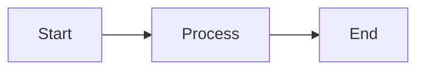

# dialoghelper


<!-- WARNING: THIS FILE WAS AUTOGENERATED! DO NOT EDIT! -->

``` python
from dialoghelper import *
```

``` python
from fastcore import tools
from fastcore.test import *
```

## Basics

``` python
a = 1
find_var('a')
```

    1

``` python
1
```

    1

<div class="prose" markdown="1">

------------------------------------------------------------------------

<a
href="https://github.com/AnswerDotAI/dialoghelper/blob/main/dialoghelper/core.py#L57"
target="_blank" style="float:right; font-size:smaller">source</a>

### names_containing

``` python

def names_containing(
    s:str
):

```

*Names containing `s` in IPython user namespace, or caller globals*

</div>

``` python
names_containing('ipython')
```

    ['get_ipython', 'load_ipython_extension', 'ipython_shell', 'in_ipython']

<div class="prose" markdown="1">

------------------------------------------------------------------------

<a
href="https://github.com/AnswerDotAI/dialoghelper/blob/main/dialoghelper/core.py#L65"
target="_blank" style="float:right; font-size:smaller">source</a>

### find_dname

``` python

def find_dname(
    dname:NoneType=None, required:bool=True
):

```

\*Get the dialog name by searching the call stack for \_\_dialog_name,
and resolving `dname` if supplied.\*

</div>

``` python
find_dname()
```

    '/aai-ws/dialoghelper/nbs/00_core'

``` python
async def repro_executor():
    return await asyncio.get_event_loop().run_in_executor(None, find_dname)
await repro_executor()
```

    '/aai-ws/dialoghelper/nbs/00_core'

``` python
find_dname('index')
```

    '/aai-ws/dialoghelper/nbs/index'

``` python
find_dname('../index')
```

    '/aai-ws/dialoghelper/index'

``` python
find_dname('/foo/bar')
```

    '/foo/bar'

<div class="prose" markdown="1">

------------------------------------------------------------------------

<a
href="https://github.com/AnswerDotAI/dialoghelper/blob/main/dialoghelper/core.py#L93"
target="_blank" style="float:right; font-size:smaller">source</a>

### xgeta

``` python

async def xgeta(
    url, kwargs:VAR_KEYWORD
):

```

*Call self as a function.*

</div>

<div class="prose" markdown="1">

------------------------------------------------------------------------

<a
href="https://github.com/AnswerDotAI/dialoghelper/blob/main/dialoghelper/core.py#L90"
target="_blank" style="float:right; font-size:smaller">source</a>

### xposta

``` python

async def xposta(
    url, kwargs:VAR_KEYWORD
):

```

*Call self as a function.*

</div>

<div class="prose" markdown="1">

------------------------------------------------------------------------

<a
href="https://github.com/AnswerDotAI/dialoghelper/blob/main/dialoghelper/core.py#L117"
target="_blank" style="float:right; font-size:smaller">source</a>

### call_endpa

``` python

async def call_endpa(
    path, dname:str='', json:bool=False, raiseex:bool=False, id:NoneType=None, required:bool=True, timeout:int=10,
    audit:bool=False, data:VAR_KEYWORD
):

```

*Call self as a function.*

</div>

<div class="prose" markdown="1">

------------------------------------------------------------------------

<a
href="https://github.com/AnswerDotAI/dialoghelper/blob/main/dialoghelper/core.py#L112"
target="_blank" style="float:right; font-size:smaller">source</a>

### call_endp

``` python

def call_endp(
    path, dname:str='', json:bool=False, raiseex:bool=False, id:NoneType=None, required:bool=True, timeout:int=10,
    audit:bool=False, data:VAR_KEYWORD
):

```

*Call self as a function.*

</div>

<div class="prose" markdown="1">

------------------------------------------------------------------------

<a
href="https://github.com/AnswerDotAI/dialoghelper/blob/main/dialoghelper/core.py#L129"
target="_blank" style="float:right; font-size:smaller">source</a>

### curr_dialog

``` python

async def curr_dialog(
    with_messages:bool=False, # Include messages as well?
    dname:str='', # Dialog to get info for; defaults to current dialog
)->dict | str:

```

*Get the current dialog info.*

</div>

<div class="prose" markdown="1">

------------------------------------------------------------------------

<a
href="https://github.com/AnswerDotAI/dialoghelper/blob/main/dialoghelper/core.py#L139"
target="_blank" style="float:right; font-size:smaller">source</a>

### msg_idx

``` python

async def msg_idx(
    id:str=None, # Message id to find (defaults to current message)
    dname:str='', # Dialog to get message index from; defaults to current dialog
)->int:

```

*Get absolute index of message in dialog.*

</div>

``` python
await msg_idx()
```

    26

<div class="prose" markdown="1">

------------------------------------------------------------------------

<a
href="https://github.com/AnswerDotAI/dialoghelper/blob/main/dialoghelper/core.py#L157"
target="_blank" style="float:right; font-size:smaller">source</a>

### add_html

``` python

def add_html(
    content:str, # The HTML to send to the client (generally should include hx-swap-oob)
    dname:str='', # Dialog to get info for; defaults to current dialog
):

```

*Send HTML to the browser to be swapped into the DOM*

</div>

<div class="prose" markdown="1">

------------------------------------------------------------------------

<a
href="https://github.com/AnswerDotAI/dialoghelper/blob/main/dialoghelper/core.py#L149"
target="_blank" style="float:right; font-size:smaller">source</a>

### add_html_a

``` python

async def add_html_a(
    content:str, # The HTML to send to the client (generally should include hx-swap-oob)
    dname:str='', # Dialog to get info for; defaults to current dialog
):

```

*Send HTML to the browser to be swapped into the DOM*

</div>

``` python
from fasthtml.common import *
```

``` python
add_html(Div(P('Hi'), hx_swap_oob='beforeend:#dialog-container'))
```

    {'success': 'Content added to DOM'}

<div class="prose" markdown="1">

------------------------------------------------------------------------

<a
href="https://github.com/AnswerDotAI/dialoghelper/blob/main/dialoghelper/core.py#L171"
target="_blank" style="float:right; font-size:smaller">source</a>

### add_scr

``` python

def add_scr(
    scr, oob:str='innerHTML:#ephemeral'
):

```

*Swap a script element to the end of the ephemeral element*

</div>

<div class="prose" markdown="1">

------------------------------------------------------------------------

<a
href="https://github.com/AnswerDotAI/dialoghelper/blob/main/dialoghelper/core.py#L166"
target="_blank" style="float:right; font-size:smaller">source</a>

### add_scr_a

``` python

async def add_scr_a(
    scr, oob:str='innerHTML:#ephemeral'
):

```

*Swap a script element to the end of the ephemeral element*

</div>

<div class="prose" markdown="1">

------------------------------------------------------------------------

<a
href="https://github.com/AnswerDotAI/dialoghelper/blob/main/dialoghelper/core.py#L196"
target="_blank" style="float:right; font-size:smaller">source</a>

### add_mod_a

``` python

async def add_mod_a(
    s:str
):

```

*Wrap javascript code string in a js script module and add it via
[`add_html`](https://AnswerDotAI.github.io/dialoghelper/core.html#add_html)*

</div>

<div class="prose" markdown="1">

------------------------------------------------------------------------

<a
href="https://github.com/AnswerDotAI/dialoghelper/blob/main/dialoghelper/core.py#L192"
target="_blank" style="float:right; font-size:smaller">source</a>

### add_mod

``` python

def add_mod(
    s:str
):

```

*Wrap javascript code string in a js script module and add it via
[`add_html`](https://AnswerDotAI.github.io/dialoghelper/core.html#add_html)*

</div>

<div class="prose" markdown="1">

------------------------------------------------------------------------

<a
href="https://github.com/AnswerDotAI/dialoghelper/blob/main/dialoghelper/core.py#L188"
target="_blank" style="float:right; font-size:smaller">source</a>

### iife

``` python

def iife(
    code:str
):

```

*Wrap javascript code string in an IIFE and execute it via
[`add_html`](https://AnswerDotAI.github.io/dialoghelper/core.html#add_html)*

</div>

<div class="prose" markdown="1">

------------------------------------------------------------------------

<a
href="https://github.com/AnswerDotAI/dialoghelper/blob/main/dialoghelper/core.py#L184"
target="_blank" style="float:right; font-size:smaller">source</a>

### iife_a

``` python

async def iife_a(
    code:str
):

```

*Wrap javascript code string in an IIFE and execute it via
[`add_html`](https://AnswerDotAI.github.io/dialoghelper/core.html#add_html)*

</div>

<div class="prose" markdown="1">

------------------------------------------------------------------------

<a
href="https://github.com/AnswerDotAI/dialoghelper/blob/main/dialoghelper/core.py#L204"
target="_blank" style="float:right; font-size:smaller">source</a>

### pop_data

``` python

def pop_data(
    idx, timeout:int=15
):

```

*Call self as a function.*

</div>

<div class="prose" markdown="1">

------------------------------------------------------------------------

<a
href="https://github.com/AnswerDotAI/dialoghelper/blob/main/dialoghelper/core.py#L201"
target="_blank" style="float:right; font-size:smaller">source</a>

### pop_data_a

``` python

async def pop_data_a(
    idx, timeout:int=15
):

```

*Call self as a function.*

</div>

<div class="prose" markdown="1">

------------------------------------------------------------------------

<a
href="https://github.com/AnswerDotAI/dialoghelper/blob/main/dialoghelper/core.py#L214"
target="_blank" style="float:right; font-size:smaller">source</a>

### fire_event

``` python

def fire_event(
    evt:str, data:VAR_KEYWORD
):

```

*Call self as a function.*

</div>

<div class="prose" markdown="1">

------------------------------------------------------------------------

<a
href="https://github.com/AnswerDotAI/dialoghelper/blob/main/dialoghelper/core.py#L213"
target="_blank" style="float:right; font-size:smaller">source</a>

### fire_event_a

``` python

async def fire_event_a(
    evt:str, data:VAR_KEYWORD
):

```

*Call self as a function.*

</div>

<div class="prose" markdown="1">

------------------------------------------------------------------------

<a
href="https://github.com/AnswerDotAI/dialoghelper/blob/main/dialoghelper/core.py#L227"
target="_blank" style="float:right; font-size:smaller">source</a>

### event_get

``` python

def event_get(
    evt:str, timeout:int=15, data:VAR_KEYWORD
):

```

*Call
[`fire_event`](https://AnswerDotAI.github.io/dialoghelper/core.html#fire_event)
and then
[`pop_data`](https://AnswerDotAI.github.io/dialoghelper/core.html#pop_data)
to get a response*

</div>

<div class="prose" markdown="1">

------------------------------------------------------------------------

<a
href="https://github.com/AnswerDotAI/dialoghelper/blob/main/dialoghelper/core.py#L221"
target="_blank" style="float:right; font-size:smaller">source</a>

### event_get_a

``` python

async def event_get_a(
    evt:str, timeout:int=15, data:VAR_KEYWORD
):

```

*Call
[`fire_event`](https://AnswerDotAI.github.io/dialoghelper/core.html#fire_event)
and then
[`pop_data`](https://AnswerDotAI.github.io/dialoghelper/core.html#pop_data)
to get a response*

</div>

<div class="prose" markdown="1">

------------------------------------------------------------------------

<a
href="https://github.com/AnswerDotAI/dialoghelper/blob/main/dialoghelper/core.py#L234"
target="_blank" style="float:right; font-size:smaller">source</a>

### trigger_now

``` python

def trigger_now(
    evt, data:NoneType=None, ttl:int=5000
):

```

*Synchronously trigger a browser event, safe against replay*

</div>

<div class="prose" markdown="1">

------------------------------------------------------------------------

<a
href="https://github.com/AnswerDotAI/dialoghelper/blob/main/dialoghelper/core.py#L253"
target="_blank" style="float:right; font-size:smaller">source</a>

### event_once_a

``` python

async def event_once_a(
    evt, timeout:int=15, ttl:int=5000, data:VAR_KEYWORD
):

```

*Like event_get_a but with replay/dedup safety via trigger_now*

</div>

<div class="prose" markdown="1">

------------------------------------------------------------------------

<a
href="https://github.com/AnswerDotAI/dialoghelper/blob/main/dialoghelper/core.py#L247"
target="_blank" style="float:right; font-size:smaller">source</a>

### event_once

``` python

def event_once(
    evt, timeout:int=15, ttl:int=5000, data:VAR_KEYWORD
):

```

*Like event_get but with replay/dedup safety via trigger_now*

</div>

``` python
iife("$('body').one('test_evt', e => pushData(e.detail.idx, {reply: 'it worked!'}));")
event_once('test_evt', data={'hello': 'world'})
```

<script>
if (Date.now() - 1782350915921 < 5000 && !window["_trig_1782350915921"]) {
    window["_trig_1782350915921"]=1;
    htmx.trigger(document.body, 'test_evt', {"data": {"hello": "world"}, "idx": "7f13a39e-7cb0-41c6-98c0-110198d4d573"});
}</script>

<div class="prose" markdown="1">

``` python
{'data_id': '7f13a39e-7cb0-41c6-98c0-110198d4d573', 'reply': 'it worked!'}
```

</div>

<div class="prose" markdown="1">

------------------------------------------------------------------------

<a
href="https://github.com/AnswerDotAI/dialoghelper/blob/main/dialoghelper/core.py#L267"
target="_blank" style="float:right; font-size:smaller">source</a>

### js_run_a

``` python

async def js_run_a(
    code
):

```

*Run JS code that calls done() when finished, and wait for result*

</div>

<div class="prose" markdown="1">

------------------------------------------------------------------------

<a
href="https://github.com/AnswerDotAI/dialoghelper/blob/main/dialoghelper/core.py#L261"
target="_blank" style="float:right; font-size:smaller">source</a>

### js_run

``` python

def js_run(
    code
):

```

*Run JS code that calls done() when finished, and wait for result*

</div>

``` python
js_run("fetch('/curr_dialog_', {method:'POST'}).then(r => r.json()).then(done)")
```

<div class="prose" markdown="1">

``` python
{ 'data_id': '6b4001ee-6dbd-4f10-8d9e-853343467380',
  'error': 'No active dialog',
  'ready': True}
```

</div>

<div class="prose" markdown="1">

------------------------------------------------------------------------

<a
href="https://github.com/AnswerDotAI/dialoghelper/blob/main/dialoghelper/core.py#L280"
target="_blank" style="float:right; font-size:smaller">source</a>

### js_eval_a

``` python

async def js_eval_a(
    expr
):

```

*Evaluate a JS expression in the browser and return the result*

</div>

<div class="prose" markdown="1">

------------------------------------------------------------------------

<a
href="https://github.com/AnswerDotAI/dialoghelper/blob/main/dialoghelper/core.py#L274"
target="_blank" style="float:right; font-size:smaller">source</a>

### js_eval

``` python

def js_eval(
    expr
):

```

*Evaluate a JS expression in the browser and return the result*

</div>

``` python
js_eval("return {width: window.innerWidth}")
```

<div class="prose" markdown="1">

``` python
{'data_id': 'cbf2b411-92d9-49d4-8f52-73be4d6d5d0c', 'result': {'width': 1374}}
```

</div>

``` python
js_eval("return document.querySelectorAll('.msg').length")
```

<div class="prose" markdown="1">

``` python
{'data_id': '31551cf6-07a7-42fe-a059-bcfa896834bb', 'result': 0}
```

</div>

``` python
js_eval("a=1")
js_eval("return a+1")
```

<div class="prose" markdown="1">

``` python
{'data_id': 'cf5491ce-eb10-476a-8a48-d83629335cb1', 'result': 2}
```

</div>

``` python
await js_eval_a("return (await fetch('/curr_dialog_', {method:'POST'})).json()")
```

<div class="prose" markdown="1">

``` python
{ 'data_id': 'dfa1530d-ddae-4c2e-8ff1-81636fb48e5b',
  'result': {'error': 'No active dialog'}}
```

</div>

<div class="prose" markdown="1">

------------------------------------------------------------------------

<a
href="https://github.com/AnswerDotAI/dialoghelper/blob/main/dialoghelper/core.py#L287"
target="_blank" style="float:right; font-size:smaller">source</a>

### display_response

``` python

def display_response(
    display:str, result:str=None
):

```

*Return a special response where `display` is added as markdown/HTML to
the prompt output, and `result` is returned to the LLM*

</div>

<div class="prose" markdown="1">

------------------------------------------------------------------------

<a
href="https://github.com/AnswerDotAI/dialoghelper/blob/main/dialoghelper/core.py#L297"
target="_blank" style="float:right; font-size:smaller">source</a>

### connfiles

``` python

async def connfiles(
    dlg_name:str='', # Name of dialog to get connfile path for; if empty, return dict of all running dialogs with their paths
):

```

*Get a running dialogs’ connection file path (or dict of all of them if
no `dlg_name`.*

</div>

<div class="prose" markdown="1">

------------------------------------------------------------------------

<a
href="https://github.com/AnswerDotAI/dialoghelper/blob/main/dialoghelper/core.py#L307"
target="_blank" style="float:right; font-size:smaller">source</a>

### realpath

``` python

async def realpath(
    subpath:str='/', # Path under data root (absolute with `/`, else relative to current dialog's folder)
)->str:

```

*Get the real on-disk path to solveit `subpath`. ‘/’ gets on-disk base
path.*

</div>

``` python
await realpath()
await realpath() # run twice to check acache works
```

    '/Users/jhoward'

<div class="prose" markdown="1">

------------------------------------------------------------------------

<a
href="https://github.com/AnswerDotAI/dialoghelper/blob/main/dialoghelper/core.py#L315"
target="_blank" style="float:right; font-size:smaller">source</a>

### list_dialogs

``` python

async def list_dialogs(
    subpath:str='', # Path under data root (absolute with `/`, else relative to current dialog's folder)
    depth:int=1, # Directory depth
)->dict:

```

*List dialogs and folders under `subpath`. Folders have `/` suffix.*

</div>

``` python
(await list_dialogs())['items'][-4:]
```

    ['05_solve_auth', '06_utils', 'data/', 'index']

``` python
(await list_dialogs('/'))['items'][:5]
```

    ['Applications/', 'CRAFT', 'CRAFTs/', 'Desktop/', 'Documents/']

## View/edit dialog

<div class="prose" markdown="1">

------------------------------------------------------------------------

<a
href="https://github.com/AnswerDotAI/dialoghelper/blob/main/dialoghelper/core.py#L333"
target="_blank" style="float:right; font-size:smaller">source</a>

### read_msg

``` python

async def read_msg(
    n:int=-1, # Message index (if relative, +ve is downwards)
    relative:bool=True, # Is `n` relative to current message (True) or absolute (False)?
    id:str=None, # Message id to find (defaults to current message)
    view_range:list=None, # Optional 1-indexed (start, end) line range for files, end=-1 for EOF
    nums:bool=False, # Whether to show line numbers
    dname:str='', # Dialog to get info for; defaults to current dialog
)->dict:

```

*Get the message indexed in the current dialog.* NB: Messages in the
current dialog above the current message are *already* visible; use this
only when you need line numbers for editing operations, or for messages
not in the current dialog or below the current message. - To get the
exact message use `n=0` and `relative=True` together with `id`. - To get
a relative message use `n` (relative position index). - To get the nth
message use `n` with `relative=False`, e.g `n=0` first message, `n=-1`
last message. {dname}

</div>

<div class="prose" markdown="1">

------------------------------------------------------------------------

<a
href="https://github.com/AnswerDotAI/dialoghelper/blob/main/dialoghelper/core.py#L354"
target="_blank" style="float:right; font-size:smaller">source</a>

### find_msgs

``` python

async def find_msgs(
    re_pattern:str='', # Optional regex to search for (re.DOTALL+re.MULTILINE is used)
    msg_type:str=None, # optional limit by message type ('code', 'note', or 'prompt')
    before:int=0, # Include additional n msgs before matches
    after:int=0, # Include additional n msgs before matches
    context:int=0, # Include additional n msgs around matches (recommended: set `context=2` when searching to see ipynb context)
    use_case:bool=False, # Use case-sensitive matching?
    use_regex:bool=True, # Use regex matching?
    only_err:bool=False, # Only return messages that have errors?
    only_exp:bool=False, # Only return messages that are exported?
    only_chg:bool=False, # Only return messages that have changed vs git HEAD?
    ids:str='', # Optionally filter by comma-separated list of message ids
    limit:int=None, # Optionally limit number of returned items
    include_output:bool=True, # Include output in returned dict?
    include_meta:bool=True, # Include all additional message metadata
    as_xml:bool=False, # Use concise unescaped XML output format
    nums:bool=False, # Show line numbers?
    trunc_out:bool=False, # Middle-out truncate code output to 100 characters?
    trunc_in:bool=False, # Middle-out truncate cell content to 80 characters?
    headers_only:bool=False, # Only return note messages that are headers (first line only); cannot be used together with `header_section`
    header_section:str=None, # Find section starting with this header; returns it plus all children
    include_skipped:bool=False, # Include messages hidden from AI (skipped)?
    dname:str='', # Dialog to get info for; defaults to current dialog
)->list: # Messages in requested dialog that contain the given information

```

*Often it is more efficient to call
[`view_dlg`](https://AnswerDotAI.github.io/dialoghelper/core.html#view_dlg)
(not
[`find_msgs`](https://AnswerDotAI.github.io/dialoghelper/core.html#find_msgs))
to see the whole dialog, so you can use it all from then on.* {dname}
Message ids are identical to those in LLM chat history, so do NOT call
this to view a specific message if it’s in the chat history–instead use
[`view_msg`](https://AnswerDotAI.github.io/dialoghelper/core.html#view_msg).
Do NOT use find_msgs to view message content in the current dialog above
the current prompt – these are *already* provided in LLM context, so
just read the content there directly. (NB: LLM context only includes
messages *above* the current prompt, whereas
[`find_msgs`](https://AnswerDotAI.github.io/dialoghelper/core.html#find_msgs)
can access *all* messages.) To refer to a found message from code, use
its `id` field.

</div>

``` python
1+1
```

    2

``` python
r = await find_msgs(r'1\+1', include_meta=False, include_output=True)
r
```

    [{'id': '_8ce548d6', 'is_exported': 0, 'content': '1+1', 'output': '2', 'msg_type': 'code'}, {'id': '_372c363d', 'is_exported': 0, 'content': "_id = await add_msg('1+1', run=True, msg_type='code')", 'output': '', 'msg_type': 'code'}]

``` python
hl_md(await find_msgs(r'1\+1', include_meta=False, as_xml=True))
```

<div class="prose" markdown="1">

``` html
<msgs><code id="_8ce548d6"><source>1+1<out>2</out></code><code id="_372c363d">_id = await add_msg('1+1', run=True, msg_type='code')</code></msgs>
```

</div>

<div class="prose" markdown="1">

------------------------------------------------------------------------

<a
href="https://github.com/AnswerDotAI/dialoghelper/blob/main/dialoghelper/core.py#L391"
target="_blank" style="float:right; font-size:smaller">source</a>

### view_dlg

``` python

async def view_dlg(
    dname:str='', # Dialog to get info for; defaults to current dialog
    msg_type:str=None, # optional limit by message type ('code', 'note', or 'prompt')
    nums:bool=False, # Whether to show line numbers
    include_output:bool=False, # Include output in returned dict?
    trunc_out:bool=True, # Middle-out truncate code output to 100 characters (only applies if `include_output`)?
    trunc_in:bool=False, # Middle-out truncate cell content to 80 characters?
    include_skipped:bool=False, # Include messages hidden from AI (skipped)?
)->str:

```

*Concise XML view of all messages (optionally filtered by type), not
including metadata. Often it is more efficient to call this to see the
whole dialog at once (including line numbers if needed), instead of
running
[`find_msgs`](https://AnswerDotAI.github.io/dialoghelper/core.html#find_msgs)
or
[`view_msg`](https://AnswerDotAI.github.io/dialoghelper/core.html#view_msg)
multiple times.*

</div>

``` python
hl_md((await view_dlg(nums=True))[:500])
```

<div class="prose" markdown="1">

``` html
<msgs><code id="_955b9784">     1 │ #| default_exp core</code><code id="_a982e24d">     1 │ from dialoghelper import *</code><note id="_0aafe008">     1 │ # dialoghelper</note><code id="_4dd4b925" export>     1 │ import os,re,inspect,ast,collections,time,asyncio,json,linecache,importlib,difflib,uuid,builtins,subprocess,sys
     2 │ 
     3 │ from typing import Dict
     4 │ from tempfile import TemporaryDirectory
     5 │ from ipykernel_helper import *
     6 │ from dataclasses import dataclass
```

</div>

<div class="prose" markdown="1">

------------------------------------------------------------------------

<a
href="https://github.com/AnswerDotAI/dialoghelper/blob/main/dialoghelper/core.py#L452"
target="_blank" style="float:right; font-size:smaller">source</a>

### add_msg

``` python

async def add_msg(
    content:str, # Content of the message (i.e the message prompt, code, or note text)
    msg_type:str='note', # Message type, can be 'code', 'note', or 'prompt'
    run:bool=False, # Run the message?
    placement:str='', # Location to place message. Can be 'at_start' or 'at_end', and if id provided or in curr dlg can also be 'add_after' or 'add_before'. Defaults to 'at_end' if no id and not targeting curr dlg
    id:str=None, # id of message that placement is relative to (if None, uses current message)
    dname:str='', # Dialog to add to; defaults to current dialog (`run` only has a effect if dialog is currently running)
    wait:bool=False, # Wait for and return response? (if `run`)
    poll:float=0.5, # Frequency of polling to check for completion (if `wait`)
    output:str='', # Prompt/code output; Code outputs must be .ipynb-compatible JSON array
    time_run:str | None='', # When was message executed
    is_exported:int | None=0, # Export message to a module?
    skipped:int | None=0, # Hide message from prompt?
    i_collapsed:int | None=0, # Collapse input?
    o_collapsed:int | None=0, # Collapse output?
    heading_collapsed:int | None=0, # Collapse heading section?
    pinned:int | None=0, # Pin to context?
)->str: # Message ID of newly created message

```

*Add/update a message to the queue to show after code execution
completes, and optionally run it.* Code messages are run using python’s
restricted sandbox. **NB**: when creating multiple messages in a row,
after the 1st message set `id` to the result of the last
[`add_msg`](https://AnswerDotAI.github.io/dialoghelper/core.html#add_msg)
call, otherwise messages will appear in the dialog in REVERSE order.
{dname}

</div>

``` python
_id = await add_msg('testing')
_id
```

    '_b91d09bd'

<div class="prose" markdown="1">

------------------------------------------------------------------------

<a
href="https://github.com/AnswerDotAI/dialoghelper/blob/main/dialoghelper/core.py#L467"
target="_blank" style="float:right; font-size:smaller">source</a>

### read_msgid

``` python

async def read_msgid(
    id:str, # Message id to find
    view_range:list=None, # Optional 1-indexed (start, end) line range for files, end=-1 for EOF
    nums:bool=False, # Whether to show line numbers
    dname:str='', # Dialog to get message from; defaults to current dialog
    add_to_dlg:bool=False, # Whether to add message content to current dialog (as a raw message)
)->dict:

```

*Get message `id`. Message IDs can be view directly in LLM chat
history/context, or found in
[`find_msgs`](https://AnswerDotAI.github.io/dialoghelper/core.html#find_msgs)
results.* Use `add_to_dlg` if the LLM or human may need to refer to the
message content again later.

</div>

``` python
r = await read_msg(-2)
print((await read_msg(-2)).content)
```

    testing

[`read_msg`](https://AnswerDotAI.github.io/dialoghelper/core.html#read_msg)
(and all endpoints that return json) wrap responses in `dict2obj`, so
you can use either dict or object syntax.

``` python
bmsg = await add_msg('at bottom', placement='at_end')
```

``` python
assert(await msg_idx(bmsg)>await msg_idx(_id)+10)
```

<div class="prose" markdown="1">

------------------------------------------------------------------------

<a
href="https://github.com/AnswerDotAI/dialoghelper/blob/main/dialoghelper/core.py#L481"
target="_blank" style="float:right; font-size:smaller">source</a>

### view_msg

``` python

async def view_msg(
    id:str, # Message id to view
    dname:str='', # Dialog to get message from; defaults to current dialog
    nums:bool=True, # Whether to show line numbers
    view_range:list=None, # Optional 1-indexed (start, end) line range for files, end=-1 for EOF. Rarely needed--read whole message in nearly all cases instead
    add_to_dlg:bool=False, # Whether to add message content to current dialog (as a raw message)
)->str:

```

*Views the* content\* of message `id`. Same as
`read_msgid(...)['content']`, defaulting to `nums=True`.\* Use
`add_to_dlg` if the LLM or human may need to refer to the message
content again later.

</div>

``` python
print((await view_msg(r.id)))
```

         1 │ testing

``` python
# dh_settings['dname'] = 'tmp'
# _id = await add_msg('testing', placement='at_end')
# print(_id)
# del(dh_settings['dname'])
```

<div class="prose" markdown="1">

------------------------------------------------------------------------

<a
href="https://github.com/AnswerDotAI/dialoghelper/blob/main/dialoghelper/core.py#L495"
target="_blank" style="float:right; font-size:smaller">source</a>

### msg_ref

``` python

def msg_ref(
    id, dname:NoneType=None
):

```

*Markdown ref to a message — same-dialog `#id` or cross-dialog
`#dname/id`*

</div>

<div class="prose" markdown="1">

------------------------------------------------------------------------

<a
href="https://github.com/AnswerDotAI/dialoghelper/blob/main/dialoghelper/core.py#L501"
target="_blank" style="float:right; font-size:smaller">source</a>

### del_msg

``` python

async def del_msg(
    id:str=None, # id of message to delete
    dname:str='', # Dialog to get info for; defaults to current dialog
    log_changed:bool=False, # Add a note showing the deleted content?
)->dict:

```

*Delete a message from the dialog. DO NOT USE THIS unless you have been
explicitly instructed to delete messages.*

</div>

``` python
await del_msg(bmsg)
await del_msg(_id)
```

    {'status': 'success'}

``` python
_id = await add_msg('1+1', run=True, msg_type='code')
```

``` python
await del_msg(_id)
```

    {'status': 'success'}

``` python
_id = await add_msg('Hi', run=True, msg_type='prompt')
```

``` python
await del_msg(_id)
```

    {'status': 'success'}

<div class="prose" markdown="1">

------------------------------------------------------------------------

<a
href="https://github.com/AnswerDotAI/dialoghelper/blob/main/dialoghelper/core.py#L513"
target="_blank" style="float:right; font-size:smaller">source</a>

### run_and_prompt

``` python

async def run_and_prompt(
    code:str, # Python code to run
    prompt:str='Continue.', # Prompt to add after code execution
)->str:

```

*Run `code` and then run `prompt`, returning the resulting message ID.*

</div>

<div class="prose" markdown="1">

------------------------------------------------------------------------

<a
href="https://github.com/AnswerDotAI/dialoghelper/blob/main/dialoghelper/core.py#L538"
target="_blank" style="float:right; font-size:smaller">source</a>

### update_msg

``` python

async def update_msg(
    id:str=None, # id of message to update (if None, uses current message)
    msg:Optional=None, # Dictionary of field keys/values to update
    dname:str='', # Dialog to get info for; defaults to current dialog
    log_changed:bool=False, # Add a note showing the diff?
    content:str | None=None, # Content of the message (i.e the message prompt, code, or note text)
    msg_type:str | None=None, # Message type, can be 'code', 'note', or 'prompt'
    output:str | None=None, # Prompt/code output; Code outputs must be .ipynb-compatible JSON array
    time_run:str | None=None, # When was message executed
    is_exported:int | None=None, # Export message to a module?
    skipped:int | None=None, # Hide message from prompt?
    i_collapsed:int | None=None, # Collapse input?
    o_collapsed:int | None=None, # Collapse output?
    heading_collapsed:int | None=None, # Collapse heading section?
    pinned:int | None=None, # Pin to context?
)->str:

```

*Update an existing message. Provide either `msg` OR field key/values to
update.* - Use `content` param to update contents. - Only include
parameters to update–missing ones will be left unchanged. {dname}

</div>

``` python
_id = await add_msg('testing')
```

``` python
_id = await update_msg(_id, content='toasting')
```

``` python
_id = await update_msg(_id, skipped=1)
```

``` python
msg = await read_msgid(_id)
msg['content'] = 'toasted'
await update_msg(msg=msg)
```

    '_bd4ab687'

``` python
await del_msg(_id)
```

    {'status': 'success'}

``` python
_edit_id = await add_msg('This message should be found.\n\nThis is a multiline message.')
_edit_id
```

    '_ab38bf2b'

``` python
print((await read_msg())['content'])
```

    This message should be found.

    This is a multiline message.

``` python
print((await read_msg(n=0, id=_edit_id, nums=True))['content'])
```

         1 │ This message should be found.
         2 │ 
         3 │ This is a multiline message.

``` python
print((await read_msg(n=0, id=_edit_id, nums=True, view_range=[2,3]))['content'])
```

         2 │ 
         3 │ This is a multiline message.

<div class="prose" markdown="1">

------------------------------------------------------------------------

<a
href="https://github.com/AnswerDotAI/dialoghelper/blob/main/dialoghelper/core.py#L559"
target="_blank" style="float:right; font-size:smaller">source</a>

### run_msg

``` python

async def run_msg(
    ids:str=None, # Comma-separated ids of message(s) to execute
    dname:str='', # Running dialog to get info for; defaults to current dialog. (Note dialog *must* be running for this function)
):

```

*Adds a message to the run queue. Use read_msg to see the output once it
runs.*

</div>

``` python
codeid = (await read_msg())['id']
```

``` python
await run_msg(codeid)
```

    {'status': 'queued'}

<div class="prose" markdown="1">

------------------------------------------------------------------------

<a
href="https://github.com/AnswerDotAI/dialoghelper/blob/main/dialoghelper/core.py#L567"
target="_blank" style="float:right; font-size:smaller">source</a>

### copy_msg

``` python

async def copy_msg(
    ids:str=None, # Comma-separated ids of message(s) to copy
    cut:bool=False, # Cut message(s)? (If not, copies)
    dname:str='', # Running dialog to copy messages from; defaults to current dialog. (Note dialog *must* be running for this function)
)->dict:

```

*Add `ids` to clipboard.*

</div>

<div class="prose" markdown="1">

------------------------------------------------------------------------

<a
href="https://github.com/AnswerDotAI/dialoghelper/blob/main/dialoghelper/core.py#L578"
target="_blank" style="float:right; font-size:smaller">source</a>

### paste_msg

``` python

async def paste_msg(
    id:str=None, # Message id to paste next to
    after:bool=True, # Paste after id? (If not, pastes before)
    dname:str='', # Running dialog to copy messages from; defaults to current dialog. (Note dialog *must* be running for this function)
)->dict:

```

*Paste clipboard msg(s) after/before the current selected msg (id).*

</div>

``` python
await copy_msg(codeid)
```

    {'success': 'complete'}

``` python
test_eq((await copy_msg('_fake', dname='/dlg/nonexistent'))['error'], 'Dialog /dlg/nonexistent may not be running, or message not found')
```

``` python
tgt = (await read_msg())['id']
```

``` python
await paste_msg(tgt)
```

    {'success': 'complete'}

``` python
# TODO fix so this passes
# test_eq((await paste_msg('_fake', dname='/dlg/nonexistent'))['error'], 'Dialog /dlg/nonexistent may not be running, or message not found')
```

``` python
newmsg = await read_msg(1, id=tgt)
newmsg['content']
```

    'async def run_msg(\n    ids:str=None, # Comma-separated ids of message(s) to execute\n    dname:str=\'\' # Running dialog to get info for; defaults to current dialog. (Note dialog *must* be running for this function)\n):\n    "Adds a message to the run queue. Use read_msg to see the output once it runs."\n    return await call_endpa(\'add_runq_\', dname, ids=ids, json=True)'

``` python
await del_msg(newmsg['id'])
```

    {'status': 'success'}

<div class="prose" markdown="1">

------------------------------------------------------------------------

<a
href="https://github.com/AnswerDotAI/dialoghelper/blob/main/dialoghelper/core.py#L590"
target="_blank" style="float:right; font-size:smaller">source</a>

### enable_mermaid

``` python

def enable_mermaid(
    
):

```

*Call self as a function.*

</div>

``` python
enable_mermaid()
```

<div class="prose" markdown="1">

``` html
<script type="module">
if (window.mermaid) mermaid.run()
else {
    import('https://cdn.jsdelivr.net/npm/mermaid@11/dist/mermaid.esm.min.mjs').then(m => {
        window.mermaid = m.default;
        window.mermaid.run();
        htmx.onLoad(elt => {
            if (elt.matches('div.mermaid, pre.mermaid') || htmx.findAll(elt, 'div.mermaid, pre.mermaid')) window.mermaid.run();
        });
    });
}</script>
```

</div>

<div class="prose" markdown="1">

------------------------------------------------------------------------

<a
href="https://github.com/AnswerDotAI/dialoghelper/blob/main/dialoghelper/core.py#L604"
target="_blank" style="float:right; font-size:smaller">source</a>

### mermaid

``` python

def mermaid(
    code, cls:str='mermaid', kwargs:VAR_KEYWORD
):

```

*A mermaid diagram*

</div>

``` python
mermaid('graph LR; A[Start] --> B[Process]; B --> C[End];')
```

<div class="prose" markdown="1">

``` html
<div class="mermaid">graph LR; A[Start] --&gt; B[Process]; B --&gt; C[End];</div>
```

</div>

You can also add to a note:

    ```mermaid
    graph LR
    A[Start] --> B[Process]
    B --> C[End]
    ```

This renders as:


``` mermaid
graph LR
A[Start] --> B[Process]
B --> C[End]
```

You can also add to a note:

    ```mermaid
    graph LR
    A[Start] --> B[Process]
    B --> C[End]
    ```

This renders as:

    graph LR
    A[Start] --> B[Process]
    B --> C[End]

<div class="prose" markdown="1">

------------------------------------------------------------------------

<a
href="https://github.com/AnswerDotAI/dialoghelper/blob/main/dialoghelper/core.py#L609"
target="_blank" style="float:right; font-size:smaller">source</a>

### toggle_header

``` python

async def toggle_header(
    id:str, # id of markdown header note message to toggle collapsed state
    dname:str='', # Running dialog to copy messages from; defaults to current dialog. (Note dialog *must* be running for this function)
)->dict:

```

*Toggle collapsed header state for `id`*

</div>

<div class="prose" markdown="1">

------------------------------------------------------------------------

<a
href="https://github.com/AnswerDotAI/dialoghelper/blob/main/dialoghelper/core.py#L618"
target="_blank" style="float:right; font-size:smaller">source</a>

### toggle_bookmark

``` python

async def toggle_bookmark(
    id:str, # id of message to toggle bookmark on
    n:int, # Bookmark number (1-9)
    dname:str='', # Dialog to set bookmark in; defaults to current dialog
)->dict:

```

*Toggle numbered bookmark (1-9) on a message, clearing it from any other
message when setting*

</div>

<div class="prose" markdown="1">

------------------------------------------------------------------------

<a
href="https://github.com/AnswerDotAI/dialoghelper/blob/main/dialoghelper/core.py#L627"
target="_blank" style="float:right; font-size:smaller">source</a>

### toggle_comment

``` python

async def toggle_comment(
    id:str, # id of code message (or comma-separated ids) to toggle comments on
    dname:str='', # Dialog to toggle comments in; defaults to current dialog. (Note dialog *must* be running for this function)
)->dict:

```

*Toggle line comments on code message(s). If any lines are uncommented,
comments all; otherwise uncomments all.*

</div>

``` python
await toggle_comment(codeid) # comment
await toggle_comment(codeid) # uncomment
```

    {'success': 'complete'}

``` python
test_eq((await toggle_comment('_fake', dname='/dlg/nonexistent'))['error'], 'Dialog /dlg/nonexistent may not be running, or message not found')
```

#### test header

#### header end

``` python
hdid = (await read_msg())['id']
```

``` python
await toggle_header(hdid)
```

    {'success': 'complete'}

``` python
test_eq((await toggle_header('_fake', dname='/dlg/nonexistent'))['error'], 'Dialog /dlg/nonexistent may not be running, or message not found')
```

### Dlg conveniences

<div class="prose" markdown="1">

------------------------------------------------------------------------

<a
href="https://github.com/AnswerDotAI/dialoghelper/blob/main/dialoghelper/core.py#L638"
target="_blank" style="float:right; font-size:smaller">source</a>

### url2note

``` python

async def url2note(
    url:str, # URL to read
    extract_section:bool=True, # If url has an anchor, return only that section
    selector:str=None, # Select section(s) using BeautifulSoup.select (overrides extract_section)
    ai_img:bool=True, # Make images visible to the AI
    split_re:str='', # Regex to split content into multiple notes, set to '' for single note
):

```

*Read URL as markdown, and add note(s) below current message with the
result*

</div>

``` python
_id = await url2note('https://docs.python.org')
```

``` python
await del_msg(_id)
```

    {'status': 'success'}

<div class="prose" markdown="1">

------------------------------------------------------------------------

<a
href="https://github.com/AnswerDotAI/dialoghelper/blob/main/dialoghelper/core.py#L652"
target="_blank" style="float:right; font-size:smaller">source</a>

### create_or_run_dialog

``` python

async def create_or_run_dialog(
    name:str, # Name/path of the dialog (relative to current dialog's folder, or absolute if starts with '/')
    template:bool=True, # Include TEMPLATE.ipynb files when creating a new dialog
):

```

*Create a new dialog, or set an existing one running*

</div>

``` python
await create_or_run_dialog('test_dialog')
```

    {'success': '"aai-ws/dialoghelper/nbs/test_dialog" is now running'}

<div class="prose" markdown="1">

------------------------------------------------------------------------

<a
href="https://github.com/AnswerDotAI/dialoghelper/blob/main/dialoghelper/core.py#L661"
target="_blank" style="float:right; font-size:smaller">source</a>

### stop_dialog

``` python

async def stop_dialog(
    name:str, # Name/path of the dialog (relative to current dialog's folder, or absolute if starts with '/')
):

```

*Stop a running dialog kernel*

</div>

``` python
await stop_dialog('test_dialog')
```

    {'success': 'dialog stopped'}

<div class="prose" markdown="1">

------------------------------------------------------------------------

<a
href="https://github.com/AnswerDotAI/dialoghelper/blob/main/dialoghelper/core.py#L669"
target="_blank" style="float:right; font-size:smaller">source</a>

### load_dialog

``` python

async def load_dialog(
    src_dname:str, # Dialog to load code from (path relative to solveit data dir, no .ipynb)
    dname:str='', # Target dialog; defaults to current dialog
):

```

*Run all code messages from `src_dname` into the target dialog’s kernel
and return dialog contents. Do not call from python; use directly as an
LLM tool.*

</div>

<div class="prose" markdown="1">

------------------------------------------------------------------------

<a
href="https://github.com/AnswerDotAI/dialoghelper/blob/main/dialoghelper/core.py#L679"
target="_blank" style="float:right; font-size:smaller">source</a>

### rm_dialog

``` python

async def rm_dialog(
    name:str, # Name/path of the dialog to delete (relative to current dialog's folder, or absolute if starts with '/')
):

```

*Delete a dialog (or folder) and associated records, stopping the kernel
if running*

</div>

``` python
await rm_dialog('test_dialog')
```

    {'success': 'deleted "/Users/jhoward/aai-ws/dialoghelper/nbs/test_dialog"'}

<div class="prose" markdown="1">

------------------------------------------------------------------------

<a
href="https://github.com/AnswerDotAI/dialoghelper/blob/main/dialoghelper/core.py#L687"
target="_blank" style="float:right; font-size:smaller">source</a>

### run_code_interactive

``` python

async def run_code_interactive(
    code:str, # Code to have user run
):

```

*Insert code into user’s dialog and request for the user to run it. Use
other functions where possible,* but if they can not find needed
information, *ALWAYS* use this instead of guessing or giving up.
IMPORTANT: This tool is TERMINAL - after calling it, you MUST stop all
tool usage and wait for user response. Never call additional tools after
this one.

</div>

## Text Edit

``` python
await msg_insert_line(_edit_id, 0, 'This should go to the first line')
await msg_insert_line(_edit_id, 3, 'This should go to the 4th line')
print(await msg_insert_line(_edit_id, 5, 'This should go to the last line'))
```

    @@ -5 +5,2 @@
     This is a multiline message.
    +This should go to the last line

``` python
print((await read_msg(n=0, id=_edit_id, nums=True))['content'])
```

         1 │ This should go to the first line
         2 │ This message should be found.
         3 │ 
         4 │ This should go to the 4th line
         5 │ This is a multiline message.
         6 │ This should go to the last line

``` python
print(await msg_str_replace(_edit_id, 'This should go to the first line', 'This should go to the 1st line'))
```

    @@ -1,2 +1,2 @@
    -This should go to the first line
    +This should go to the 1st line
     This message should be found.

``` python
print((await read_msg(n=0, id=_edit_id, nums=True))['content'])
```

         1 │ This should go to the 1st line
         2 │ This message should be found.
         3 │ 
         4 │ This should go to the 4th line
         5 │ This is a multiline message.
         6 │ This should go to the last line

``` python
print(await msg_strs_replace(_edit_id, ['This is a multiline message.', 'This should go to the last line'], ['5th line', 'last line']))
```

    @@ -4,3 +4,3 @@
     This should go to the 4th line
    -This is a multiline message.
    -This should go to the last line
    +5th line
    +last line

``` python
print((await read_msg(n=0, id=_edit_id, nums=True))['content'])
```

         1 │ This should go to the 1st line
         2 │ This message should be found.
         3 │ 
         4 │ This should go to the 4th line
         5 │ 5th line
         6 │ last line

``` python
print(await msg_replace_lines(_edit_id, 2, 4,'line 2\nline 3\nline 4\n'))
```

    @@ -1,5 +1,5 @@
     This should go to the 1st line
    -This message should be found.
    -
    -This should go to the 4th line
    +line 2
    +line 3
    +line 4
     5th line

``` python
print((await read_msg(n=0, id=_edit_id, nums=True))['content'])
```

         1 │ This should go to the 1st line
         2 │ line 2
         3 │ line 3
         4 │ line 4
         5 │ 5th line
         6 │ last line

``` python
print(await msg_del_lines(_edit_id, 2, 4))
```

    @@ -1,5 +1,2 @@
     This should go to the 1st line
    -line 2
    -line 3
    -line 4
     5th line

``` python
print((await read_msg(n=0, id=_edit_id, nums=True)).content)
```

         1 │ This should go to the 1st line
         2 │ 5th line
         3 │ last line

``` python
print(await msg_python(_edit_id, r"'\n'.join(sorted(text.splitlines()))"))
```

    @@ -1,3 +1,3 @@
    +5th line
     This should go to the 1st line
    -5th line
     last line

``` python
print((await read_msg(n=0, id=_edit_id, nums=True)).content)
```

         1 │ 5th line
         2 │ This should go to the 1st line
         3 │ last line

``` python
await del_msg(_edit_id)
```

    {'status': 'success'}

``` python
id1 = await add_msg('hello world')
id2 = await add_msg('hello there', id=id1)
```

``` python
results = await msg_str_replace([id1, id2], 'hello', 'hi')
print(results)
```

    [('_bcd0d6bd', '@@ -1 +1 @@\n-hello world\n+hi world'), ('_a8b6369f', '@@ -1 +1 @@\n-hello there\n+hi there')]

``` python
await del_msg(id1)
await del_msg(id2)
```

    {'status': 'success'}

## Help

<div class="prose" markdown="1">

------------------------------------------------------------------------

<a
href="https://github.com/AnswerDotAI/dialoghelper/blob/main/dialoghelper/core.py#L856"
target="_blank" style="float:right; font-size:smaller">source</a>

### solveit_docs

``` python

def solveit_docs(
    
):

```

*Full reference documentation for Solveit - use this to answer questions
about how to use Solveit.* **NB**: The whole docs fit in LLM context, so
read the whole thing, don’t search/filter it. *Always* re-run rather
than relying on truncated history or assumptions.

</div>

<div class="prose" markdown="1">

------------------------------------------------------------------------

<a
href="https://github.com/AnswerDotAI/dialoghelper/blob/main/dialoghelper/core.py#L865"
target="_blank" style="float:right; font-size:smaller">source</a>

### dialog_link

``` python

def dialog_link(
    dname:str='', # Dialog to link to (relative to current dialog's folder, or absolute if starts with '/'); empty for in-page anchor link
    msg_id:str=None, # Optional message id to scroll to
):

```

*Return an IPython HTML link to open a dialog in Solveit.* After calling
this, output the resulting HTML anchor tag exactly as returned—do not
wrap in a fenced code block or convert to markdown link format.

</div>

``` python
dialog_link(msg_id='_a7d82acd')
```

<div class="prose" markdown="1">

[\#\_a7d82acd](#_a7d82acd)

</div>

``` python
dialog_link(dname='/CRAFT')
```

<a href="/dialog_?name=CRAFT" target="_blank">CRAFT</a>

``` python
dialog_link(dname='/CRAFT', msg_id='_ce727fd8')
```

<a href="/dialog_?name=CRAFT#_ce727fd8" target="_blank">CRAFT</a>

<div class="prose" markdown="1">

------------------------------------------------------------------------

<a
href="https://github.com/AnswerDotAI/dialoghelper/blob/main/dialoghelper/core.py#L881"
target="_blank" style="float:right; font-size:smaller">source</a>

### spawn_agent

``` python

async def spawn_agent(
    prompt:str
):

```

*Spawn a subagent to complete a task defined by `prompt`. Must be run as
a tool - not from Python.* The subagent’s context and tools is defined
by the parent prompt’s history

</div>

## Web Search

<div class="prose" markdown="1">

------------------------------------------------------------------------

<a
href="https://github.com/AnswerDotAI/dialoghelper/blob/main/dialoghelper/core.py#L887"
target="_blank" style="float:right; font-size:smaller">source</a>

### search

``` python

async def search(
    q:str
):

```

*Get search results for a query and return as text. Rarely used instead
of
[`web_answer`](https://AnswerDotAI.github.io/dialoghelper/core.html#web_answer).*

</div>

``` python
# r = await search("Weather Brisbane")
# r
```

<div class="prose" markdown="1">

------------------------------------------------------------------------

<a
href="https://github.com/AnswerDotAI/dialoghelper/blob/main/dialoghelper/core.py#L892"
target="_blank" style="float:right; font-size:smaller">source</a>

### searches

``` python

async def searches(
    searches:list
):

```

*Get search results for multiple queries in parallel. Rarely used
instead of
[`web_answer`](https://AnswerDotAI.github.io/dialoghelper/core.html#web_answer).*

</div>

``` python
# r = await searches(["Weather Brisbane", "Weather Sydney", "Weather Melbourne"])
# r
```

<div class="prose" markdown="1">

------------------------------------------------------------------------

<a
href="https://github.com/AnswerDotAI/dialoghelper/blob/main/dialoghelper/core.py#L897"
target="_blank" style="float:right; font-size:smaller">source</a>

### web_answer

``` python

async def web_answer(
    pr:str, # The prompt - i.e the question to get answered
    qs:list, # A list of 1 or more web search queries that might provide useful results. Do not constrain the queries too much - make sure the agent as a range of links to choose from
    page_chars:int=50000, # Truncate web pages beyond this size
):

```

*Use a search agent to search for all of `qs`, choose suitable pages to
read, and answer `pr` based on the page contents.*

</div>

``` python
# r = await web_answer(pr="What's the weather in Brisbane?", qs=["Weather Brisbane"], page_chars=1000)
# r
```
