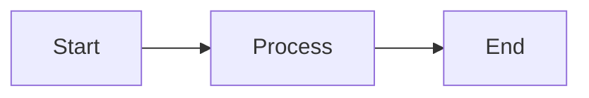

# dialoghelper


<!-- WARNING: THIS FILE WAS AUTOGENERATED! DO NOT EDIT! -->

``` python
from dialoghelper import *
```

``` python
from fastcore import tools
from fastcore.test import *
```

## Basics

``` python
a = 1
find_var('a')
```

    1

``` python
%%py
1
```

    1

------------------------------------------------------------------------

<a
href="https://github.com/AnswerDotAI/dialoghelper/blob/main/dialoghelper/core.py#L64"
target="_blank" style="float:right; font-size:smaller">source</a>

### names_containing

``` python
def names_containing(
    s:str
):
```

*Names containing `s` in IPython user namespace, or caller globals*

``` python
names_containing('ipython')
```

    ['get_ipython', 'load_ipython_extension', 'ipython_shell', 'in_ipython']

------------------------------------------------------------------------

<a
href="https://github.com/AnswerDotAI/dialoghelper/blob/main/dialoghelper/core.py#L72"
target="_blank" style="float:right; font-size:smaller">source</a>

### find_dname

``` python
def find_dname(
    dname:NoneType=None, required:bool=True
):
```

\*Get the dialog name by searching the call stack for \_\_dialog_name,
and resolving `dname` if supplied.\*

``` python
find_dname()
```

    '/aai-ws/dialoghelper/nbs/00_core'

``` python
async def repro_executor():
    return await asyncio.get_running_loop().run_in_executor(None, find_dname)
await repro_executor()
```

    '/aai-ws/dialoghelper/nbs/00_core'

``` python
find_dname('index')
```

    '/aai-ws/dialoghelper/nbs/index'

``` python
find_dname('../index')
```

    '/aai-ws/dialoghelper/index'

``` python
find_dname('/foo/bar')
```

    '/foo/bar'

------------------------------------------------------------------------

<a
href="https://github.com/AnswerDotAI/dialoghelper/blob/main/dialoghelper/core.py#L100"
target="_blank" style="float:right; font-size:smaller">source</a>

### xgeta

``` python
async def xgeta(
    url, **kwargs
):
```

*Call self as a function.*

------------------------------------------------------------------------

<a
href="https://github.com/AnswerDotAI/dialoghelper/blob/main/dialoghelper/core.py#L97"
target="_blank" style="float:right; font-size:smaller">source</a>

### xposta

``` python
async def xposta(
    url, **kwargs
):
```

*Call self as a function.*

------------------------------------------------------------------------

<a
href="https://github.com/AnswerDotAI/dialoghelper/blob/main/dialoghelper/core.py#L113"
target="_blank" style="float:right; font-size:smaller">source</a>

### DialogAPIError

``` python
def DialogAPIError(
    *args, **kwargs
):
```

*A Solveit API endpoint reported an error (its JSON response carried an
`error` key)*

------------------------------------------------------------------------

<a
href="https://github.com/AnswerDotAI/dialoghelper/blob/main/dialoghelper/core.py#L129"
target="_blank" style="float:right; font-size:smaller">source</a>

### call_endpa

``` python
async def call_endpa(
    path, dname:str='', json:bool=False, raiseex:bool=False, id:NoneType=None, required:bool=True, timeout:int=10,
    audit:bool=False, chkerr:bool=True, **data
):
```

*Call self as a function.*

------------------------------------------------------------------------

<a
href="https://github.com/AnswerDotAI/dialoghelper/blob/main/dialoghelper/core.py#L124"
target="_blank" style="float:right; font-size:smaller">source</a>

### call_endp

``` python
def call_endp(
    path, dname:str='', json:bool=False, raiseex:bool=False, id:NoneType=None, required:bool=True, timeout:int=10,
    audit:bool=False, chkerr:bool=True, **data
):
```

*Call self as a function.*

------------------------------------------------------------------------

<a
href="https://github.com/AnswerDotAI/dialoghelper/blob/main/dialoghelper/core.py#L141"
target="_blank" style="float:right; font-size:smaller">source</a>

### curr_dialog

``` python
async def curr_dialog(
    with_messages:bool=False, # Unused; kept for signature compatibility
    dname:str='', # Dialog to get info for; defaults to current dialog
)->dict | str:
```

*Get the current dialog info.*

------------------------------------------------------------------------

<a
href="https://github.com/AnswerDotAI/dialoghelper/blob/main/dialoghelper/core.py#L151"
target="_blank" style="float:right; font-size:smaller">source</a>

### msg_idx

``` python
async def msg_idx(
    id:str=None, # Message id to find (defaults to current message)
    dname:str='', # Dialog to get message index from; defaults to current dialog
)->int:
```

*Get absolute index of message in dialog.*

``` python
await msg_idx()
```

    26

------------------------------------------------------------------------

<a
href="https://github.com/AnswerDotAI/dialoghelper/blob/main/dialoghelper/core.py#L170"
target="_blank" style="float:right; font-size:smaller">source</a>

### add_html

``` python
def add_html(
    content:str, # The HTML to send to the client (generally should include hx-swap-oob)
    dname:str='', # Dialog to get info for; defaults to current dialog
):
```

*Send HTML to the browser to be swapped into the DOM*

------------------------------------------------------------------------

<a
href="https://github.com/AnswerDotAI/dialoghelper/blob/main/dialoghelper/core.py#L162"
target="_blank" style="float:right; font-size:smaller">source</a>

### add_html_a

``` python
async def add_html_a(
    content:str, # The HTML to send to the client (generally should include hx-swap-oob)
    dname:str='', # Dialog to get info for; defaults to current dialog
):
```

*Send HTML to the browser to be swapped into the DOM*

``` python
from fasthtml.common import *
```

``` python
add_html(Div(P('Hi'), hx_swap_oob='beforeend:#dialog-container'))
```

    {'success': 'Content added to DOM'}

------------------------------------------------------------------------

<a
href="https://github.com/AnswerDotAI/dialoghelper/blob/main/dialoghelper/core.py#L184"
target="_blank" style="float:right; font-size:smaller">source</a>

### add_scr

``` python
def add_scr(
    scr, oob:str='innerHTML:#ephemeral'
):
```

*Swap a script element to the end of the ephemeral element*

------------------------------------------------------------------------

<a
href="https://github.com/AnswerDotAI/dialoghelper/blob/main/dialoghelper/core.py#L179"
target="_blank" style="float:right; font-size:smaller">source</a>

### add_scr_a

``` python
async def add_scr_a(
    scr, oob:str='innerHTML:#ephemeral'
):
```

*Swap a script element to the end of the ephemeral element*

------------------------------------------------------------------------

<a
href="https://github.com/AnswerDotAI/dialoghelper/blob/main/dialoghelper/core.py#L209"
target="_blank" style="float:right; font-size:smaller">source</a>

### add_mod_a

``` python
async def add_mod_a(
    s:str
):
```

*Wrap javascript code string in a js script module and add it via
[`add_html`](https://AnswerDotAI.github.io/dialoghelper/core.html#add_html)*

------------------------------------------------------------------------

<a
href="https://github.com/AnswerDotAI/dialoghelper/blob/main/dialoghelper/core.py#L205"
target="_blank" style="float:right; font-size:smaller">source</a>

### add_mod

``` python
def add_mod(
    s:str
):
```

*Wrap javascript code string in a js script module and add it via
[`add_html`](https://AnswerDotAI.github.io/dialoghelper/core.html#add_html)*

------------------------------------------------------------------------

<a
href="https://github.com/AnswerDotAI/dialoghelper/blob/main/dialoghelper/core.py#L201"
target="_blank" style="float:right; font-size:smaller">source</a>

### iife

``` python
def iife(
    code:str
):
```

*Wrap javascript code string in an IIFE and execute it via
[`add_html`](https://AnswerDotAI.github.io/dialoghelper/core.html#add_html)*

------------------------------------------------------------------------

<a
href="https://github.com/AnswerDotAI/dialoghelper/blob/main/dialoghelper/core.py#L197"
target="_blank" style="float:right; font-size:smaller">source</a>

### iife_a

``` python
async def iife_a(
    code:str
):
```

*Wrap javascript code string in an IIFE and execute it via
[`add_html`](https://AnswerDotAI.github.io/dialoghelper/core.html#add_html)*

------------------------------------------------------------------------

<a
href="https://github.com/AnswerDotAI/dialoghelper/blob/main/dialoghelper/core.py#L217"
target="_blank" style="float:right; font-size:smaller">source</a>

### pop_data

``` python
def pop_data(
    idx, timeout:int=15
):
```

*Call self as a function.*

------------------------------------------------------------------------

<a
href="https://github.com/AnswerDotAI/dialoghelper/blob/main/dialoghelper/core.py#L214"
target="_blank" style="float:right; font-size:smaller">source</a>

### pop_data_a

``` python
async def pop_data_a(
    idx, timeout:int=15
):
```

*Call self as a function.*

------------------------------------------------------------------------

<a
href="https://github.com/AnswerDotAI/dialoghelper/blob/main/dialoghelper/core.py#L227"
target="_blank" style="float:right; font-size:smaller">source</a>

### fire_event

``` python
def fire_event(
    evt:str, **data
):
```

*Call self as a function.*

------------------------------------------------------------------------

<a
href="https://github.com/AnswerDotAI/dialoghelper/blob/main/dialoghelper/core.py#L226"
target="_blank" style="float:right; font-size:smaller">source</a>

### fire_event_a

``` python
async def fire_event_a(
    evt:str, **data
):
```

*Call self as a function.*

------------------------------------------------------------------------

<a
href="https://github.com/AnswerDotAI/dialoghelper/blob/main/dialoghelper/core.py#L240"
target="_blank" style="float:right; font-size:smaller">source</a>

### event_get

``` python
def event_get(
    evt:str, timeout:int=15, **data
):
```

*Call
[`fire_event`](https://AnswerDotAI.github.io/dialoghelper/core.html#fire_event)
and then
[`pop_data`](https://AnswerDotAI.github.io/dialoghelper/core.html#pop_data)
to get a response*

------------------------------------------------------------------------

<a
href="https://github.com/AnswerDotAI/dialoghelper/blob/main/dialoghelper/core.py#L234"
target="_blank" style="float:right; font-size:smaller">source</a>

### event_get_a

``` python
async def event_get_a(
    evt:str, timeout:int=15, **data
):
```

*Call
[`fire_event`](https://AnswerDotAI.github.io/dialoghelper/core.html#fire_event)
and then
[`pop_data`](https://AnswerDotAI.github.io/dialoghelper/core.html#pop_data)
to get a response*

------------------------------------------------------------------------

<a
href="https://github.com/AnswerDotAI/dialoghelper/blob/main/dialoghelper/core.py#L247"
target="_blank" style="float:right; font-size:smaller">source</a>

### trigger_now

``` python
def trigger_now(
    evt, data:NoneType=None, ttl:int=5000
):
```

*Synchronously trigger a browser event, safe against replay*

------------------------------------------------------------------------

<a
href="https://github.com/AnswerDotAI/dialoghelper/blob/main/dialoghelper/core.py#L266"
target="_blank" style="float:right; font-size:smaller">source</a>

### event_once_a

``` python
async def event_once_a(
    evt, timeout:int=15, ttl:int=5000, **data
):
```

*Like event_get_a but with replay/dedup safety via trigger_now*

------------------------------------------------------------------------

<a
href="https://github.com/AnswerDotAI/dialoghelper/blob/main/dialoghelper/core.py#L260"
target="_blank" style="float:right; font-size:smaller">source</a>

### event_once

``` python
def event_once(
    evt, timeout:int=15, ttl:int=5000, **data
):
```

*Like event_get but with replay/dedup safety via trigger_now*

``` python
iife("$('body').one('test_evt', e => pushData(e.detail.idx, {reply: 'it worked!'}));")
event_once('test_evt', data={'hello': 'world'})
```

<script>
if (Date.now() - 1785909683860 < 5000 && !window["_trig_1785909683860"]) {
    window["_trig_1785909683860"]=1;
    htmx.trigger(document.body, 'test_evt', {"data": {"hello": "world"}, "idx": "3c187866-612f-4c61-a55a-aa8f83581f24"});
}</script>

``` python
{'data_id': '3c187866-612f-4c61-a55a-aa8f83581f24', 'reply': 'it worked!'}
```

------------------------------------------------------------------------

<a
href="https://github.com/AnswerDotAI/dialoghelper/blob/main/dialoghelper/core.py#L280"
target="_blank" style="float:right; font-size:smaller">source</a>

### js_run_a

``` python
async def js_run_a(
    code
):
```

*Run JS code that calls done() when finished, and wait for result*

------------------------------------------------------------------------

<a
href="https://github.com/AnswerDotAI/dialoghelper/blob/main/dialoghelper/core.py#L274"
target="_blank" style="float:right; font-size:smaller">source</a>

### js_run

``` python
def js_run(
    code
):
```

*Run JS code that calls done() when finished, and wait for result*

``` python
scr = "fetch('/curr_dialog_', {method:'POST', body:new URLSearchParams({dlg_name:'%s'})}).then(r => r.json()).then(done)"
r = js_run(scr % find_dname().strip('/'))
r['curr_msgid']
```

    'bb3dc747'

------------------------------------------------------------------------

<a
href="https://github.com/AnswerDotAI/dialoghelper/blob/main/dialoghelper/core.py#L293"
target="_blank" style="float:right; font-size:smaller">source</a>

### js_eval_a

``` python
async def js_eval_a(
    expr
):
```

*Evaluate a JS expression in the browser and return the result*

------------------------------------------------------------------------

<a
href="https://github.com/AnswerDotAI/dialoghelper/blob/main/dialoghelper/core.py#L287"
target="_blank" style="float:right; font-size:smaller">source</a>

### js_eval

``` python
def js_eval(
    expr
):
```

*Evaluate a JS expression in the browser and return the result*

``` python
js_eval("return {width: window.innerWidth}")
```

``` python
{'data_id': '738eba56-7602-4454-a62c-f553e2dbf034', 'result': {'width': 1512}}
```

``` python
js_eval("return document.querySelectorAll('.msg').length")
```

``` python
{'data_id': '795d59c6-8e44-437e-8e0d-9df906d36906', 'result': 0}
```

``` python
js_eval("a=1")
js_eval("return a+1")
```

``` python
{'data_id': '71cf9d99-f799-4794-827f-6f367f12fe5c', 'result': 2}
```

``` python
await js_eval_a("return (await fetch('/curr_dialog_', {method:'POST'})).json()")
```

``` python
{ 'data_id': '4d432861-b294-4edb-8b1d-225c7dc804ba',
  'result': {'error': 'No active dialog'}}
```

The helpers above make one-shot round trips through the browser page,
and remain the right choice for collecting single values.
[`Channel`](https://AnswerDotAI.github.io/dialoghelper/core.html#channel)
instead holds open a persistent two-way connection, for long-lived
protocols and event streams where per-message HTTP overhead would hurt.

------------------------------------------------------------------------

<a
href="https://github.com/AnswerDotAI/dialoghelper/blob/main/dialoghelper/core.py#L300"
target="_blank" style="float:right; font-size:smaller">source</a>

### Channel

``` python
def Channel(
    chan, url:NoneType=None
):
```

*Duplex JSON messaging with the other peers on a named `/wsx` relay
channel*

A
[`Channel`](https://AnswerDotAI.github.io/dialoghelper/core.html#channel)
connects to a named channel on solveit’s `/wsx` relay, which forwards
every frame verbatim to all other peers on the same name. Frames are
JSON dicts: pass fields as kwargs to `send`, and receive them as
`AttrDict`s. Frames that answer a pending `request` are matched up by
their `id`; everything else goes to the `events` queue. The main peer
today is the
[solveit-chrome](https://github.com/AnswerDotAI/solveit-chrome)
extension, which `solvecdp` drives through this class.

Two peers on one channel: a plain `send` arrives in the other peer’s
`events`.

``` python
ch1,ch2 = await Channel.connect('test'),await Channel.connect('test')
await ch1.send(hello='world')
test_eq((await ch2.events.get()).hello, 'world')
```

`request` adds an `id` to the frame and waits for the reply with the
same `id`, so several requests can be in flight at once. Here the second
peer answers, echoing the `id` back with a result:

``` python
async def _responder():
    msg = await ch2.events.get()
    await ch2.send(id=msg.id, result=msg.x*2)

task = asyncio.create_task(_responder())
test_eq((await ch1.request(x=21)).result, 42)
```

`is_open` shows whether the connection is still up:

``` python
assert ch1.is_open
await ch1.close()
await ch2.close()
assert not ch1.is_open
```

------------------------------------------------------------------------

<a
href="https://github.com/AnswerDotAI/dialoghelper/blob/main/dialoghelper/core.py#L343"
target="_blank" style="float:right; font-size:smaller">source</a>

### display_response

``` python
def display_response(
    display:str, result:str=None
):
```

*Return a special response where `display` is added as markdown/HTML to
the prompt output, and `result` is returned to the LLM*

------------------------------------------------------------------------

<a
href="https://github.com/AnswerDotAI/dialoghelper/blob/main/dialoghelper/core.py#L350"
target="_blank" style="float:right; font-size:smaller">source</a>

### realpath

``` python
async def realpath(
    subpath:str='/', # Path under data root (absolute with `/`, else relative to current dialog's folder)
)->str:
```

*Get the real on-disk path to solveit `subpath`. ‘/’ gets on-disk base
path.*

``` python
await realpath()
await realpath() # run twice to check acache works
```

    '/Users/jhoward'

------------------------------------------------------------------------

<a
href="https://github.com/AnswerDotAI/dialoghelper/blob/main/dialoghelper/core.py#L358"
target="_blank" style="float:right; font-size:smaller">source</a>

### list_dialogs

``` python
async def list_dialogs(
    subpath:str='', # Path under data root (absolute with `/`, else relative to current dialog's folder)
    depth:int=1, # Directory depth
)->dict:
```

*List dialogs and folders under `subpath`. Folders have `/` suffix.*

``` python
(await list_dialogs())['items'][-4:]
```

    ['06_utils', '07_test', 'data/', 'index']

``` python
(await list_dialogs('/'))['items'][:5]
```

    ['Applications/', 'CRAFT', 'CRAFTs/', 'Desktop/', 'Documents/']

## Dialog model

Kernel-side code works with dialogs through
[aidialog](https://github.com/AnswerDotAI/aidialog)’s
[`Dialog`](https://AnswerDotAI.github.io/dialoghelper/core.html#dialog)/[`Message`](https://AnswerDotAI.github.io/dialoghelper/core.html#message).
These subclasses declare solveit’s persisted fields (`meta_attrs`), so
reads promote them to attributes and writes serialize them back; a
solveit kernel passes
[`Dialog`](https://AnswerDotAI.github.io/dialoghelper/core.html#dialog)
to `dsk.set_dlg(path, cls=...)` at startup, making every ambient `dsk`
read construct them.

------------------------------------------------------------------------

<a
href="https://github.com/AnswerDotAI/dialoghelper/blob/main/dialoghelper/core.py#L388"
target="_blank" style="float:right; font-size:smaller">source</a>

### Dialog

``` python
def Dialog(
    messages:NoneType=None, # Initial `Message`s, shared not copied: a wrap of live messages is a view over the originals
    name:str='', # Dialog name, usually the file stem
    meta:NoneType=None, # Notebook-level metadata dict, carried verbatim through save/load
):
```

*aidialog
[`Dialog`](https://AnswerDotAI.github.io/dialoghelper/core.html#dialog)
producing dialoghelper
[`Message`](https://AnswerDotAI.github.io/dialoghelper/core.html#message)s*

------------------------------------------------------------------------

<a
href="https://github.com/AnswerDotAI/dialoghelper/blob/main/dialoghelper/core.py#L376"
target="_blank" style="float:right; font-size:smaller">source</a>

### Message

``` python
def Message(
    content:str='', # The message text: markdown, code, or a prompt's request
    dlg:NoneType=None, # The `Dialog` this message belongs to
    output:str='', # Jupyter-style output list (code and prompt messages), or ''
    id:NoneType=None, # Message id; 4 random hex bytes if None
    msg_type:str='code', # One of `smsg_types`: code, note, prompt, or raw
    attachments:NoneType=None, # `Attachment`s carried by the message
    meta:NoneType=None, # Remaining cell metadata, carried verbatim through save/load
    **xtras
):
```

*aidialog
[`Message`](https://AnswerDotAI.github.io/dialoghelper/core.html#message)
with solveit’s persisted fields declared*

------------------------------------------------------------------------

<a
href="https://github.com/AnswerDotAI/dialoghelper/blob/main/dialoghelper/core.py#L401"
target="_blank" style="float:right; font-size:smaller">source</a>

### dlg_path

``` python
def dlg_path(
    dname:str=''
):
```

*The `.ipynb` file for `dname` (default: the current dialog)*

------------------------------------------------------------------------

<a
href="https://github.com/AnswerDotAI/dialoghelper/blob/main/dialoghelper/core.py#L393"
target="_blank" style="float:right; font-size:smaller">source</a>

### data_root

``` python
def data_root():
```

*The data directory dialog names are relative to*

The tools below edit the dialog file directly through these classes:
each call reads the file, applies its change, and saves. Solveit hears
the change from the gateway’s watcher like any foreign write, so no
server round trip is involved.
[`data_root`](https://AnswerDotAI.github.io/dialoghelper/core.html#data_root)
anchors dialog names to the filesystem (the boot `repoint` records it;
outside a solveit kernel it derives from the current dialog’s name and
folder).

## View/edit dialog

``` python
s = 'x = 21\nx*2\ndone'
test_eq(_lnhashs_content(s), '\n'.join(lnhash(i,l)+l for i,l in enumerate(s.splitlines(),1)))
test_eq(_lnhashs_content(s, 2, -1).splitlines()[0], lnhash(2,'x*2')+'x*2')
test_eq(len(_lnhashs_content(s, 1, 2).splitlines()), 2)
```

------------------------------------------------------------------------

<a
href="https://github.com/AnswerDotAI/dialoghelper/blob/main/dialoghelper/core.py#L422"
target="_blank" style="float:right; font-size:smaller">source</a>

### read_msg

``` python
async def read_msg(
    n:int=-1, # Message index (if relative, +ve is downwards)
    relative:bool=True, # Is `n` relative to current message (True) or absolute (False)?
    id:str=None, # Message id to find (defaults to current message)
    start_line:int=1, # Starting line to view
    end_line:int=None, # End line (defaults to last line if None; -1 for EOF)
    nums:bool=False, # Whether to show line numbers
    lnhashs:bool=False, # Show exhash `lineno|hash|` addresses instead of line numbers?
    dname:str='', # Dialog to get info for; defaults to current dialog
)->dict:
```

*Get the message indexed in the current dialog.* NB: Messages in the
current dialog above the current message are *already* visible; use this
only when you need line numbers for editing operations, or for messages
not in the current dialog or below the current message. - To get the
exact message use `n=0` and `relative=True` together with `id`. - To get
a relative message use `n` (relative position index). - To get the nth
message use `n` with `relative=False`, e.g `n=0` first message, `n=-1`
last message. {dname}

------------------------------------------------------------------------

<a
href="https://github.com/AnswerDotAI/dialoghelper/blob/main/dialoghelper/core.py#L463"
target="_blank" style="float:right; font-size:smaller">source</a>

### find_msgs

``` python
async def find_msgs(
    re_pattern:str='', # Optional regex to search for (re.DOTALL+re.MULTILINE is used)
    msg_type:str=None, # optional limit by message type ('code', 'note', or 'prompt')
    before:int=0, # Include additional n msgs before matches
    after:int=0, # Include additional n msgs after matches
    context:int=None, # Include additional n msgs around matches (default 1, or 0 when `headers_only`)
    use_case:bool=False, # Use case-sensitive matching?
    use_regex:bool=True, # Use regex matching?
    only_err:bool=False, # Only return messages that have errors?
    only_exp:bool=False, # Only return messages that are exported?
    only_chg:bool=False, # Only return messages that have changed vs git HEAD?
    ids:str='', # Optionally filter by comma-separated list of message ids
    limit:int=None, # Optionally limit number of returned items
    include_output:bool=True, # Include output in returned dict?
    include_meta:bool=True, # Include all additional message metadata
    as_xml:bool=False, # Use concise unescaped XML output format
    nums:bool=False, # Show line numbers?
    trunc_out:bool=False, # Middle-out truncate code output to 100 characters?
    trunc_in:bool=False, # Middle-out truncate cell content to 80 characters?
    headers_only:bool=False, # Only return note messages that are headers (first line only); cannot be used together with `header_section`
    header_section:str=None, # Find section starting with this header; returns it plus all children
    include_skipped:bool=False, # Include messages hidden from AI (skipped)?
    dname:str='', # Dialog to get info for; defaults to current dialog
)->list: # Messages in requested dialog that contain the given information
```

*Often it is more efficient to call
[`view_dlg`](https://AnswerDotAI.github.io/dialoghelper/core.html#view_dlg)
(not
[`find_msgs`](https://AnswerDotAI.github.io/dialoghelper/core.html#find_msgs))
to see the whole dialog, so you can use it all from then on.* {dname}
Message ids are identical to those in LLM chat history, so do NOT call
this to view a specific message if it’s in the chat history–instead use
[`view_msg`](https://AnswerDotAI.github.io/dialoghelper/core.html#view_msg).
Do NOT use find_msgs to view message content in the current dialog above
the current prompt – these are *already* provided in LLM context, so
just read the content there directly. (NB: LLM context only includes
messages *above* the current prompt, whereas
[`find_msgs`](https://AnswerDotAI.github.io/dialoghelper/core.html#find_msgs)
can access *all* messages.) To refer to a found message from code, use
its `id` field.

``` python
1+1
```

    2

``` python
r = await find_msgs(r'1\+1', include_meta=False, include_output=True)
r
```

    [{'id': '6a4aa03b', 'content': '#| export\nasync def find_msgs(\n    re_pattern:str=\'\', # Optional regex to search for (re.DOTALL+re.MULTILINE is used)\n    msg_type:str=None, # optional limit by message type (\'code\', \'note\', or \'prompt\')\n    before:int=0,  # Include additional n msgs before matches\n    after:int=0,   # Include additional n msgs after matches\n    context:int=None, # Include additional n msgs around matches (default 1, or 0 when `headers_only`)\n    use_case:bool=False, # Use case-sensitive matching?\n    use_regex:bool=True, # Use regex matching?\n    only_err:bool=False, # Only return messages that have errors?\n    only_exp:bool=False, # Only return messages that are exported?\n    only_chg:bool=False, # Only return messages that have changed vs git HEAD?\n    ids:str=\'\', # Optionally filter by comma-separated list of message ids\n    limit:int=None, # Optionally limit number of returned items\n    include_output:bool=True, # Include output in returned dict?\n    include_meta:bool=True, # Include all additional message metadata\n    as_xml:bool=False, # Use concise unescaped XML output format\n    nums:bool=False, # Show line numbers?\n    trunc_out:bool=False, # Middle-out truncate code output to 100 characters?\n    trunc_in:bool=False, # Middle-out truncate cell content to 80 characters?\n    headers_only:bool=False, # Only return note messages that are headers (first line only); cannot be used together with `header_section`\n    header_section:str=None, # Find section starting with this header; returns it plus all children\n    include_skipped:bool=False, # Include messages hidden from AI (skipped)?\n    dname:str=\'\' # Dialog to get info for; defaults to current dialog\n)->list[dict]: # Messages in requested dialog that contain the given information\n    """Often it is more efficient to call `view_dlg` (not `find_msgs`) to see the whole dialog, so you can use it all from then on.\n    {dname}\n    Message ids are identical to those in LLM chat history, so do NOT call this to view a specific message if it\'s in the chat history--instead use `view_msg`.\n    Do NOT use find_msgs to view message content in the current dialog above the current prompt -- these are *already* provided in LLM context, so just read the content there directly. (NB: LLM context only includes messages *above* the current prompt, whereas `find_msgs` can access *all* messages.)\n    To refer to a found message from code, use its `id` field."""\n    if context is None: context = 0 if headers_only else 1\n    res = await call_endpa(\'find_msgs_\', dname, json=False, re_pattern=re_pattern, msg_type=msg_type, limit=limit, ids=ids,\n                    use_case=use_case, use_regex=use_regex, only_err=only_err, only_exp=only_exp, only_chg=only_chg,\n                    include_output=include_output, include_meta=include_meta, as_xml=as_xml, nums=nums,\n                    trunc_out=trunc_out, trunc_in=trunc_in, before=before, after=after, context=context,\n                    headers_only=headers_only, header_section=header_section, include_skipped=include_skipped)\n    return _maybe_xml(res, as_xml=as_xml, key=\'msgs\')', 'output': '', 'msg_type': 'code', 'exported': True}, {'id': '8ce548d6', 'content': '1+1', 'output': '2', 'msg_type': 'code', 'exported': False}, {'id': 'df4be3ff', 'content': "r = await find_msgs(r'1\\+1', include_meta=False, include_output=True)\nr", 'output': '', 'msg_type': 'code', 'exported': False}, {'id': '9c6c959b', 'content': 'await del_msgs(bmsg)\nawait del_msgs(_id)', 'output': '', 'msg_type': 'code', 'exported': False}, {'id': '372c363d', 'content': "_id = await add_msg('1+1', run=True, msg_type='code')", 'output': '', 'msg_type': 'code', 'exported': False}, {'id': '8f1e0ee6', 'content': 'await del_msgs(_id)', 'output': '', 'msg_type': 'code', 'exported': False}]

``` python
hl_md(await find_msgs(r'1\+1', include_meta=False, as_xml=True))
```

``` html
<msgs><code id="6a4aa03b">#| export
async def find_msgs(
    re_pattern:str='', # Optional regex to search for (re.DOTALL+re.MULTILINE is used)
    msg_type:str=None, # optional limit by message type ('code', 'note', or 'prompt')
    before:int=0,  # Include additional n msgs before matches
    after:int=0,   # Include additional n msgs after matches
    context:int=None, # Include additional n msgs around matches (default 1, or 0 when `headers_only`)
    use_case:bool=False, # Use case-sensitive matching?
    use_regex:bool=True, # Use regex matching?
    only_err:bool=False, # Only return messages that have errors?
    only_exp:bool=False, # Only return messages that are exported?
    only_chg:bool=False, # Only return messages that have changed vs git HEAD?
    ids:str='', # Optionally filter by comma-separated list of message ids
    limit:int=None, # Optionally limit number of returned items
    include_output:bool=True, # Include output in returned dict?
    include_meta:bool=True, # Include all additional message metadata
    as_xml:bool=False, # Use concise unescaped XML output format
    nums:bool=False, # Show line numbers?
    trunc_out:bool=False, # Middle-out truncate code output to 100 characters?
    trunc_in:bool=False, # Middle-out truncate cell content to 80 characters?
    headers_only:bool=False, # Only return note messages that are headers (first line only); cannot be used together with `header_section`
    header_section:str=None, # Find section starting with this header; returns it plus all children
    include_skipped:bool=False, # Include messages hidden from AI (skipped)?
    dname:str='' # Dialog to get info for; defaults to current dialog
)->list[dict]: # Messages in requested dialog that contain the given information
    """Often it is more efficient to call `view_dlg` (not `find_msgs`) to see the whole dialog, so you can use it all from then on.
    {dname}
    Message ids are identical to those in LLM chat history, so do NOT call this to view a specific message if it's in the chat history--instead use `view_msg`.
    Do NOT use find_msgs to view message content in the current dialog above the current prompt -- these are *already* provided in LLM context, so just read the content there directly. (NB: LLM context only includes messages *above* the current prompt, whereas `find_msgs` can access *all* messages.)
    To refer to a found message from code, use its `id` field."""
    if context is None: context = 0 if headers_only else 1
    res = await call_endpa('find_msgs_', dname, json=False, re_pattern=re_pattern, msg_type=msg_type, limit=limit, ids=ids,
                    use_case=use_case, use_regex=use_regex, only_err=only_err, only_exp=only_exp, only_chg=only_chg,
                    include_output=include_output, include_meta=include_meta, as_xml=as_xml, nums=nums,
                    trunc_out=trunc_out, trunc_in=trunc_in, before=before, after=after, context=context,
                    headers_only=headers_only, header_section=header_section, include_skipped=include_skipped)
    return _maybe_xml(res, as_xml=as_xml, key='msgs')</code><code id="8ce548d6">1+1<out>2</out></code><code id="df4be3ff">r = await find_msgs(r'1\+1', include_meta=False, include_output=True)
r<out>[{'id': '6a4aa03b', 'content': '#| export\nasync def find_msgs(\n    re_pattern:str=\'\', # Optional regex to search for (re.DOTALL+re.MULTILINE is used)\n    msg_type:str=None, # optional limit by message type (\'code\', \'note\', or \'prompt\')\n    before:int=0,  # Include additional n msgs before matches\n    after:int=0,   # Include additional n msgs after matches\n    context:int=None, # Include additional n msgs around matches (default 1, or 0 when `headers_only`)\n    use_case:bool=False, # Use case-sensitive matching?\n    use_regex:bool=True, # Use regex matching?\n    only_err:bool=False, # Only return messages that have errors?\n    only_exp:bool=False, # Only return messages that are exported?\n    only_chg:bool=False, # Only return messages that have changed vs git HEAD?\n    ids:str=\'\', # Optionally filter by comma-separated list of message ids\n    limit:int=None, # Optionally limit number of returned items\n    include_output:bool=True, # Include output in returned dict?\n    include_meta:bool=True, # Include all additional message metadata\n    as_xml:bool=False, # Use concise unescaped XML output format\n    nums:bool=False, # Show line numbers?\n    trunc_out:bool=False, # Middle-out truncate code output to 100 characters?\n    trunc_in:bool=False, # Middle-out truncate cell content to 80 characters?\n    headers_only:bool=False, # Only return note messages that are headers (first line only); cannot be used together with `header_section`\n    header_section:str=None, # Find section starting with this header; returns it plus all children\n    include_skipped:bool=False, # Include messages hidden from AI (skipped)?\n    dname:str=\'\' # Dialog to get info for; defaults to current dialog\n)->list[dict]: # Messages in requested dialog that contain the given information\n    """Often it is more efficient to call `view_dlg` (not `find_msgs`) to see the whole dialog, so you can use it all from then on.\n    {dname}\n    Message ids are identical to those in LLM chat history, so do NOT call this to view a specific message if it\'s in the chat history--instead use `view_msg`.\n    Do NOT use find_msgs to view message content in the current dialog above the current prompt -- these are *already* provided in LLM context, so just read the content there directly. (NB: LLM context only includes messages *above* the current prompt, whereas `find_msgs` can access *all* messages.)\n    To refer to a found message from code, use its `id` field."""\n    if context is None: context = 0 if headers_only else 1\n    res = await call_endpa(\'find_msgs_\', dname, json=False, re_pattern=re_pattern, msg_type=msg_type, limit=limit, ids=ids,\n                    use_case=use_case, use_regex=use_regex, only_err=only_err, only_exp=only_exp, only_chg=only_chg,\n                    include_output=include_output, include_meta=include_meta, as_xml=as_xml, nums=nums,\n                    trunc_out=trunc_out, trunc_in=trunc_in, before=before, after=after, context=context,\n                    headers_only=headers_only, header_section=header_section, include_skipped=include_skipped)\n    return _maybe_xml(res, as_xml=as_xml, key=\'msgs\')', 'output': '', 'msg_type': 'code', 'exported': True}, {'id': '8ce548d6', 'content': '1+1', 'output': '2', 'msg_type': 'code', 'exported': False}, {'id': 'df4be3ff', 'content': "r = await find_msgs(r'1\\+1', include_meta=False, include_output=True)\nr", 'output': '', 'msg_type': 'code', 'exported': False}, {'id': '9c6c959b', 'content': 'await del_msgs(bmsg)\nawait del_msgs(_id)', 'output': '', 'msg_type': 'code', 'exported': False}, {'id': '372c363d', 'content': "_id = await add_msg('1+1', run=True, msg_type='code')", 'output': '', 'msg_type': 'code', 'exported': False}, {'id': '8f1e0ee6', 'content': 'await del_msgs(_id)', 'output': '', 'msg_type': 'code', 'exported': False}]</out></code><code id="9c6c959b">await del_msgs(bmsg)
await del_msgs(_id)</code><code id="372c363d">_id = await add_msg('1+1', run=True, msg_type='code')</code><code id="8f1e0ee6">await del_msgs(_id)</code></msgs>
```

------------------------------------------------------------------------

<a
href="https://github.com/AnswerDotAI/dialoghelper/blob/main/dialoghelper/core.py#L501"
target="_blank" style="float:right; font-size:smaller">source</a>

### view_dlg

``` python
async def view_dlg(
    dname:str='', # Dialog to get info for; defaults to current dialog
    msg_type:str=None, # optional limit by message type ('code', 'note', or 'prompt')
    nums:bool=False, # Whether to show line numbers
    include_output:bool=False, # Include output in returned dict?
    trunc_out:bool=True, # Middle-out truncate code output to 100 characters (only applies if `include_output`)?
    trunc_in:bool=False, # Middle-out truncate cell content to 80 characters?
    include_skipped:bool=False, # Include messages hidden from AI (skipped)?
)->str:
```

*Concise XML view of all messages (optionally filtered by type), not
including metadata. Often it is more efficient to call this to see the
whole dialog at once (including line numbers if needed), instead of
running
[`find_msgs`](https://AnswerDotAI.github.io/dialoghelper/core.html#find_msgs)
or
[`view_msg`](https://AnswerDotAI.github.io/dialoghelper/core.html#view_msg)
multiple times.*

``` python
hl_md((await view_dlg(nums=True))[:500])
```

``` html
<msgs><code id="955b9784">     1 │ #| default_exp core</code><code id="a982e24d">     1 │ from dialoghelper import *</code><markdown id="0aafe008">     1 │ # dialoghelper</markdown><code id="4dd4b925">     1 │ #| export
     2 │ import os,re,inspect,ast,collections,time,asyncio,json,linecache,importlib,uuid,builtins,subprocess,sys
     3 │ import websockets
     4 │ 
     5 │ from typing import Dict
     6 │ from tempfile import TemporaryDirectory
     7 │ from ipykernel_helper import *
     8 │
```

------------------------------------------------------------------------

<a
href="https://github.com/AnswerDotAI/dialoghelper/blob/main/dialoghelper/core.py#L560"
target="_blank" style="float:right; font-size:smaller">source</a>

### add_msg

``` python
async def add_msg(
    content:str, # Content of the message (i.e the message prompt, code, or note text)
    msg_type:str='note', # Message type, can be 'code', 'note', or 'prompt'
    run:bool=False, # Run the message?
    placement:str='', # Location to place message. Can be 'at_start' or 'at_end', and if id provided or in curr dlg can also be 'add_after' or 'add_before'. Defaults to 'at_end' if no id and not targeting curr dlg
    id:str=None, # id of message that placement is relative to (if None, uses current message)
    dname:str='', # Dialog to add to; defaults to current dialog (`run` only has an effect if dialog is currently running)
    output:str='', # Prompt/code output; Code outputs must be .ipynb-compatible JSON array
    time_run:str | None='', # When was message executed
    exported:int | None=0, # Mark message as exported (stored as nbdev `export` metadata)?
    skipped:int | None=0, # Hide message from prompt?
    i_collapsed:int | None=0, # Collapse input?
    o_collapsed:int | None=0, # Collapse output?
    heading_collapsed:int | None=0, # Collapse heading section?
    pinned:int | None=0, # Pin to context?
)->str: # Message ID of newly created message
```

*Add/update a message to the queue to show after code execution
completes, and optionally run it.* Code messages are run using python’s
restricted sandbox. **NB**: when creating multiple messages in a row,
after the 1st message set `id` to the result of the last
[`add_msg`](https://AnswerDotAI.github.io/dialoghelper/core.html#add_msg)
call, otherwise messages will appear in the dialog in REVERSE order.
{dname}

``` python
_id = await add_msg('testing')
_id
```

    'b75fbd2c'

------------------------------------------------------------------------

<a
href="https://github.com/AnswerDotAI/dialoghelper/blob/main/dialoghelper/core.py#L575"
target="_blank" style="float:right; font-size:smaller">source</a>

### read_msgid

``` python
async def read_msgid(
    id:str, # Message id to find
    start_line:int=1, # Starting line to view
    end_line:int=None, # End line (defaults to last line if None; -1 for EOF)
    nums:bool=False, # Whether to show line numbers
    lnhashs:bool=False, # Show exhash `lineno|hash|` addresses instead of line numbers?
    dname:str='', # Dialog to get message from; defaults to current dialog
    add_to_dlg:bool=False, # Whether to add message content to current dialog (as a raw message)
)->dict:
```

*Get message `id`. Message IDs can be view directly in LLM chat
history/context, or found in
[`find_msgs`](https://AnswerDotAI.github.io/dialoghelper/core.html#find_msgs)
results.* Use `add_to_dlg` if the LLM or human may need to refer to the
message content again later.

``` python
r = await read_msg(-2)
print((await read_msg(-2)).content)
```

    testing

[`read_msg`](https://AnswerDotAI.github.io/dialoghelper/core.html#read_msg)
(and all endpoints that return json) wrap responses in `dict2obj`, so
you can use either dict or object syntax.

``` python
bmsg = await add_msg('at bottom', placement='at_end')
```

``` python
assert(await msg_idx(bmsg)>await msg_idx(_id)+10)
```

------------------------------------------------------------------------

<a
href="https://github.com/AnswerDotAI/dialoghelper/blob/main/dialoghelper/core.py#L591"
target="_blank" style="float:right; font-size:smaller">source</a>

### view_msg

``` python
async def view_msg(
    id:str, # Message id to view
    dname:str='', # Dialog to get message from; defaults to current dialog
    nums:bool=True, # Whether to show line numbers
    lnhashs:bool=False, # Show exhash `lineno|hash|` addresses instead of line numbers?
    start_line:int=1, # Starting line to view. Rarely needed--read whole message in nearly all cases instead
    end_line:int=None, # End line (defaults to last line if None; -1 for EOF)
    incl_out:bool=False, # Append the message's output in an `<out>` block?
    trunc_out:bool=True, # Truncate an included output to ~512 chars?
    add_to_dlg:bool=False, # Whether to add message content to current dialog (as a raw message)
)->str:
```

*Views the* content\* of message `id`. Same as
`read_msgid(...)['content']`, defaulting to `nums=True`.\* Use
`add_to_dlg` if the LLM or human may need to refer to the message
content again later.

``` python
print((await view_msg(r.id)))
```

         1 │ testing

``` python
# dh_settings['dname'] = 'tmp'
# _id = await add_msg('testing', placement='at_end')
# print(_id)
# del(dh_settings['dname'])
```

------------------------------------------------------------------------

<a
href="https://github.com/AnswerDotAI/dialoghelper/blob/main/dialoghelper/core.py#L611"
target="_blank" style="float:right; font-size:smaller">source</a>

### msg_ref

``` python
def msg_ref(
    id, dname:NoneType=None
):
```

*Markdown ref to a message — same-dialog `#_id` or cross-dialog
`#dname/_id` (anchors target DOM ids, which carry a `_` prefix)*

------------------------------------------------------------------------

<a
href="https://github.com/AnswerDotAI/dialoghelper/blob/main/dialoghelper/core.py#L618"
target="_blank" style="float:right; font-size:smaller">source</a>

### del_msgs

``` python
async def del_msgs(
    ids:str=None, # Comma-separated ids of message(s) to delete
    dname:str='', # Dialog to get info for; defaults to current dialog
    log_changed:bool=False, # Add a note showing the deleted content?
)->list:
```

*Delete messages from the dialog (a collapsed heading takes its hidden
section with it). DO NOT USE THIS unless you have been explicitly
instructed to delete messages.*

``` python
await del_msgs(bmsg)
await del_msgs(_id)
```

    [{'status': 'success'}]

``` python
_id = await add_msg('1+1', run=True, msg_type='code')
```

``` python
await del_msgs(_id)
```

    [{'status': 'success'}]

``` python
_id = await add_msg('Hi', run=True, msg_type='prompt')
```

``` python
await del_msgs(_id)
```

    [{'status': 'success'}]

------------------------------------------------------------------------

<a
href="https://github.com/AnswerDotAI/dialoghelper/blob/main/dialoghelper/core.py#L638"
target="_blank" style="float:right; font-size:smaller">source</a>

### run_and_prompt

``` python
async def run_and_prompt(
    code:str, # Python code to run
    prompt:str='Continue.', # Prompt to add after code execution
)->str:
```

*Run `code` and then run `prompt`, returning the resulting message ID.*

------------------------------------------------------------------------

<a
href="https://github.com/AnswerDotAI/dialoghelper/blob/main/dialoghelper/core.py#L665"
target="_blank" style="float:right; font-size:smaller">source</a>

### update_msg

``` python
async def update_msg(
    id:str=None, # id of message to update (if None, uses current message)
    msg:Optional=None, # Dictionary of field keys/values to update
    dname:str='', # Dialog to get info for; defaults to current dialog
    log_changed:bool=False, # Add a note showing the diff?
    content:str | None=None, # Content of the message (i.e the message prompt, code, or note text)
    msg_type:str | None=None, # Message type, can be 'code', 'note', or 'prompt'
    output:str | None=None, # Prompt/code output; Code outputs must be .ipynb-compatible JSON array
    time_run:str | None=None, # When was message executed
    exported:int | None=None, # Set export state (stored as nbdev `export` metadata, migrating any `#| export` content line)?
    skipped:int | None=None, # Hide message from prompt?
    i_collapsed:int | None=None, # Collapse input?
    o_collapsed:int | None=None, # Collapse output?
    heading_collapsed:int | None=None, # Collapse heading section?
    pinned:int | None=None, # Pin to context?
    meta:dict | None=None, # Replace message meta wholesale
    mergemeta:dict | None=None, # Deep-merge into message meta; a `None` value deletes its key
)->str:
```

*Update an existing message. Provide either `msg` OR field key/values to
update.* - Use `content` param to update contents. - Only include
parameters to update–missing ones will be left unchanged. {dname}

``` python
_id = await add_msg('testing')
```

``` python
_id = await update_msg(_id, content='toasting')
```

``` python
_id = await update_msg(_id, skipped=1)
```

Meta updates follow `Message.update` semantics – `meta=` replaces
wholesale, `mergemeta=` deep-merges with a `None` value deleting its key
– and travel to the server as JSON:

``` python
await update_msg(_id, mergemeta=dict(pins=dict(a=1)))
test_eq((await read_msgid(_id))['meta']['pins'], {'a': 1})
await update_msg(_id, mergemeta=dict(pins=None))
assert 'pins' not in (await read_msgid(_id))['meta']
```

``` python
msg = await read_msgid(_id)
msg['content'] = 'toasted'
await update_msg(msg=msg)
```

    '65b6eace'

``` python
await del_msgs(_id)
```

    [{'status': 'success'}]

``` python
_edit_id = await add_msg('This message should be found.\n\nThis is a multiline message.')
_edit_id
```

    '05d014e1'

``` python
print((await read_msg())['content'])
```

    This message should be found.

    This is a multiline message.

``` python
print((await read_msg(n=0, id=_edit_id, nums=True))['content'])
```

         1 │ This message should be found.
         2 │ 
         3 │ This is a multiline message.

``` python
print((await read_msg(n=0, id=_edit_id, nums=True, start_line=2, end_line=3))['content'])
```

         2 │ 
         3 │ This is a multiline message.

------------------------------------------------------------------------

<a
href="https://github.com/AnswerDotAI/dialoghelper/blob/main/dialoghelper/core.py#L689"
target="_blank" style="float:right; font-size:smaller">source</a>

### run_msg

``` python
async def run_msg(
    ids:str=None, # Comma-separated ids of message(s) to execute
    dname:str='', # Running dialog to get info for; defaults to current dialog. (Note dialog *must* be running for this function)
):
```

*Adds a message to the run queue. Use read_msg to see the output once it
runs.*

``` python
codeid = (await read_msg())['id']
```

``` python
await run_msg(codeid)
```

    {'status': 'queued'}

------------------------------------------------------------------------

<a
href="https://github.com/AnswerDotAI/dialoghelper/blob/main/dialoghelper/core.py#L697"
target="_blank" style="float:right; font-size:smaller">source</a>

### copy_msgs

``` python
async def copy_msgs(
    ids:str=None, # Comma-separated ids of message(s) to copy
    cut:bool=False, # Cut message(s)? (If not, copies)
    dname:str='', # Running dialog to copy messages from; defaults to current dialog. (Note dialog *must* be running for this function)
)->dict:
```

*Add `ids` to clipboard.*

------------------------------------------------------------------------

<a
href="https://github.com/AnswerDotAI/dialoghelper/blob/main/dialoghelper/core.py#L708"
target="_blank" style="float:right; font-size:smaller">source</a>

### paste_msgs

``` python
async def paste_msgs(
    id:str=None, # Message id to paste next to
    after:bool=True, # Paste after id? (If not, pastes before)
    dname:str='', # Running dialog to copy messages from; defaults to current dialog. (Note dialog *must* be running for this function)
)->dict:
```

*Paste clipboard msg(s) after/before the current selected msg (id).*

``` python
await copy_msgs(codeid)
```

    {'success': 'complete'}

``` python
with expect_fail(DialogAPIError, contains='Dialog /dlg/nonexistent may not be running'):
    await copy_msgs('_fake', dname='/dlg/nonexistent')
```

``` python
tgt = (await read_msg())['id']
```

``` python
await paste_msgs(tgt)
```

    {'success': 'complete'}

``` python
# TODO fix so this passes
# with expect_fail(DialogAPIError, contains='Dialog /dlg/nonexistent may not be running'):
#     await paste_msgs('_fake', dname='/dlg/nonexistent')
```

``` python
newmsg = await read_msg(1, id=tgt)
newmsg['content']
```

    '#| export\nasync def run_msg(\n    ids:str=None, # Comma-separated ids of message(s) to execute\n    dname:str=\'\' # Running dialog to get info for; defaults to current dialog. (Note dialog *must* be running for this function)\n):\n    "Adds a message to the run queue. Use read_msg to see the output once it runs."\n    return await call_endpa(\'add_runq_\', dname, ids=ids, json=True)'

``` python
await del_msgs(newmsg['id'])
```

    [{'status': 'success'}]

------------------------------------------------------------------------

<a
href="https://github.com/AnswerDotAI/dialoghelper/blob/main/dialoghelper/core.py#L720"
target="_blank" style="float:right; font-size:smaller">source</a>

### enable_mermaid

``` python
def enable_mermaid():
```

*Call self as a function.*

``` python
enable_mermaid()
```

``` html
<script type="module">
if (window.mermaid) mermaid.run()
else {
    import('https://cdn.jsdelivr.net/npm/mermaid@11/dist/mermaid.esm.min.mjs').then(m => {
        window.mermaid = m.default;
        window.mermaid.run();
        htmx.onLoad(elt => {
            if (elt.matches('div.mermaid, pre.mermaid') || htmx.findAll(elt, 'div.mermaid, pre.mermaid')) window.mermaid.run();
        });
    });
}</script>
```

------------------------------------------------------------------------

<a
href="https://github.com/AnswerDotAI/dialoghelper/blob/main/dialoghelper/core.py#L734"
target="_blank" style="float:right; font-size:smaller">source</a>

### mermaid

``` python
def mermaid(
    code, cls:str='mermaid', **kwargs
):
```

*A mermaid diagram*

``` python
mermaid('graph LR; A[Start] --> B[Process]; B --> C[End];')
```

``` html
<div class="mermaid">graph LR; A[Start] --&gt; B[Process]; B --&gt; C[End];</div>
```

You can also add to a note:

    ```mermaid
    graph LR
    A[Start] --> B[Process]
    B --> C[End]
    ```

This renders as:


``` mermaid
graph LR
A[Start] --> B[Process]
B --> C[End]
```

------------------------------------------------------------------------

<a
href="https://github.com/AnswerDotAI/dialoghelper/blob/main/dialoghelper/core.py#L739"
target="_blank" style="float:right; font-size:smaller">source</a>

### toggle_header

``` python
async def toggle_header(
    id:str, # id of markdown header note message to toggle collapsed state
    dname:str='', # Dialog to toggle in; defaults to current dialog
)->dict:
```

*Toggle collapsed header state for `id`*

------------------------------------------------------------------------

<a
href="https://github.com/AnswerDotAI/dialoghelper/blob/main/dialoghelper/core.py#L751"
target="_blank" style="float:right; font-size:smaller">source</a>

### toggle_bookmark

``` python
async def toggle_bookmark(
    id:str, # id of message to toggle bookmark on
    n:int, # Bookmark number (1-9)
    dname:str='', # Dialog to set bookmark in; defaults to current dialog
)->dict:
```

*Toggle numbered bookmark (1-9) on a message, clearing it from any other
message when setting*

------------------------------------------------------------------------

<a
href="https://github.com/AnswerDotAI/dialoghelper/blob/main/dialoghelper/core.py#L765"
target="_blank" style="float:right; font-size:smaller">source</a>

### toggle_export

``` python
async def toggle_export(
    ids:str | list, # Message id(s) to toggle (comma-separated str, or list)
    dname:str='', # Dialog to get info for; defaults to current dialog
)->dict:
```

*Toggle whether message(s) carry the nbdev `export` directive (like the
UI export button); all follow the first message’s new state*

------------------------------------------------------------------------

<a
href="https://github.com/AnswerDotAI/dialoghelper/blob/main/dialoghelper/core.py#L785"
target="_blank" style="float:right; font-size:smaller">source</a>

### toggle_comment

``` python
async def toggle_comment(
    id:str, # id of code message (or comma-separated ids) to toggle comments on
    dname:str='', # Dialog to toggle comments in; defaults to current dialog
)->dict:
```

*Toggle line comments on code message(s). If any lines are uncommented,
comments all; otherwise uncomments all.*

``` python
await toggle_comment(codeid) # comment
await toggle_comment(codeid) # uncomment
```

    {'success': 'complete'}

``` python
with expect_fail(DialogAPIError, contains='Dialog /dlg/nonexistent may not be running'):
    await toggle_comment('_fake', dname='/dlg/nonexistent')
```

#### test header

#### header end

``` python
hdid = (await read_msg())['id']
```

``` python
await toggle_header(hdid)
```

    {'success': 'complete'}

``` python
with expect_fail(DialogAPIError, contains='Dialog /dlg/nonexistent may not be running'):
    await toggle_header('_fake', dname='/dlg/nonexistent')
```

### Dlg conveniences

------------------------------------------------------------------------

<a
href="https://github.com/AnswerDotAI/dialoghelper/blob/main/dialoghelper/core.py#L798"
target="_blank" style="float:right; font-size:smaller">source</a>

### url2note

``` python
async def url2note(
    url:str, # URL to read
    extract_section:bool=True, # If url has an anchor, return only that section
    selector:str=None, # Select section(s) using BeautifulSoup.select (overrides extract_section)
    ai_img:bool=True, # Make images visible to the AI
    split_re:str='', # Regex to split content into multiple notes, set to '' for single note
):
```

*Read URL as markdown, and add note(s) below current message with the
result*

``` python
_id = await url2note('https://docs.python.org')
```

``` python
await del_msgs(_id)
```

    [{'status': 'success'}]

------------------------------------------------------------------------

<a
href="https://github.com/AnswerDotAI/dialoghelper/blob/main/dialoghelper/core.py#L812"
target="_blank" style="float:right; font-size:smaller">source</a>

### create_or_run_dialog

``` python
async def create_or_run_dialog(
    name:str, # Name/path of the dialog (relative to current dialog's folder, or absolute if starts with '/')
    template:bool=True, # Include TEMPLATE.ipynb files when creating a new dialog
):
```

*Create a new dialog, or set an existing one running*

``` python
await create_or_run_dialog('test_dialog')
```

    {'success': '"aai-ws/dialoghelper/nbs/test_dialog" is now running'}

------------------------------------------------------------------------

<a
href="https://github.com/AnswerDotAI/dialoghelper/blob/main/dialoghelper/core.py#L821"
target="_blank" style="float:right; font-size:smaller">source</a>

### restart_dialog

``` python
async def restart_dialog(
    name:str, # Name/path of the dialog (relative to current dialog's folder, or absolute if starts with '/')
):
```

*Restart a dialog’s kernel, starting the dialog first if needed*

``` python
await restart_dialog('test_dialog')
```

    {'success': 'kernel restarted'}

------------------------------------------------------------------------

<a
href="https://github.com/AnswerDotAI/dialoghelper/blob/main/dialoghelper/core.py#L829"
target="_blank" style="float:right; font-size:smaller">source</a>

### stop_dialog

``` python
async def stop_dialog(
    name:str, # Name/path of the dialog (relative to current dialog's folder, or absolute if starts with '/')
):
```

*Stop a running dialog kernel*

``` python
await stop_dialog('test_dialog')
```

    {'success': 'dialog stopped'}

------------------------------------------------------------------------

<a
href="https://github.com/AnswerDotAI/dialoghelper/blob/main/dialoghelper/core.py#L837"
target="_blank" style="float:right; font-size:smaller">source</a>

### load_dialog

``` python
async def load_dialog(
    src_dname:str, # Dialog to load code from (path relative to solveit data dir, no .ipynb)
    dname:str='', # Target dialog; defaults to current dialog
):
```

*Run all code messages from `src_dname` into the target dialog’s kernel
and return dialog contents. Do not call from python; use directly as an
LLM tool.*

------------------------------------------------------------------------

<a
href="https://github.com/AnswerDotAI/dialoghelper/blob/main/dialoghelper/core.py#L847"
target="_blank" style="float:right; font-size:smaller">source</a>

### rm_dialog

``` python
async def rm_dialog(
    name:str, # Name/path of the dialog to delete (relative to current dialog's folder, or absolute if starts with '/')
):
```

*Delete a dialog (or folder) and associated records, stopping the kernel
if running*

``` python
await rm_dialog('test_dialog')
```

    {'success': 'deleted "/Users/jhoward/aai-ws/dialoghelper/nbs/test_dialog"'}

------------------------------------------------------------------------

<a
href="https://github.com/AnswerDotAI/dialoghelper/blob/main/dialoghelper/core.py#L855"
target="_blank" style="float:right; font-size:smaller">source</a>

### run_code_interactive

``` python
async def run_code_interactive(
    code:str, # Code to have user run
):
```

*Insert code into user’s dialog and request for the user to run it. Use
other functions where possible,* but if they can not find needed
information, *ALWAYS* use this instead of guessing or giving up.
IMPORTANT: This tool is TERMINAL - after calling it, you MUST stop all
tool usage and wait for user response. Never call additional tools after
this one.

`execute` on these classes replaces aidialog’s CaptureShell runner: in a
solveit kernel there is no point running captured and thrown away, so it
asks the server to run the messages the normal way – same attribution,
spinner, streaming card updates, and disk write as a user-initiated run,
just outside the run queue (which a caller inside a tool call could
deadlock: the queue is serial and the current turn holds its slot).
`kernel.unlock()` (ipymini) frees the kernel while we await, so the
server can run the messages back into it; the awaited response returns
each message’s output. Called through the `py` tool, the whole run
happens inside safepyrun’s audit window, so AI-initiated runs stay
sandboxed with no extra machinery.

------------------------------------------------------------------------

<a
href="https://github.com/AnswerDotAI/dialoghelper/blob/main/dialoghelper/core.py#L881"
target="_blank" style="float:right; font-size:smaller">source</a>

### Dialog.execute

``` python
async def execute(
    *ids, above:bool=False, # Include each matched cell and all cells above it?
    below:bool=False, # Include each matched cell and all cells below it?
    all:bool=False, # Include all code cells (ignores `msgids`)?
    exported:bool=False, # Only cells with `#| export` or `#| exports`?
    default_eval:bool=True, # Participation default when neither the cell nor the notebook has an `eval` directive
    ignore_eval:bool=False, # Skip `eval` filtering entirely: every selected cell runs
):
```

*Run code messages in the current dialog’s kernel, with normal run
semantics; returns their outputs*

------------------------------------------------------------------------

<a
href="https://github.com/AnswerDotAI/dialoghelper/blob/main/dialoghelper/core.py#L875"
target="_blank" style="float:right; font-size:smaller">source</a>

### Message.execute

``` python
async def execute():
```

*Run this message in the current dialog’s kernel, with normal run
semantics; returns its output*

``` python
d = Dialog(name='mm')
m = d.mk_message('x', msg_type='note', meta=dict(hide_input=True, bookmark=3))
test_eq((m.i_collapsed, m.bookmark), (True, 3))  # declared fields promote at construction
m.i_collapsed = 1
test_eq(m.cell_meta(), dict(hide_input=True, bookmark=3))  # ints demote as booleans, keys per the file convention
```

## Text Edit

``` python
await msg_insert_line(_edit_id, 0, 'This should go to the first line')
await msg_insert_line(_edit_id, 3, 'This should go to the 4th line')
print(await msg_insert_line(_edit_id, 5, 'This should go to the last line'))
```

    @@ -5 +5,2 @@
     This is a multiline message.
    +This should go to the last line

``` python
print((await read_msg(n=0, id=_edit_id, nums=True))['content'])
```

         1 │ This should go to the first line
         2 │ This message should be found.
         3 │ 
         4 │ This should go to the 4th line
         5 │ This is a multiline message.
         6 │ This should go to the last line

``` python
print(await msg_str_replace(_edit_id, 'This should go to the first line', 'This should go to the 1st line'))
```

    @@ -1,2 +1,2 @@
    -This should go to the first line
    +This should go to the 1st line
     This message should be found.

``` python
for f in (msg_str_replace, msg_strs_replace):
    assert 'use_regex' in inspect.signature(f).parameters
```

``` python
print((await read_msg(n=0, id=_edit_id, nums=True))['content'])
```

         1 │ This should go to the 1st line
         2 │ This message should be found.
         3 │ 
         4 │ This should go to the 4th line
         5 │ This is a multiline message.
         6 │ This should go to the last line

``` python
print(await msg_strs_replace(_edit_id, ['This is a multiline message.', 'This should go to the last line'], ['5th line', 'last line']))
```

    @@ -4,3 +4,3 @@
     This should go to the 4th line
    -This is a multiline message.
    -This should go to the last line
    +5th line
    +last line

``` python
print((await read_msg(n=0, id=_edit_id, nums=True))['content'])
```

         1 │ This should go to the 1st line
         2 │ This message should be found.
         3 │ 
         4 │ This should go to the 4th line
         5 │ 5th line
         6 │ last line

``` python
print(await msg_replace_lines(_edit_id, 2, 4,'line 2\nline 3\nline 4\n'))
```

    @@ -1,5 +1,5 @@
     This should go to the 1st line
    -This message should be found.
    -
    -This should go to the 4th line
    +line 2
    +line 3
    +line 4
     5th line

``` python
print((await read_msg(n=0, id=_edit_id, nums=True))['content'])
```

         1 │ This should go to the 1st line
         2 │ line 2
         3 │ line 3
         4 │ line 4
         5 │ 5th line
         6 │ last line

``` python
print(await msg_del_lines(_edit_id, 2, 4))
```

    @@ -1,5 +1,2 @@
     This should go to the 1st line
    -line 2
    -line 3
    -line 4
     5th line

``` python
print((await read_msg(n=0, id=_edit_id, nums=True)).content)
```

         1 │ This should go to the 1st line
         2 │ 5th line
         3 │ last line

``` python
await del_msgs(_edit_id)
```

    [{'status': 'success'}]

``` python
id1 = await add_msg('hello world')
id2 = await add_msg('hello there', id=id1)
```

``` python
results = await msg_str_replace([id1, id2], 'hello', 'hi')
print(results)
```

    [('333ed9f5', '@@ -1 +1 @@\n-hello world\n+hi world'), ('b47e88cb', '@@ -1 +1 @@\n-hello there\n+hi there')]

``` python
await del_msgs(id1)
await del_msgs(id2)
```

    [{'status': 'success'}]

## Help

------------------------------------------------------------------------

<a
href="https://github.com/AnswerDotAI/dialoghelper/blob/main/dialoghelper/core.py#L946"
target="_blank" style="float:right; font-size:smaller">source</a>

### solveit_docs

``` python
async def solveit_docs():
```

*Full reference documentation for Solveit - use this to answer questions
about how to use Solveit.* **NB**: The whole docs fit in LLM context, so
read the whole thing, don’t search/filter it. *Always* re-run rather
than relying on truncated history or assumptions.

------------------------------------------------------------------------

<a
href="https://github.com/AnswerDotAI/dialoghelper/blob/main/dialoghelper/core.py#L955"
target="_blank" style="float:right; font-size:smaller">source</a>

### dialog_link

``` python
def dialog_link(
    dname:str='', # Dialog to link to (relative to current dialog's folder, or absolute if starts with '/'); empty for in-page anchor link
    msg_id:str=None, # Optional message id to scroll to
):
```

*Return an IPython HTML link to open a dialog in Solveit.* After calling
this, output the resulting HTML anchor tag exactly as returned—do not
wrap in a fenced code block or convert to markdown link format.

``` python
dialog_link(msg_id='a7d82acd')
```

[\#\_a7d82acd](#_a7d82acd)

``` python
dialog_link(dname='/CRAFT')
```

<a href="/dialog_?name=CRAFT" target="_blank">CRAFT</a>

``` python
dialog_link(dname='/CRAFT', msg_id='ce727fd8')
```

<a href="/dialog_?name=CRAFT#_ce727fd8" target="_blank">CRAFT</a>

------------------------------------------------------------------------

<a
href="https://github.com/AnswerDotAI/dialoghelper/blob/main/dialoghelper/core.py#L971"
target="_blank" style="float:right; font-size:smaller">source</a>

### spawn_agent

``` python
async def spawn_agent(
    prompt:str
):
```

*Spawn a subagent to complete a task defined by `prompt`. Must be run as
a tool - not from Python.* The subagent’s context and tools is defined
by the parent prompt’s history

## Web Search

------------------------------------------------------------------------

<a
href="https://github.com/AnswerDotAI/dialoghelper/blob/main/dialoghelper/core.py#L977"
target="_blank" style="float:right; font-size:smaller">source</a>

### search

``` python
async def search(
    q:str
):
```

*Get search results for a query and return as text. Rarely used instead
of
[`web_answer`](https://AnswerDotAI.github.io/dialoghelper/core.html#web_answer).*

``` python
# r = await search("Weather Brisbane")
# r
```

------------------------------------------------------------------------

<a
href="https://github.com/AnswerDotAI/dialoghelper/blob/main/dialoghelper/core.py#L982"
target="_blank" style="float:right; font-size:smaller">source</a>

### searches

``` python
async def searches(
    searches:list
):
```

*Get search results for multiple queries in parallel. Rarely used
instead of
[`web_answer`](https://AnswerDotAI.github.io/dialoghelper/core.html#web_answer).*

``` python
# r = await searches(["Weather Brisbane", "Weather Sydney", "Weather Melbourne"])
# r
```

------------------------------------------------------------------------

<a
href="https://github.com/AnswerDotAI/dialoghelper/blob/main/dialoghelper/core.py#L987"
target="_blank" style="float:right; font-size:smaller">source</a>

### web_answer

``` python
async def web_answer(
    pr:str, # The prompt - i.e the question to get answered
    qs:list, # A list of 1 or more web search queries that might provide useful results. Do not constrain the queries too much - make sure the agent as a range of links to choose from
    page_chars:int=50000, # Truncate web pages beyond this size
):
```

*Use a search agent to search for all of `qs`, choose suitable pages to
read, and answer `pr` based on the page contents.*

``` python
# r = await web_answer(pr="What's the weather in Brisbane?", qs=["Weather Brisbane"], page_chars=1000)
# r
```
